Plan del proyecto software
==========================

Introducción
------------

La fase de planificación es un punto clave en cualquier proyecto. En
esta fase se estima el trabajo, el tiempo y el dinero que va a suponer
la realización del proyecto. Para ello, se analiza minuciosamente cada
una de las partes que componen el proyecto. Este análisis, además de
permitir conocer los recursos necesarios, es de gran ayuda en fases
posteriores del desarrollo. En este anexo se detalla todo este proceso.

La fase de planificación se puede dividir a su vez en:

-  Planificación temporal.
-  Estudio de viabilidad.

En la primera parte, se elabora un calendario o un programa de tiempos.
En estos se estima el tiempo necesario para la realización de cada una
de las partes del proyecto. Se debe establecer una fecha fija de inicio
del proyecto y una fecha de finalización estimada. Teniendo en cuenta el
peso de cada una de las tareas y los requisitos que se deben cumplir
para poder empezar a trabajar en cada una de ellas.

La segunda parte se centra en la viabilidad del proyecto. El estudio de
viabilidad se puede dividir a su vez en dos apartados:

-  Viabilidad económica: donde se estiman los costes y los beneficios
   que puede suponer la realización del proyecto.
-  Viabilidad legal: el contexto en el que se ejecuta el proyecto está
   regulado por una serie de leyes. Se deben analizar todas aquellas que
   afecten al proyecto. En el caso del software, las licencias y la Ley
   de Protección de Datos pueden ser los temas más relevantes.

Planificación temporal
----------------------

Al inicio del proyecto se planteó utilizar una metodología ágil como
Scrum para la gestión del proyecto. Aunque no se ha seguido al 100% la
metodología al tratarse de un proyecto educativo (no éramos un equipo de
4 a 8 personas, no hubo reuniones diarias, etc.), sí que se ha aplicado
en líneas generales una filosofía ágil:

-  Se aplicó una estrategia de desarrollo incremental a través de
   iteraciones (*sprints*) y revisiones.
-  La duración media de los *sprints* fue de una semana.
-  Al finalizar cada *sprint* se entregaba una parte del producto
   operativo (incremento).
-  Se realizaban reuniones de revisión al finalizar cada *sprint* y al
   mismo tiempo de planificación del nuevo *sprint*.
-  En la planificación del *sprint* se generaba una pila de tareas a
   realizar.
-  Estas tareas se estimaban y priorizaban en un tablero *canvas*.
-  Para monitorizar el progreso del proyecto se utilizó gráficos
   *burndown*.

Comentar que la estimación se realizó mediante los *story points* que
provee ZenHub y, a su vez, se les asignó una estimación temporal (cota
superior) que se recoge en la siguiente tabla:

+----------------+-----------------------+
| Story points   | Estimación temporal   |
+================+=======================+
| 1              | 15min                 |
+----------------+-----------------------+
| 2              | 45min                 |
+----------------+-----------------------+
| 3              | 2h                    |
+----------------+-----------------------+
| 5              | 5h                    |
+----------------+-----------------------+
| 8              | 12h                   |
+----------------+-----------------------+
| 13             | 24h                   |
+----------------+-----------------------+
| 21             | 2,5 días              |
+----------------+-----------------------+
| 40             | 1 semana              |
+----------------+-----------------------+

A continuación se describen los diferentes *sprints* que se han realizado.

Sprint 0 (09/09/16 - 16/09/16)
~~~~~~~~~~~~~~~~~~~~~~~~~~~~~~

La reunión de planificación de este *sprint* marcó el comienzo del
proyecto. En una reunión previa se había planteado la idea del proyecto
a Jose Francisco y este había aceptado tutorizarla. En esta nueva reunión se 
profundizó en la idea, se incorporó Raúl Marticorena como cotutor y se 
plantearon los objetivos del primer *sprint*.

Los objetivos fueron: profundizar y formalizar los objetivos del
proyecto, investigar el estado del arte en algoritmos de detección y
tracking aplicados a la apicultura, establecer el conjunto de
herramientas que conformarían el entorno de desarrollo, la gestión del
proyecto y la comunicación del equipo y, por último, realizar un esquema
rápido de la aplicación que se deseaba desarrollar.

Las tareas en las que se descompusieron los objetivos se pueden ver en:
`Sprint 0 <https://github.com/davidmigloz/go-bees/milestone/1?closed=1>`__.

Se estimaron 8 horas de trabajo y se invirtieron finalmente 9,25 horas,
completando todas las tareas.

|Sprint 0|

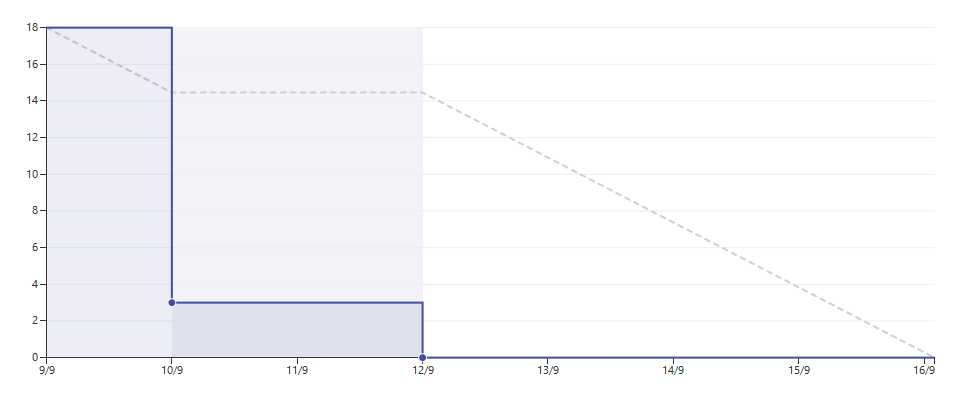

Sprint 1 (17/09/16 - 23/09/16)
~~~~~~~~~~~~~~~~~~~~~~~~~~~~~~

Los objetivos de este **sprint** fueron: tomar contacto con OpenCV para
Android, realizar un curso *online* de iniciación a Android, investigar
qué algoritmos de detección y tracking estaban disponibles en OpenCV
para Android y empezar a trabajar en la documentación.

En este *sprint* se tuvo la suerte de hablar sobre el proyecto con Rafael
Saracchini, investigador en temas de visión artificial en el Instituto
Tecnológico de Castilla y León. Rafael nos propuso una serie de
algoritmos que nos podían ser útiles y otros que no funcionarían bajo
nuestros requisitos.

Las tareas en las que se descompusieron los objetivos se pueden ver en:
`Sprint 1 <https://github.com/davidmigloz/go-bees/milestone/2?closed=1>`__.

Se estimaron 7,25 horas de trabajo y se invirtieron finalmente 13,25
horas, completando todas las tareas.

|Sprint 1|

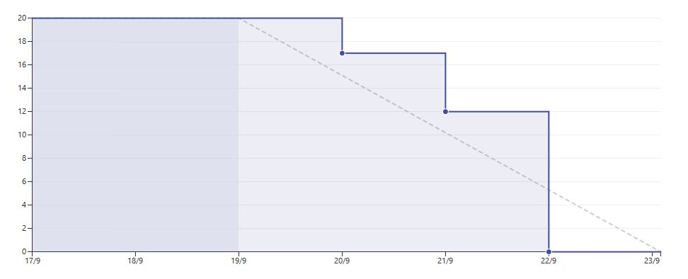
   

Sprint 2 (24/09/16 - 29/09/16)
~~~~~~~~~~~~~~~~~~~~~~~~~~~~~~

Los objetivos de este *sprint* fueron: investigar cómo implementar con
OpenCV los algoritmos descritos en el *sprint* anterior, continuar la
formación en Android y OpenCV y realizar grabaciones en el colmenar para
tener un conjunto de vídeos con los que realizar pruebas.

Las tareas en las que se descompusieron los objetivos se pueden ver en:
`Sprint 2 <https://github.com/davidmigloz/go-bees/milestone/3?closed=1>`__.

Mientras se realizaba una de las tareas del *sprint*, se encontraron dos
*bugs* relacionados con OpenCV y Android
(`#26 <https://github.com/davidmigloz/go-bees/issues/26>`__ y
`#27 <https://github.com/davidmigloz/go-bees/issues/27>`__) que nos
impidieron continuar el desarrollo. El investigar su origen y buscar
soluciones supuso una gran cantidad de horas y no se lograron resolver
hasta el siguiente *sprint*.

Se estimaron 11,75 horas de trabajo y se invirtieron finalmente 33
horas, quedando dos tareas pendientes para terminar durante el siguiente
*sprint*.

|Sprint 2|

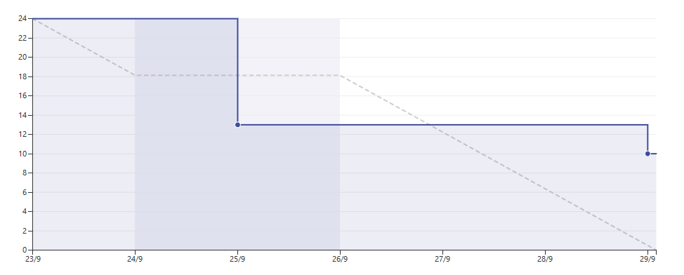

Sprint 3 (30/09/16 - 06/10/16)
~~~~~~~~~~~~~~~~~~~~~~~~~~~~~~

Los objetivos de este *sprint* fueron: intentar resolver los bugs
descubiertos en el *sprint* anterior, o si esto fuese imposible, buscar
una vía alternativa para continuar el proyecto y continuar investigando
las implementaciones de los algoritmos de extracción de fondo en OpenCV.

Las tareas en las que se descompusieron los objetivos se pueden ver en:
`Sprint 3 <https://github.com/davidmigloz/go-bees/milestone/4?closed=1>`__.

Se estimaron 20,75 horas de trabajo y se invirtieron finalmente 31
horas, quedando una tarea por terminar.

|Sprint 3|

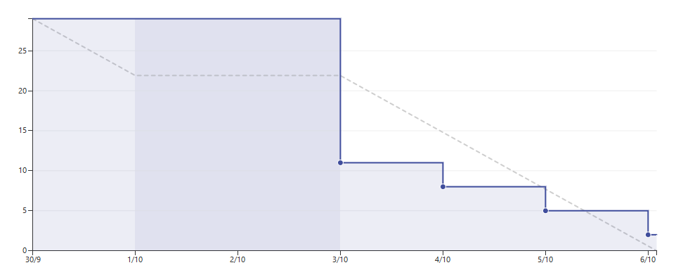

Sprint 4 (07/10/16 - 13/10/16)
~~~~~~~~~~~~~~~~~~~~~~~~~~~~~~

Los objetivos de este *sprint* fueron: investigar técnicas de preprocesado
y potprocesado para mejorar los resultados de la fase de extracción del
fondo. Seleccionar y parametrizar el algoritmo de extracción de fondo
que provea los mejores resultados para nuestro problema. Continuar el
curso de Android. Integrar los servicios de integración continua y
documentación continua en el repositorio.

Las tareas en las que se descompusieron los objetivos se pueden ver en:
`Sprint 4 <https://github.com/davidmigloz/go-bees/milestone/5?closed=1>`__.

Se estimaron 37 horas de trabajo y se invirtieron finalmente 39,5 horas,
completando todas las tareas.

|Sprint 4|

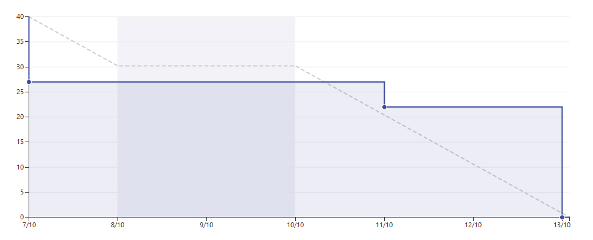

Sprint 5 (14/10/16 - 20/10/16)
~~~~~~~~~~~~~~~~~~~~~~~~~~~~~~

Los objetivos de este *sprint* fueron: afinar la parametrización de los
algoritmos implementados en el *sprint* anterior. Detectar contornos y
contar los pertenecientes a abejas. Pensar algún método que pueda
solventar el problema del solapamiento de abejas. Documentar *sprint*
anterior. Continuar la formación en Android.

Las tareas en las que se descompusieron los objetivos se pueden ver en:
`Sprint 5 <https://github.com/davidmigloz/go-bees/milestone/6?closed=1>`__.

Se estimaron 27 horas de trabajo y se invirtieron finalmente 34 horas,
completando todas las tareas.

|Sprint 5|

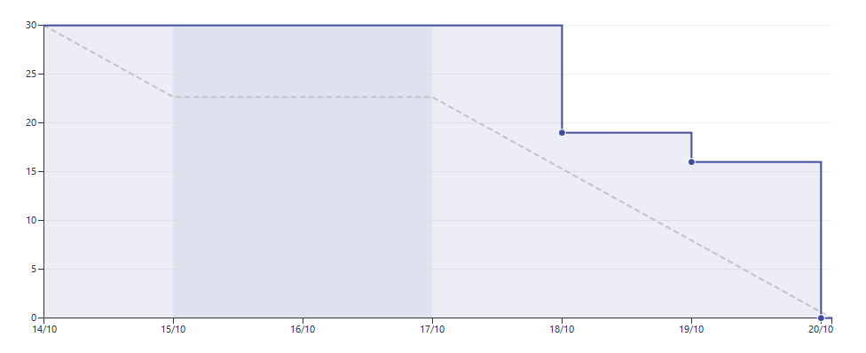

Sprint 6 (21/10/16 - 27/10/16)
~~~~~~~~~~~~~~~~~~~~~~~~~~~~~~

Los objetivos de este *sprint* fueron: mudar el algoritmo de visión
artificial desarrollado en la plataforma Java a Android. Comenzar a
desarrollar una aplicación de testeo del algoritmo para conocer el error
que comete. Investigar si es posible simular el entorno de trabajo
filmando a una pantalla.

Las tareas en las que se descompusieron los objetivos se pueden ver en:
`Sprint 6 <https://github.com/davidmigloz/go-bees/milestone/7?closed=1>`__.

Mientras se mudaba el algoritmo a Android se encontró un *bug* de OpenCV
(`#55 <https://github.com/davidmigloz/go-bees/issues/55>`__) que agotaba
la memoria del móvil. Este se debía a una mala liberación de recursos
por parte de OpenCV y resolvió liberándolos manualmente.

La tarea que más se desvió de su estimación fue la de testeo de los
algoritmos. Esto se debió a la dificultad añadida que supuso ejecutar
los test unitarios con dependencias de OpenCV en Travis. Finalmente, se
solventó instalando OpenCV en la máquina virtual de Travis (compilando
desde el código fuente) e inicializando la librería de forma estática
(ya que no se deseaba tener que arrancar un emulador para ejecutar los
tests unitarios).

Se estimaron 20,75 horas de trabajo y se invirtieron finalmente 41
horas, completando todas las tareas.

|Sprint 6|

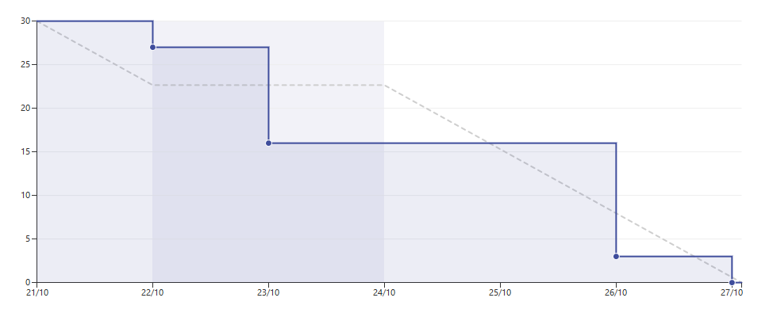

Sprint 7 (28/10/16 - 04/11/16)
~~~~~~~~~~~~~~~~~~~~~~~~~~~~~~

Los objetivos de este *sprint* fueron: estudiar patrón de arquitectura MVP
(*Model-View-Presenter*) y pensar en cómo aplicarlo al proyecto. Diseñar
la posible arquitectura de la aplicación. Estudiar el uso de inyección
de dependencias en Android con Dagger 2. Documentar las secciones de
Introducción y Objetivos.

Las tareas en las que se descompusieron los objetivos se pueden ver en:
`Sprint 7 <https://github.com/davidmigloz/go-bees/milestone/8?closed=1>`__.

Se estimaron 16 horas de trabajo y se invirtieron finalmente 23 horas,
completando todas las tareas.

|Sprint 7|

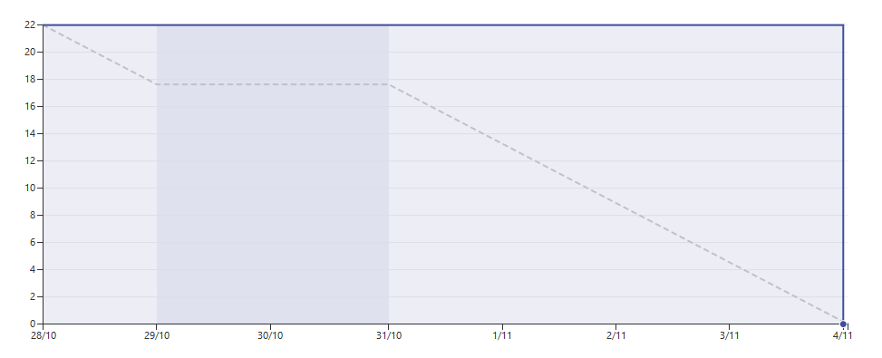

Sprint 8 (05/11/16 - 10/11/16)
~~~~~~~~~~~~~~~~~~~~~~~~~~~~~~

Los objetivos de este *sprint* fueron: diseñar el modelo de datos de la
aplicación teniendo en cuenta el uso final de estos. Desarrollar una
aplicación Java para realizar un conteo manual de un conjunto de frames.
Utilizar los datos obtenidos mediante la aplicación de conteo para
implementar un test que calcule el error que comete el algoritmo.

Las tareas en las que se descompusieron los objetivos se pueden ver en:
`Sprint 8 <https://github.com/davidmigloz/go-bees/milestone/9?closed=1>`__.

Se estimaron 46 horas de trabajo y se invirtieron finalmente 53 horas,
completando todas las tareas.

|Sprint 8|

.. |Sprint 8| image:: ../../img/burndowns/sprint8.png

Sprint 9 (11/11/16 - 17/11/16)
~~~~~~~~~~~~~~~~~~~~~~~~~~~~~~

Los objetivos de este *sprint* fueron: implementar acceso a datos.
Inyección de dependencias con los *build variants* de Gradle. Empezar a
desarrollar las distintas actividades de la app.

Las tareas en las que se descompusieron los objetivos se pueden ver en:
`Sprint 9 <https://github.com/davidmigloz/go-bees/milestone/10?closed=1>`__.

Se estimaron 23 horas de trabajo y se invirtieron finalmente 24,25
horas, completando todas las tareas.

|Sprint 9|

.. |Sprint 9| image:: ../../img/burndowns/sprint9.png

Sprint 10 (11/11/16 - 17/11/16)
~~~~~~~~~~~~~~~~~~~~~~~~~~~~~~~

Los objetivos de este *sprint* fueron: continuar desarrollando las actividades 
principales de la app. Corregir documentación escrita hasta el momento. 
Documentar Técnicas y herramientas y Aspectos relevantes.

Las tareas en las que se descompusieron los objetivos se pueden ver en:
`Sprint 10 <https://github.com/davidmigloz/go-bees/milestone/11?closed=1>`__.

Se estimaron 33,75 horas de trabajo y se invirtieron finalmente 39,25
horas, completando todas las tareas.

|Sprint 10|

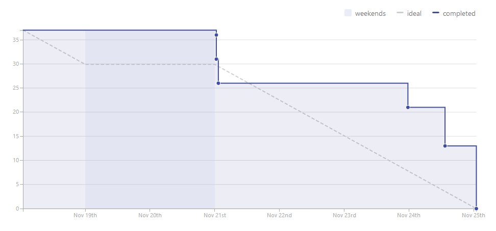
   
Sprint 11 (26/11/16 - 01/12/16)
~~~~~~~~~~~~~~~~~~~~~~~~~~~~~~~

Los objetivos de este *sprint* fueron: implementar la vista detalle de una colmena 
con sus grabaciones, pestañas en las vistas de colmenar y colmena y la sección de 
ajustes. Corregir los errores en la documentación indicados por los tutores. 
Continuar la formación en Android.

Las tareas en las que se descompusieron los objetivos se pueden ver en:
`Sprint 11 <https://github.com/davidmigloz/go-bees/milestone/12?closed=1>`__.

Se estimaron 25,75 horas de trabajo y se invirtieron finalmente 34
horas, completando todas las tareas.

|Sprint 11|

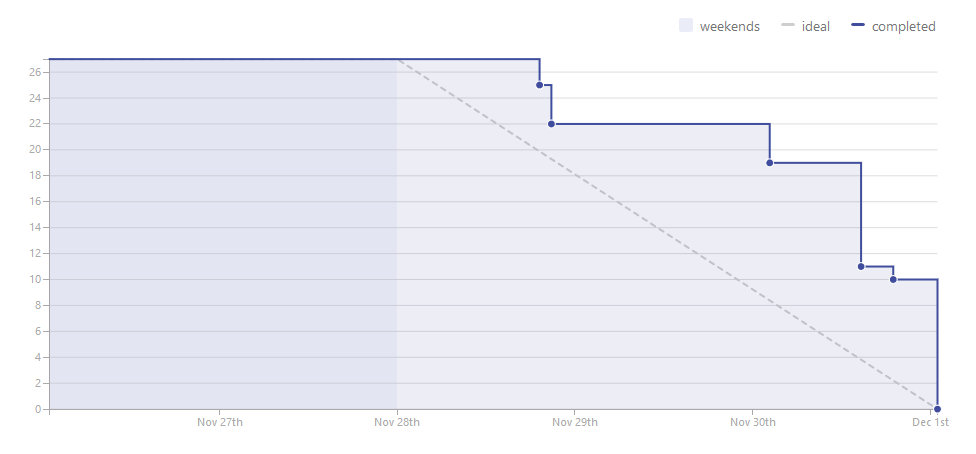
   
Sprint 12 (02/12/16 - 09/12/16)
~~~~~~~~~~~~~~~~~~~~~~~~~~~~~~~

Los objetivos de este *sprint* fueron: implementar las partes de visualización de 
los datos recogidos por la app (gráficos de actividad de vuelo, temperatura, 
precipitaciones, vientes, etc.) Documentar trabajos relacionados. Empezar a 
desarrollar la web del producto.

Las tareas en las que se descompusieron los objetivos se pueden ver en:
`Sprint 12 <https://github.com/davidmigloz/go-bees/milestone/13?closed=1>`__.

Se estimaron 36,25 horas de trabajo y se invirtieron finalmente 50,75
horas, completando todas las tareas.

|Sprint 12|

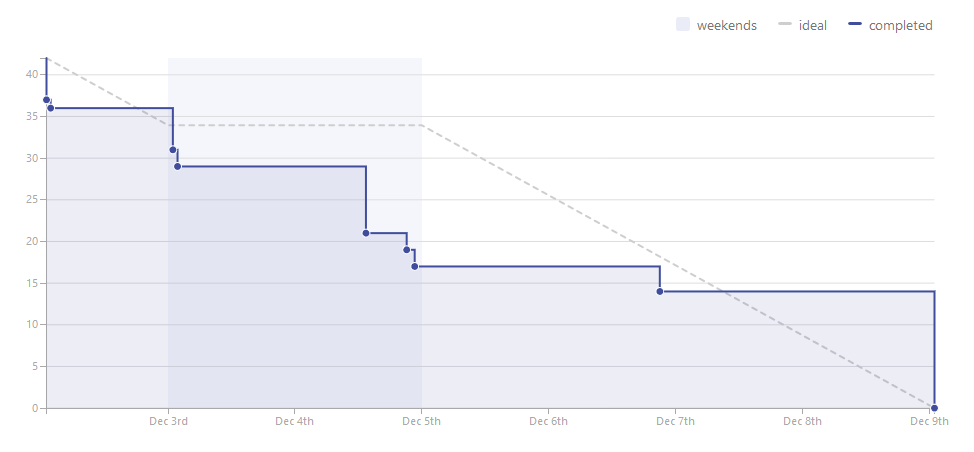

Sprint 13 (10/12/16 - 14/12/16)
~~~~~~~~~~~~~~~~~~~~~~~~~~~~~~~

Los objetivos de este *sprint* fueron: agregar opción de localización GPS al 
añadir colmenar. Incluir una tabla comparativa en la sección Trabajos relacionados.

Las tareas en las que se descompusieron los objetivos se pueden ver en:
`Sprint 13 <https://github.com/davidmigloz/go-bees/milestone/14?closed=1>`__.

Se estimaron 26,25 horas de trabajo y se invirtieron finalmente 14,25
horas, completando todas las tareas.

|Sprint 13|

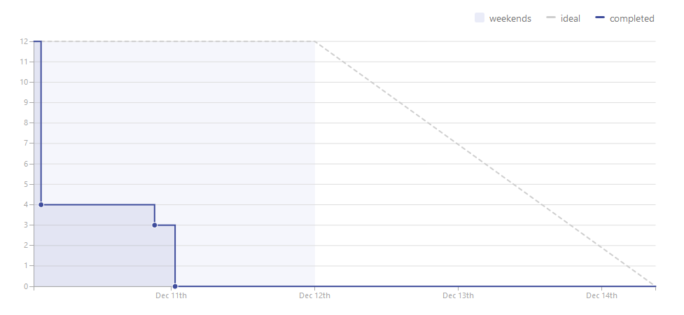

Sprint 14 (15/12/16 - 11/01/17)
~~~~~~~~~~~~~~~~~~~~~~~~~~~~~~~

Se trató del sprint más largo de todos los realizados, con una duración de cuatro
semanas debido a las vacaciones de Navidad.

Los objetivos de este *sprint* fueron: implementar el servicio de monitorización 
en segundo plano, junto con su sección de ajustes, la obtención de información 
meteorológica, la edición y borrado de colmenares y colmenas y las pestañas de 
información de colmenar y colmena. Además, realizar un estudio de viabilidad 
legal y seleccionar la licencia más apropiada para el proyecto.

Las tareas en las que se descompusieron los objetivos se pueden ver en:
`Sprint 14 <https://github.com/davidmigloz/go-bees/milestone/15?closed=1>`__.

Se estimaron 143 horas de trabajo y se invirtieron finalmente 187,75
horas, completando todas las tareas.

|Sprint 14|

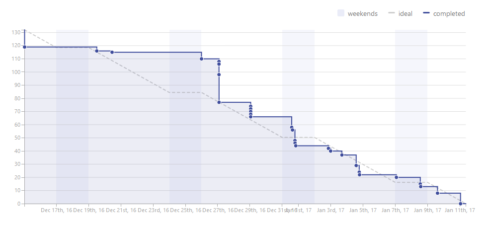
   
Sprint 15 (12/01/17 - 18/01/17)
~~~~~~~~~~~~~~~~~~~~~~~~~~~~~~~

Los objetivos de este *sprint* fueron: finalizar el desarrollo principal de la 
app completando el menú y la internacionalización. Completar los contenidos de 
la memoria y continuar con los anexos "Plan del proyecto software" y "Requisitos."

Las tareas en las que se descompusieron los objetivos se pueden ver en:
`Sprint 15 <https://github.com/davidmigloz/go-bees/milestone/16?closed=1>`__.

Se estimaron 39 horas de trabajo y se invirtieron finalmente 37,75
horas, a falta de terminar los anexos planificados por falta de tiempo.

|Sprint 15|

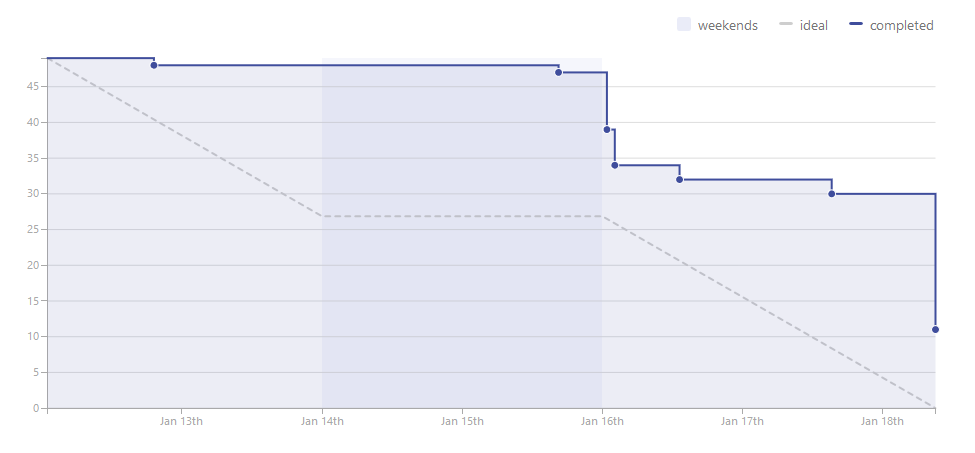

Sprint 16 (19/01/17 - 25/01/17)
~~~~~~~~~~~~~~~~~~~~~~~~~~~~~~~

Los objetivos de este *sprint* fueron: completar las tareas pendientes del anterior 
sprint (Especificación de requisitos y Análisis económico), documentar el diseño de 
datos, procedimental y arquitectónico y aumentar la cobertura de los test.

Las tareas en las que se descompusieron los objetivos se pueden ver en:
`Sprint 16 <https://github.com/davidmigloz/go-bees/milestone/17?closed=1>`__.

Se estimaron 45,75 horas de trabajo y se invirtieron finalmente 45,25
horas, completando todas las tareas.

|Sprint 16|

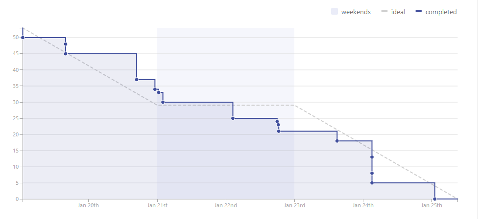

Sprint 17 (26/01/17 - 02/02/17)
~~~~~~~~~~~~~~~~~~~~~~~~~~~~~~~

Los objetivos de este *sprint* fueron: continuar anexos. Convertir la memoria a 
formato LaTeX. Pulir los últimos detalles de la aplicación y publicarla en Google 
Play.

Las tareas en las que se descompusieron los objetivos se pueden ver en:
`Sprint 17 <https://github.com/davidmigloz/go-bees/milestone/18?closed=1>`__.

Se estimaron 53,50 horas de trabajo y se invirtieron finalmente 56,50
horas, completando todas las tareas.

|Sprint 17|

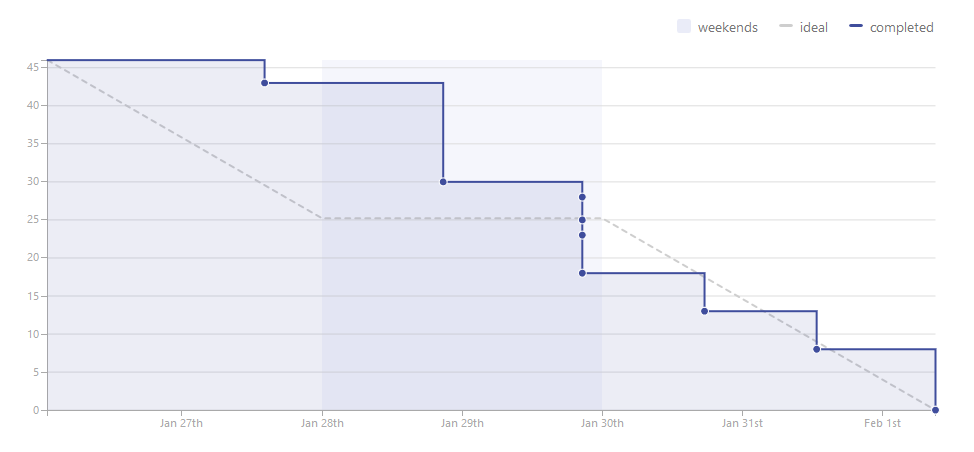

Sprint 18 (02/02/17 - 07/02/17)
~~~~~~~~~~~~~~~~~~~~~~~~~~~~~~~

Los objetivos de este *sprint* fueron: imprimir memoria, terminar anexos 
y corrección de errores.

Las tareas en las que se descompusieron los objetivos se pueden ver en:
`Sprint 18 <https://github.com/davidmigloz/go-bees/milestone/19?closed=1>`__.

Se estimaron 41 horas de trabajo y se invirtieron finalmente 41
horas, completando todas las tareas.

|Sprint 18|

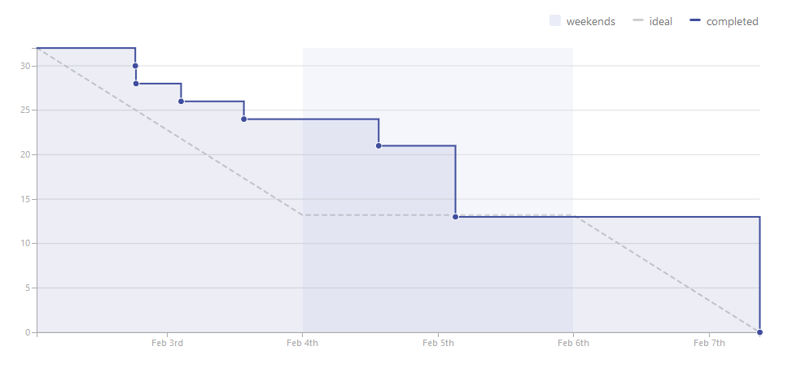

Resumen
~~~~~~~

En la siguiente tabla se muestra un resumen del tiempo dedicado a los 
distintos tipos de tareas.

+----------------------------+--------------+------------+
| Categoría                  | *Issues*     | Tiempo (h) | 
+============================+==============+============+
| *Bug*                      | 26           | 40,75      |
+----------------------------+--------------+------------+
| *Documentation*            | 41           | 106        |
+----------------------------+--------------+------------+
| *Feature*                  | 63           | 410        |
+----------------------------+--------------+------------+
| *Research*                 | 30           | 128        |
+----------------------------+--------------+------------+
| *Testing*                  | 7            | 49         |
+----------------------------+--------------+------------+
| TOTAL                      | 167          | 794        |
+----------------------------+--------------+------------+

|project-sumary|

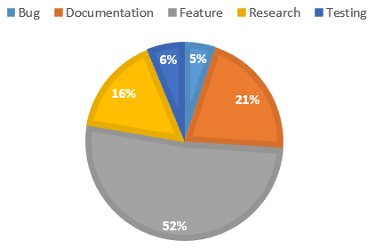
   
Estudio de viabilidad
---------------------

Viabilidad económica
~~~~~~~~~~~~~~~~~~~~

En el siguiente apartado se analizarán los costes y beneficios que
podría haber supuesto el proyecto si se hubiese realizado en un entorno
empresarial real.

Costes
^^^^^^

La estructura de costes del proyecto se puede desglosar en las
siguientes categorías.

**Costes de personal:**

El proyecto ha sido llevado a cabo por un desarrollador empleado a
tiempo completo durante cinco meses. Se considera el siguiente salario:

+----------------------------+--------------+
| **Concepto**               | **Coste**    |
+============================+==============+
| Salario mensual neto       | 1.000€       |
+----------------------------+--------------+
| Retención IRPF (15%)       | 272,23€      |
+----------------------------+--------------+
| Seguridad Social (29,9%)   | 542,65€      |
+----------------------------+--------------+
| Salario mensual bruto      | 1.814,88€    |
+----------------------------+--------------+
| **Total 5 meses**          | 9.074,40 €   |
+----------------------------+--------------+

La retribución a la Seguridad Social se ha calculado como un 23,60% por
contingencias comunes, más un 5,50% por desempleo de tipo general, más
un 0,20% para el Fondo de Garantía Salarial y más un 0,60% de formación
profesional. En total un 29,9% que se aplica al salario bruto [ss_cotizacion]_.

**Costes de hardware:**

En este apartado se revisan todos los costes en dispositivos *hardware*
que se han necesitado para el desarrollo del proyecto. Se considera que
la amortización ronda los 5 años y han sido utilizados durante 5 meses.

+----------------------+-------------+------------------------+
| **Concepto**         | **Coste**   | **Coste amortizado**   |
+======================+=============+========================+
| Dispositivo móvil    | 300€        | 25€                    |
+----------------------+-------------+------------------------+
| Ordenador portátil   | 800€        | 66,67€                 |
+----------------------+-------------+------------------------+
| **Total**            | 1.100€      | 91,67€                 |
+----------------------+-------------+------------------------+

**Costes de software:**

En este apartado se revisan todos los costes en licencias de *software*
no gratuito. Se considera que la amortización del *software* ronda los 2
años.

+------------------+-------------+------------------------+
| **Concepto**     | **Coste**   | **Coste amortizado**   |
+==================+=============+========================+
| Windows 10 Pro   | 279€        | 58,13€                 |
+------------------+-------------+------------------------+
| Creately         | 5€          | 1,04€                  |
+------------------+-------------+------------------------+
| **Total**        | 284€        | 59,17€                 |
+------------------+-------------+------------------------+

**Costes varios:**

En este apartado se revisan el resto de costes del proyecto.

+------------------------------------+-------------+
| **Concepto**                       | **Coste**   |
+====================================+=============+
| Dominio gobees.io                  | 31,90€      |
+------------------------------------+-------------+
| Cuenta Google Play                 | 25€         |
+------------------------------------+-------------+
| Memoria impresa y cartel           | 50€         |
+------------------------------------+-------------+
| Alquiler de oficina                | 500€        |
+------------------------------------+-------------+
| Internet                           | 150€        |
+------------------------------------+-------------+
| Material de apicultura de prueba   | 150€        |
+------------------------------------+-------------+
| **Total**                          | 906,90€     |
+------------------------------------+-------------+

**Costes totales:**

El sumatorio de todos los costes es el siguiente:

+----------------+--------------+
| **Concepto**   | **Coste**    |
+================+==============+
| Personal       | 9.074,40€    |
+----------------+--------------+
| *Hardware*     | 91,67€       |
+----------------+--------------+
| *Software*     | 59,17€       |
+----------------+--------------+
| Varios         | 906,90€      |
+----------------+--------------+
| Total          | 10.132,14€   |
+----------------+--------------+

Beneficios
^^^^^^^^^^

La aplicación desarrollada se distribuirá de forma gratuita y sin
publicidad, por lo que a corto plazo no se obtendrán beneficios.

La forma de monetizar la aplicación será en una segunda fase, cuando se
desarrolle una plataforma en la nube que sincronice la información de
varios dispositivos y permita el acceso remoto a la información.

Se considerarán tres tipos de suscripciones:

+---------------+------------------+----------------+-------------------+--------------+
| **Tipo**      | **Colmenares**   | **Colmenas**   | **Plataformas**   | **Precio**   |
+===============+==================+================+===================+==============+
| Hobby         | 1                | 10             | App / Cloud       | Gratis       |
+---------------+------------------+----------------+-------------------+--------------+
| Amateur       | 5                | 100            | App / Cloud       | 5€/mes       |
+---------------+------------------+----------------+-------------------+--------------+
| Profesional   | Ilimitados       | Ilimitados     | App / Cloud       | 20€/mes      |
+---------------+------------------+----------------+-------------------+--------------+

Viabilidad legal
~~~~~~~~~~~~~~~~

En esta sección se discutirán los temas relacionados con las licencias.
Tanto del propio *software*, como de su documentación, imágenes y
vídeos.

"En Derecho, una licencia es un contrato mediante el cual una persona
recibe de otra el derecho de uso, de copia, de distribución, de estudio
y de modificación (en el caso del *Software* Libre) de varios de sus
bienes, normalmente de carácter no tangible o intelectual, pudiendo
darse a cambio del pago de un monto determinado por el uso de los
mismos." [wiki:licencia]_

Software
^^^^^^^^

En primer lugar, vamos a analizar cuál sería la licencia más conveniente
para nuestro proyecto. Por un lado, somos nosotros los que podemos
elegir qué derechos queremos proporcionar a los usuarios y cuáles no.
Sin embargo, estamos limitados por los derechos que nos conceden a
nosotros las licencias de las dependencias utilizadas en el proyecto.

A continuación, se muestran las licencias de las dependencias usadas.

+----------------+---------+----------------------------------------------+----------+
| Dependencia    | Versión | Descripción                                  | Licencia |
+================+=========+==============================================+==========+
| Android        | 25.1.0  | Biblioteca de compatibilidad de Android.     | Apache   |
| Support        |         |                                              | v2.0     |
| Library        |         |                                              |          |
+----------------+---------+----------------------------------------------+----------+
| OpenCV         | 3.1.0   | Biblioteca de visión artificial.             | BSD      |
+----------------+---------+----------------------------------------------+----------+
| Google Play    | 10.0.1  | Biblioteca que proporciona acceso a          | Apache   |
| Services       |         | diferentes servicios, entre ellos,           | v2.0     |
|                |         | localización.                                |          |
+----------------+---------+----------------------------------------------+----------+
| Guava          | 20.0    | Conjunto de bibliotecas comunes para Java.   | Apache   |
|                |         |                                              | v2.0     |
+----------------+---------+----------------------------------------------+----------+
| RoundedImageVi | 2.3.0   | Componente para mostrar imágenes redondeadas | Apache   |
| ew             |         | en Android.                                  | v2.0     |
+----------------+---------+----------------------------------------------+----------+
| MPAndroidChart | 3.0.1   | Biblioteca de gráficos para Android.         | Apache   |
|                |         |                                              | v2.0     |
+----------------+---------+----------------------------------------------+----------+
| VNTNumberPicker| 1.0.0   | Componente para seleccionar valores          | Apache   |
| Preference     |         | numéricos.                                   | v2.0     |
+----------------+---------+----------------------------------------------+----------+
| Permission     | 1.0.6   | Biblioteca que facilita la gestión de        | MIT      |
| Utils          |         | permisos en tiempo de ejecución.             |          |
+----------------+---------+----------------------------------------------+----------+
| JUnit          | 4.12    | Framework para *testing* unitario en Java.   | EPL      |
+----------------+---------+----------------------------------------------+----------+
| Mockito        | 2.0.2   | Framework para *mocking* en Java.            | MIT      |
+----------------+---------+----------------------------------------------+----------+
| SLF4J          | 1.7.21  | API para *logging* en Java.                  | MIT      |
|                |         |                                              |          |
+----------------+---------+----------------------------------------------+----------+
| Apache Log4j   | 1.7.21  | Biblioteca para *logging* en Java.           | Apache   |
|                |         |                                              | v2.0     |
+----------------+---------+----------------------------------------------+----------+
| Android JSON   | 20160810| Biblioteca para trabajar con JSON.           | Apache   |
|                |         |                                              | v2.0     |
+----------------+---------+----------------------------------------------+----------+
| Espresso       | 2.2.2   | Framework de *testing* para Android.         | Apache   |
|                |         |                                              | v2.0     |
+----------------+---------+----------------------------------------------+----------+

Por lo tanto, tenemos que escoger una licencia para nuestro proyecto que
sea compatible con Apache v2.0, BSD, MIT y EPL. En el siguiente gráfico
mostramos la compatibilidad entre estas licencias, así como su grado de
permisividad.

|licenses compatibility|

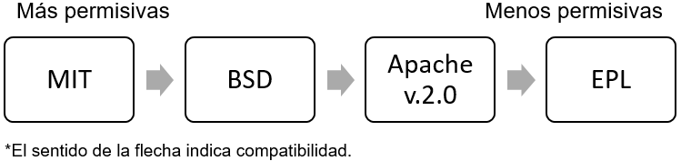

Podemos observar que la licencia más restrictiva (en el sentido de
obligaciones a cumplir) es la *Eclipse Public License* que posee la
librería JUnit.

La forma de monetización del proyecto se realizará mediante
suscripciones a una plataforma *cloud* que permitirá la sincronización
entre varios dispositivos, entre otras funcionalidades. Por lo tanto, la
liberación del código del proyecto no pone en peligro su monetización,
sino todo lo contrario, abre la puerta a que la comunidad *Open Source*
aporte valor adicional a nuestro proyecto. El permitir la distribución
de la app libremente y de forma gratuita también nos es beneficioso, ya
que aumenta las posibilidades de recibir nuevas suscripciones de
usuarios. Y por último, no nos importaría que otras empresas se basaran
en nuestro código fuente para desarrollar sus productos, siempre los
liberaran bajo una licencia de código abierto para que nosotros también
pudiéramos aprovechar las mejoras que hubieran realizado.

Teniendo en cuenta todo lo anterior, la licencia que más se ajusta a
nuestras pretensiones es la *GNU General Public License v3.0*, que, de
forma resumida, establece lo siguiente: [license:gplv3]_

+--------------------+------------------------------------------+----------------------------------+
| Derechos           | Condiciones                              | Limitaciones                     |
+====================+==========================================+==================================+
| Uso comercial.     | Liberar código fuente.                   | Limitación de responsabilidad.   |
+--------------------+------------------------------------------+----------------------------------+
| Distribución.      | Nota sobre la licencia y copyright.      | Sin garantías.                   |
+--------------------+------------------------------------------+----------------------------------+
| Modificación.      | Modificaciones bajo la misma licencia.   |                                  |
+--------------------+------------------------------------------+----------------------------------+
| Uso de patentes.   | Indicar modificaciones realizadas.       |                                  |
+--------------------+------------------------------------------+----------------------------------+
| Uso privado.       |                                          |                                  |
+--------------------+------------------------------------------+----------------------------------+

Sin embargo, GPL v3.0 no es compatible con la licencia EPL que posee
JUnit. Ya que, la EPL requiere que "cualquier distribución del trabajo
conceda a todos los destinatarios una licencia para las patentes que
pudieran tener que cubrir las modificaciones que han hecho" [license:epl]_. Esto supone
que los destinatarios pueden añadir una restricción adicional, hecho que
prohíbe rotundamente GPL: "[que el distribuidor] no imponga ninguna
restricción más sobre el ejercicio de los derechos concedidos a los
beneficiarios" [license:gplv3]_.

Tras analizar otras licencias alternativas, no se ha encontrado ninguna
compatible con EPL y, a la vez, con nuestras pretensiones. Por lo que
finalmente se ha tomado la decisión de utilizar dos licencias para el
código fuente del proyecto. Por un lado, todo el código fuente de la
aplicación se ha licenciado bajo GPL v3.0. Mientras que el código fuente
de testeo, que hace uso de código licenciado bajo EPL (JUnit), se ha
liberado bajo licencia Apache v2.0, la cual sí que es compatible con
EPL.

Documentación
^^^^^^^^^^^^^

Aunque se puede utilizar también la licencia GPL v3.0 para licenciar la
documentación, no es lo más recomendable. Ya que contiene numerosas
cláusulas que solo tienen sentido cuando se habla de código fuente. Por
ejemplo, si alguien quisiese distribuir una copia de la documentación de
forma impresa, estaría obligado a proporcionar también una copia del
código fuente.

Por lo que se ha decido utilizar una licencia *Creative Commons*, las
cuales están más enfocadas a licenciar este tipo de material. En
concreto, se ha elegido la *Creative Commons Attribution 4.0
International* (CC-BY-4.0). Que establece lo siguiente: [license:ccby4]_

+--------------+---------------------------+-------------------------------------+
| Derechos     | Condiciones               | Limitaciones                        |
+==============+===========================+=====================================+
| Uso          | Nota sobre la licencia y  | Limitación de responsabilidad.      |
| comercial.   | copyright.                |                                     |
+--------------+---------------------------+-------------------------------------+
| Distribución.| Indicar modificaciones    | Sin garantías.                      |
|              | realizadas.               |                                     |
+--------------+---------------------------+-------------------------------------+
| Modificación.|                           | No proporciona derechos sobre       |
|              |                           | marcas registradas.                 |
+--------------+---------------------------+-------------------------------------+
| Uso privado. |                           | No proporciona derechos sobre       |
|              |                           | patentes.                           |
+--------------+---------------------------+-------------------------------------+

Imágenes y vídeos
^^^^^^^^^^^^^^^^^

En la documentación no se ha utilizado ninguna imagen de terceros, todas
las imágenes son propias del proyecto y cuentan con la misma licencia
que la documentación (CC-BY-4.0).

El *dataset* de vídeos de prueba también se encuentra bajo la misma
licencia.

Por otro lado, en la aplicación se han utilizado dos fuentes de
imágenes de terceros:

+-------------------------+-----------------------------------------+---------------+
| Fuente                  | Descripción                             | Licencia      |
+=========================+=========================================+===============+
| Material design icons   | Conjunto de iconos oficial de Google.   | Apache v2.0   |
+-------------------------+-----------------------------------------+---------------+
| Simple Weather Icons    | Conjunto de iconos meteorológicos.      | Apache v2.0   |
+-------------------------+-----------------------------------------+---------------+

Aunque ambos autores renuncian a la obligación de especificar
explícitamente su autoría, se les ha mencionado en la sección "Licencias
de software libre" de la aplicación.

El resto de imágenes y gráficos utilizados son de autoría propia y se
distribuyen también bajo CC-BY-4.0.3.

Resumen
^^^^^^^

En la siguiente tabla se resumen las licencias que posee el proyecto.

+-----------------------+---------------+
| Recurso               | Licencia      |
+=======================+===============+
| Código fuente app     | GPLv3         |
+-----------------------+---------------+
| Código fuente tests   | Apache v2.0   |
+-----------------------+---------------+
| Documentación         | CC-BY-4.0     |
+-----------------------+---------------+
| Imágenes              | CC-BY-4.0     |
+-----------------------+---------------+
| Vídeos                | CC-BY-4.0     |
+-----------------------+---------------+

.. References

.. [wiki:licencia]
   https://es.wikipedia.org/w/index.php?title=Licencia&oldid=94243114
.. [license:gplv3]
   https://www.gnu.org/licenses/gpl-3.0.txt
.. [license:epl]
   https://www.eclipse.org/legal/epl-v10.html
.. [license:ccby4]
   https://creativecommons.org/licenses/by/4.0
.. [ss_cotizacion]
   http://www.seg-social.es/Internet_1/Trabajadores/CotizacionRecaudaci10777/Basesytiposdecotiza36537/index.htm