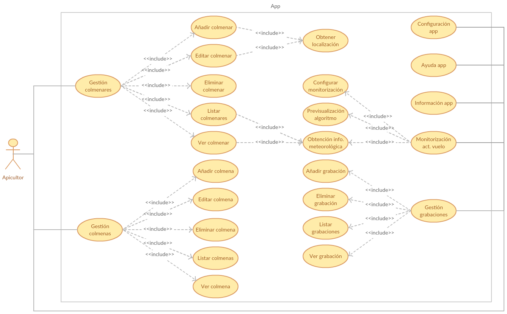

Especificación de Requisitos
============================

Introducción
------------

Este anexo recoge la especificación de requisitos que define el
comportamiento del sistema desarrollado. Posee un doble objetivo: servir
como documento contractual entre el cliente y el equipo de desarrollo y
como documentación correspondiente al análisis a la aplicación.

Se ha realizado siguiendo las recomendaciones del estándar IEEE
830-1998, que manifiesta que una buena especificación de requisitos
*software* debe ser: [ieee_830_1998]_

-  **Completa**: todos los requerimientos deben estar reflejados en ella
   y todas las referencias deben estar definidas.

-  **Consistente**: debe ser coherente con los propios requerimientos y
   también con otros documentos de especificación.

-  **Inequívoca**: la redacción debe ser clara de modo que no se pueda
   mal interpretar.

-  **Correcta**: el software debe cumplir con los requisitos de la
   especificación.

-  **Trazable**\ *: s*\ e refiere a la posibilidad de verificar la
   historia, ubicación o aplicación de un ítem a través de su
   identificación almacenada y documentada.

-  **Priorizable**: los requisitos deben poder organizarse
   jerárquicamente según su relevancia para el negocio y clasificándolos
   en esenciales, condicionales y opcionales.

-  **Modificable**: aunque todo requerimiento es modificable, se refiere
   a que debe ser fácilmente modificable.

-  **Verificable**: debe existir un método finito sin costo para poder
   probarlo.

Objetivos generales
-------------------

El proyecto persigue los siguientes objetivos generales:

-  Desarrollar una aplicación para *smartphones* que permita la
   monitorización de la actividad de vuelo de una colmena a través de su
   cámara.

-  Facilitar la interpretación de los datos recogidos mediante
   representaciones gráficas.

-  Aportar información extra a los datos de actividad que ayude en la
   toma de decisiones.

-  Almacenar todos los datos generados de forma estructurada y
   fácilmente accesible.

Catálogo de requisitos
----------------------

A continuación, se enumeran los requisitos específicos derivados de los
objetivos generales del proyecto.

Requisitos funcionales
~~~~~~~~~~~~~~~~~~~~~~

-  **RF-1 Gestión de colmenares:** la aplicación tiene que ser capaz de
   gestionar colmenares.

   -  **RF-1.1 Añadir colmenar:** el usuario debe poder añadir un nuevo
      colmenar con un nombre, una localización y unas notas específicas.

      -  **RF-1.1.1: Obtener localización:** la aplicación tiene que ser
         capaz de obtener la localización actual del usuario.

   -  **RF-1.2 Editar colmenar:** el usuario debe poder editar la
      información de un colmenar ya existente.

      -  **RF-1.2.1: Obtener localización:** la aplicación tiene que ser
         capaz de obtener la localización actual del usuario.

   -  **RF-1.3 Eliminar colmenar:** el usuario debe poder eliminar un
      colmenar ya existente junto con toda su información asociada.

   -  **RF-1.4 Listar colmenares:** el usuario debe poder listar todos
      los colmenares existentes.

      -  **RF-1.4.1 Obtención de información meteorológica:** la
         aplicación tiene que ser capaz de obtener la información
         meteorológica de cada uno de los colmenares.

   -  **RF-1.5 Ver colmenar:** el usuario debe poder visualizar toda la
      información relativa a un determinado colmenar.

      -  **RF-1.5.1 Obtención de información meteorológica:** la
         aplicación tiene que ser capaz de obtener la información
         meteorológica relativa a un determinado colmenar.

-  **RF-2 Gestión de colmenas:** la aplicación tiene que ser capaz de
   gestionar colmenas.

   -  **RF-2.1 Añadir colmena:** el usuario debe poder añadir una nueva
      colmena con un nombre y unas notas específicas.

   -  **RF-2.2 Editar colmena:** el usuario debe poder editar la
      información de una colmena ya existente.

   -  **RF-2.3 Eliminar colmena:** el usuario debe poder eliminar una
      colmena ya existente junto con toda su información asociada.

   -  **RF-2.4 Listar colmenas:** el usuario debe poder listar todas las
      colmenas existentes en un determinado colmenar.

   -  **RF-2.5 Ver colmena:** el usuario debe poder visualizar toda la
      información relativa a una determinada colmena.

-  **RF-3 Gestión de grabaciones:** la aplicación tiene que ser capaz de
   gestionar grabaciones.

   -  **RF-3.1 Añadir grabación:** la aplicación tiene que ser capaz de
      crear una nueva grabación a partir de los datos de monitorización.

   -  **RF-3.2 Eliminar grabación:** el usuario debe poder eliminar una
      grabación ya existente junto con toda su información asociada.

   -  **RF-3.3 Listar grabaciones:** el usuario debe poder listar todas
      las grabaciones existentes de una determinada colmena.

   -  **RF-3.4 Ver grabación:** el usuario debe poder visualizar toda la
      información relativa a una determinada grabación.

-  **RF-4 Monitorización de la actividad de vuelo:** el usuario tiene
   que ser capaz de monitorizar la actividad de vuelo de una colmena a
   partir de una determinada parametrización de esta.

   -  **RF-4.1 Previsualización:** el usuario debe poder previsualizar
      la salida del algoritmo de conteo de abejas.

   -  **RF-4.2 Configurar monitorización:** el usuario debe poder
      configurar todos los parámetros relativos a la monitorización.

   -  **RF-4.3 Obtención de información meteorológica:** la aplicación
      tiene que ser capaz de obtener la información meteorológica
      relativa a un determinado colmenar.

-  **RF-5 Configuración de la aplicación:** el usuario debe poder
   configurar todos los parámetros disponibles en la aplicación, como el
   idioma o las unidades meteorológicas.

-  **RF-6 Ayuda de la aplicación:** el usuario debe poder obtener ayuda
   sobre cada una de las funcionalidades de la aplicación.

-  **RF-7 Información de la aplicación:** el usuario debe poder obtener
   información sobre la aplicación, compartirla o enviar sugerencias.

Requisitos no funcionales
~~~~~~~~~~~~~~~~~~~~~~~~~

-  **RNF-1 Usabilidad:** la aplicación debe ser intuitiva, con una curva
   baja de aprendizaje, errores explicativos y adaptada al entorno de
   trabajo.

-  **RNF-2 Rendimiento:** la aplicación tiene que tener unos tiempos de
   carga y procesado aceptables en un dispositivo móvil de gama media.
   La pantalla nunca deberá quedar congelada.

-  **RNF-3 Capacidad y Escalabilidad:** la aplicación tiene que estar
   preparada para una recogida de datos continuada y debe permitir la
   adición de nuevas funcionalidades de forma sencilla.

-  **RNF-4 Disponibilidad:** la aplicación debe estar siempre disponible
   para su uso, independientemente de la localización, la no
   disponibilidad de internet, o cualquier otro factor.

-  **RNF-5 Seguridad:** la aplicación debe gestionar de forma adecuada
   todos los datos de carácter sensible, como claves, *tokens*, etc.

-  **RNF-6 Mantenibilidad**: la aplicación debe ser desarrollada de
   acuerdo a algún patrón arquitectónico estándar que asegure
   escalabilidad, portabilidad, testabilidad, etc. Además, tiene que
   cumplir los estándares de código de Android.

-  **RNF-7 Soporte**: la aplicación debe dar soporte a versiones mayores
   o iguales a Android 4.4 (*KitKat*).

-  **RNF-8 Monitorización**: la aplicación debe monitorizar
   correctamente la actividad de vuelo de una colmena cuando el
   dispositivo se coloca en posición cenital a la colmena, sobre un
   soporte estático y con un fondo claro y uniforme.

-  **RNF-9 Internacionalización**: la aplicación deberá estar preparada
   para soportar varios idiomas, localizando textos, unidades de medida,
   imágenes, etc.

Especificación de requisitos
----------------------------

En esta sección se mostrará el diagrama de casos de uso resultante y se
desarrollará cada uno de ellos.

Diagrama de casos de uso
~~~~~~~~~~~~~~~~~~~~~~~~

|use cases diagram|

Actores
~~~~~~~

Solo interactuará con el sistema un actor, que se corresponderá con la
figura del apicultor.

Casos de uso
~~~~~~~~~~~~

+----------------------------+-----------------------------------------------------------------------------------------+
| **CU-01**                  | **Gestión de colmenares**                                                               |
+============================+=========================================================================================+
| **Versión**                | 1.0                                                                                     |
+----------------------------+-----------------------------------------------------------------------------------------+
| **Autor**                  | David Miguel Lozano                                                                     |
+----------------------------+-----------------------------------------------------------------------------------------+
| **Requisitos asociados**   | RF-1, RF-1.1, RF-1.1.1, RF-1.2, RF-1.2.1, RF-1.3, RF-1.4, RF-1.5, RF-1.5.1              |
+----------------------------+-----------------------------------------------------------------------------------------+
| **Descripción**            | Permite al usuario gestionar sus colmenares.                                            |
+----------------------------+-----------------------------------------------------------------------------------------+
| **Precondición**           | La base de datos se encuentra disponible.                                               |
+----------------------------+-----------------------------------------------------------------------------------------+
| **Acciones**               | 1. El usuario entra en la aplicación.                                                   |
|                            |                                                                                         |
|                            | 2. Se listan todos los colmenares.                                                      |
|                            |                                                                                         |
|                            | 3. Por cada colmenar se da la opción de ver detalle, editar o eliminar.                 |
|                            |                                                                                         |
|                            | 4. Se muestra un botón para añadir un colmenar.                                         |
+----------------------------+-----------------------------------------------------------------------------------------+
| **Postcondición**          | El número de colmenares listado es igual al número de colmenares en la base de datos.   |
+----------------------------+-----------------------------------------------------------------------------------------+
| **Excepciones**            | -  Error al cargar colmenares (mensaje).                                                |
|                            |                                                                                         |
|                            | -  No existe ningún colmenar (vista especial).                                          |
+----------------------------+-----------------------------------------------------------------------------------------+
| **Importancia**            | Alta                                                                                    |
+----------------------------+-----------------------------------------------------------------------------------------+

+----------------------------+--------------------------------------------------------------------------------------+
| **CU-02**                  | **Añadir colmenar**                                                                  |
+============================+======================================================================================+
| **Versión**                | 1.0                                                                                  |
+----------------------------+--------------------------------------------------------------------------------------+
| **Autor**                  | David Miguel Lozano                                                                  |
+----------------------------+--------------------------------------------------------------------------------------+
| **Requisitos asociados**   | RF-1.1, RF-1.1.1                                                                     |
+----------------------------+--------------------------------------------------------------------------------------+
| **Descripción**            | Permite al usuario añadir un nuevo colmenar.                                         |
+----------------------------+--------------------------------------------------------------------------------------+
| **Precondición**           | La base de datos se encuentra disponible.                                            |
+----------------------------+--------------------------------------------------------------------------------------+
| **Acciones**               | 1. El usuario presiona en el botón de añadir colmenar.                               |
|                            |                                                                                      |
|                            | 2. Se muestra el formulario para introducir los datos del colmenar.                  |
|                            |                                                                                      |
|                            | 3. El usuario introduce el nombre.                                                   |
|                            |                                                                                      |
|                            | 4. El usuario pulsa obtener localización (opcional).                                 |
|                            |                                                                                      |
|                            |    a. Se obtiene la localización del usuario.                                        |
|                            |                                                                                      |
|                            | 5. El usuario introduce notas sobre el colmenar (opcional).                          |
|                            |                                                                                      |
|                            | 6. El usuario pulsa el botón de aceptar.                                             |
|                            |                                                                                      |
|                            | 7. Si no hay ningún error, se guarda un nuevo colmenar con los datos introducidos.   |
|                            |                                                                                      |
|                            | 8. Volver a Gestión de colmenares.                                                   |
+----------------------------+--------------------------------------------------------------------------------------+
| **Postcondición**          | Existe un colmenar más en la base de datos.                                          |
+----------------------------+--------------------------------------------------------------------------------------+
| **Excepciones**            | -  Error al guardar colmenar (mensaje).                                              |
|                            |                                                                                      |
|                            | -  No se ha introducido nombre del colmenar (resaltar).                              |
+----------------------------+--------------------------------------------------------------------------------------+
| **Importancia**            | Alta                                                                                 |
+----------------------------+--------------------------------------------------------------------------------------+

+----------------------------+----------------------------------------------------------------------------+
| **CU-03**                  | **Editar colmenar**                                                        |
+============================+============================================================================+
| **Versión**                | 1.0                                                                        |
+----------------------------+----------------------------------------------------------------------------+
| **Autor**                  | David Miguel Lozano                                                        |
+----------------------------+----------------------------------------------------------------------------+
| **Requisitos asociados**   | RF-1.2, RF-1.2.1                                                           |
+----------------------------+----------------------------------------------------------------------------+
| **Descripción**            | Permite al usuario editar un colmenar ya existente.                        |
+----------------------------+----------------------------------------------------------------------------+
| **Precondición**           | La base de datos se encuentra disponible.                                  |
|                            |                                                                            |
|                            | El colmenar a editar existe.                                               |
+----------------------------+----------------------------------------------------------------------------+
| **Acciones**               | 1. El usuario selecciona un colmenar para editar.                          |
|                            |                                                                            |
|                            | 2. Se obtienen los datos del colmenar de la base de datos.                 |
|                            |                                                                            |
|                            | 3. Se rellena el formulario de edición con los datos del colmenar.         |
|                            |                                                                            |
|                            | 4. El usuario edita alguno de los campos.                                  |
|                            |                                                                            |
|                            | 1. Si el usuario pulsa obtener localización.                               |
|                            |                                                                            |
|                            |    a. Se obtiene la localización del usuario.                              |
|                            |                                                                            |
|                            | 1. El usuario pulsa el botón aceptar.                                      |
|                            |                                                                            |
|                            | 2. Si no hay ningún error, se actualiza el colmenar en la base de datos.   |
+----------------------------+----------------------------------------------------------------------------+
| **Postcondición**          | La información del colmenar en la base de datos ha sido actualizada.       |
+----------------------------+----------------------------------------------------------------------------+
| **Excepciones**            | -  Error al guardar colmenar (mensaje).                                    |
|                            |                                                                            |
|                            | -  No se ha introducido nombre del colmenar (resaltar).                    |
+----------------------------+----------------------------------------------------------------------------+
| **Importancia**            | Alta                                                                       |
+----------------------------+----------------------------------------------------------------------------+

+----------------------------+-----------------------------------------------------------------+
| **CU-04**                  | **Eliminar colmenar**                                           |
+============================+=================================================================+
| **Versión**                | 1.0                                                             |
+----------------------------+-----------------------------------------------------------------+
| **Autor**                  | David Miguel Lozano                                             |
+----------------------------+-----------------------------------------------------------------+
| **Requisitos asociados**   | RF-1.3                                                          |
+----------------------------+-----------------------------------------------------------------+
| **Descripción**            | Permite al usuario eliminar un colmenar ya existente.           |
+----------------------------+-----------------------------------------------------------------+
| **Precondición**           | La base de datos se encuentra disponible.                       |
|                            |                                                                 |
|                            | El colmenar a eliminar existe.                                  |
+----------------------------+-----------------------------------------------------------------+
| **Acciones**               | 1. El usuario selecciona un colmenar para eliminar.             |
|                            |                                                                 |
|                            | 2. Se eliminan los datos de ese colmenar de la base de datos.   |
|                            |                                                                 |
|                            | 3. Se elimina el colmenar de la vista.                          |
|                            |                                                                 |
|                            | 4. Se informa al usuario.                                       |
+----------------------------+-----------------------------------------------------------------+
| **Postcondición**          | Existe un colmenar menos en la base de datos.                   |
+----------------------------+-----------------------------------------------------------------+
| **Excepciones**            | -  Error al eliminar colmenar (mensaje).                        |
+----------------------------+-----------------------------------------------------------------+
| **Importancia**            | Alta                                                            |
+----------------------------+-----------------------------------------------------------------+

+----------------------------+------------------------------------------------------------------------------------------------------------------------------------------------------------------------------------+
| **CU-05**                  | **Listar colmenares**                                                                                                                                                              |
+============================+====================================================================================================================================================================================+
| **Versión**                | 1.0                                                                                                                                                                                |
+----------------------------+------------------------------------------------------------------------------------------------------------------------------------------------------------------------------------+
| **Autor**                  | David Miguel Lozano                                                                                                                                                                |
+----------------------------+------------------------------------------------------------------------------------------------------------------------------------------------------------------------------------+
| **Requisitos asociados**   | RF-1.4, RF-1.4.1                                                                                                                                                                   |
+----------------------------+------------------------------------------------------------------------------------------------------------------------------------------------------------------------------------+
| **Descripción**            | Permite al usuario listar todos sus colmenares. Por cada colmenar se muestra el nombre, el número de colmenas y la condición meteorológica y temperatura actuales.                 |
+----------------------------+------------------------------------------------------------------------------------------------------------------------------------------------------------------------------------+
| **Precondición**           | La base de datos se encuentra disponible.                                                                                                                                          |
+----------------------------+------------------------------------------------------------------------------------------------------------------------------------------------------------------------------------+
| **Acciones**               | 1. El usuario accede a Gestionar Colmenares.                                                                                                                                       |
|                            |                                                                                                                                                                                    |
|                            | 2. Se obtienen todos los colmenares de la base de datos.                                                                                                                           |
|                            |                                                                                                                                                                                    |
|                            | 3. Se actualiza su información meteorológica si no se dispone de esta o la que se dispone es de hace más de 15 minutos.                                                            |
|                            |                                                                                                                                                                                    |
|                            | 4. Se muestran la lista de colmenares. Cada elemento de la lista posee el nombre del colmenar, el número de colmenas y la condición meteorológica y temperatura de ese colmenar.   |
+----------------------------+------------------------------------------------------------------------------------------------------------------------------------------------------------------------------------+
| **Postcondición**          | -                                                                                                                                                                                  |
+----------------------------+------------------------------------------------------------------------------------------------------------------------------------------------------------------------------------+
| **Excepciones**            | -  Error al cargar colmenares (mensaje).                                                                                                                                           |
|                            |                                                                                                                                                                                    |
|                            | -  No existen colmenares (vista especial).                                                                                                                                         |
|                            |                                                                                                                                                                                    |
|                            | -  No existe conexión a internet (mensaje).                                                                                                                                        |
|                            |                                                                                                                                                                                    |
|                            | -  Error al recuperar la información meteorológica (mensaje).                                                                                                                      |
+----------------------------+------------------------------------------------------------------------------------------------------------------------------------------------------------------------------------+
| **Importancia**            | Alta                                                                                                                                                                               |
+----------------------------+------------------------------------------------------------------------------------------------------------------------------------------------------------------------------------+

+----------------------------+---------------------------------------------------------------------------------------------------------------------------+
| **CU-06**                  | **Ver colmenar**                                                                                                          |
+============================+===========================================================================================================================+
| **Versión**                | 1.0                                                                                                                       |
+----------------------------+---------------------------------------------------------------------------------------------------------------------------+
| **Autor**                  | David Miguel Lozano                                                                                                       |
+----------------------------+---------------------------------------------------------------------------------------------------------------------------+
| **Requisitos asociados**   | RF-1.5, RF-1.5.1                                                                                                          |
+----------------------------+---------------------------------------------------------------------------------------------------------------------------+
| **Descripción**            | Permite al usuario visualizar toda la información relativa a un determinado colmenar existente.                           |
+----------------------------+---------------------------------------------------------------------------------------------------------------------------+
| **Precondición**           | La base de datos se encuentra disponible.                                                                                 |
|                            |                                                                                                                           |
|                            | El colmenar a visualizar existe.                                                                                          |
+----------------------------+---------------------------------------------------------------------------------------------------------------------------+
| **Acciones**               | 1. El usuario selecciona un colmenar para visualizar.                                                                     |
|                            |                                                                                                                           |
|                            | 2. Se obtienen los datos del colmenar de la base de datos (incluidas sus colmenas).                                       |
|                            |                                                                                                                           |
|                            | 3. Se actualiza su información meteorológica si no se dispone de esta o la que se dispone es de hace más de 15 minutos.   |
|                            |                                                                                                                           |
|                            | 4. Se muestra una lista con sus colmenas.                                                                                 |
|                            |                                                                                                                           |
|                            | 5. Se muestra la información general del colmenar (localización, número de colmenas, última revisión y notas).            |
|                            |                                                                                                                           |
|                            | 6. Se muestra la información meteorológica en detalle.                                                                    |
+----------------------------+---------------------------------------------------------------------------------------------------------------------------+
| **Postcondición**          | -                                                                                                                         |
+----------------------------+---------------------------------------------------------------------------------------------------------------------------+
| **Excepciones**            | -  Error al cargar colmenar (mensaje).                                                                                    |
|                            |                                                                                                                           |
|                            | -  No existe conexión a internet (mensaje).                                                                               |
|                            |                                                                                                                           |
|                            | -  Error al recuperar la información meteorológica (mensaje).                                                             |
+----------------------------+---------------------------------------------------------------------------------------------------------------------------+
| **Importancia**            | Alta                                                                                                                      |
+----------------------------+---------------------------------------------------------------------------------------------------------------------------+

+----------------------------+-----------------------------------------------------------------------------------------------------------------------------------------------------------------------------------------------------------------------+
| **CU-07**                  | **Obtener localización**                                                                                                                                                                                              |
+============================+=======================================================================================================================================================================================================================+
| **Versión**                | 1.0                                                                                                                                                                                                                   |
+----------------------------+-----------------------------------------------------------------------------------------------------------------------------------------------------------------------------------------------------------------------+
| **Autor**                  | David Miguel Lozano                                                                                                                                                                                                   |
+----------------------------+-----------------------------------------------------------------------------------------------------------------------------------------------------------------------------------------------------------------------+
| **Requisitos asociados**   | RF-1.1.1, RF-1.2.1                                                                                                                                                                                                    |
+----------------------------+-----------------------------------------------------------------------------------------------------------------------------------------------------------------------------------------------------------------------+
| **Descripción**            | Permite obtener la localización actual del usuario.                                                                                                                                                                   |
+----------------------------+-----------------------------------------------------------------------------------------------------------------------------------------------------------------------------------------------------------------------+
| **Precondición**           | Se poseen permisos de acceso a la localización.                                                                                                                                                                       |
+----------------------------+-----------------------------------------------------------------------------------------------------------------------------------------------------------------------------------------------------------------------+
| **Acciones**               | 1. El usuario selecciona obtener localización actual.                                                                                                                                                                 |
|                            |                                                                                                                                                                                                                       |
|                            | 2. La aplicación se conecta al servicio de localización.                                                                                                                                                              |
|                            |                                                                                                                                                                                                                       |
|                            | 3. El servicio de localización va devolviendo ubicaciones, cada vez más precisas.                                                                                                                                     |
|                            |                                                                                                                                                                                                                       |
|                            | 4. Cuando el usuario considera la localización suficientemente buena, vuelve a presionar el botón de localización para detener la localización. Si no lo hace, se detendrá automáticamente al cambiar de actividad.   |
|                            |                                                                                                                                                                                                                       |
|                            | 5. Se devuelve la localización obtenida.                                                                                                                                                                              |
+----------------------------+-----------------------------------------------------------------------------------------------------------------------------------------------------------------------------------------------------------------------+
| **Postcondición**          | Las coordenadas devueltas son válidas.                                                                                                                                                                                |
+----------------------------+-----------------------------------------------------------------------------------------------------------------------------------------------------------------------------------------------------------------------+
| **Excepciones**            | -  No se poseen permisos de localización (solicitar).                                                                                                                                                                 |
|                            |                                                                                                                                                                                                                       |
|                            | -  Error de conexión con el GPS (mensaje).                                                                                                                                                                            |
+----------------------------+-----------------------------------------------------------------------------------------------------------------------------------------------------------------------------------------------------------------------+
| **Importancia**            | Alta                                                                                                                                                                                                                  |
+----------------------------+-----------------------------------------------------------------------------------------------------------------------------------------------------------------------------------------------------------------------+

+----------------------------+--------------------------------------------------------------------------------------------------------+
| **CU-08**                  | **Obtener información meteorológica**                                                                  |
+============================+========================================================================================================+
| **Versión**                | 1.0                                                                                                    |
+----------------------------+--------------------------------------------------------------------------------------------------------+
| **Autor**                  | David Miguel Lozano                                                                                    |
+----------------------------+--------------------------------------------------------------------------------------------------------+
| **Requisitos asociados**   | RF-1.4.1, RF-1.5.1                                                                                     |
+----------------------------+--------------------------------------------------------------------------------------------------------+
| **Descripción**            | Permite obtener la información meteorológica actual en un determinado colmenar.                        |
+----------------------------+--------------------------------------------------------------------------------------------------------+
| **Precondición**           | Se poseen permisos de acceso a internet.                                                               |
|                            |                                                                                                        |
|                            | El colmenar existe y posee localización.                                                               |
+----------------------------+--------------------------------------------------------------------------------------------------------+
| **Acciones**               | 1. El sistema ejecuta la orden de actualizar información meteorológica para un determinado colmenar.   |
|                            |                                                                                                        |
|                            | 2. Se obtiene la ubicación del colmenar de la base de datos.                                           |
|                            |                                                                                                        |
|                            | 3. Se realiza una consulta a la API de *OpenWeatherMap*.                                               |
|                            |                                                                                                        |
|                            | 4. Se procesan los datos recibidos.                                                                    |
|                            |                                                                                                        |
|                            | 5. Se devuelven los datos recibidos.                                                                   |
+----------------------------+--------------------------------------------------------------------------------------------------------+
| **Postcondición**          | La información meteorológica devuelta es válida.                                                       |
+----------------------------+--------------------------------------------------------------------------------------------------------+
| **Excepciones**            | -  No se poseen permisos de internet (solicitar).                                                      |
|                            |                                                                                                        |
|                            | -  El colmenar no tiene localización (ignorar petición).                                               |
+----------------------------+--------------------------------------------------------------------------------------------------------+
| **Importancia**            | Alta                                                                                                   |
+----------------------------+--------------------------------------------------------------------------------------------------------+

+----------------------------+-----------------------------------------------------------------------------------------------------+
| **CU-09**                  | **Gestión de colmenas**                                                                             |
+============================+=====================================================================================================+
| **Versión**                | 1.0                                                                                                 |
+----------------------------+-----------------------------------------------------------------------------------------------------+
| **Autor**                  | David Miguel Lozano                                                                                 |
+----------------------------+-----------------------------------------------------------------------------------------------------+
| **Requisitos asociados**   | RF-2, RF-2.1, RF-2.2, RF-2.3, RF-2.4, RF-2.5                                                        |
+----------------------------+-----------------------------------------------------------------------------------------------------+
| **Descripción**            | Permite al usuario gestionar las colmenas de un determinado colmenar.                               |
+----------------------------+-----------------------------------------------------------------------------------------------------+
| **Precondición**           | La base de datos se encuentra disponible.                                                           |
|                            |                                                                                                     |
|                            | El colmenar existe.                                                                                 |
+----------------------------+-----------------------------------------------------------------------------------------------------+
| **Acciones**               | 1. El usuario entra en la vista detalle de un colmenar.                                             |
|                            |                                                                                                     |
|                            | 2. Se listan todas las colmenas.                                                                    |
|                            |                                                                                                     |
|                            | 3. Por cada colmena se da la opción de ver detalle, editar o eliminar.                              |
|                            |                                                                                                     |
|                            | 4. Se muestra un botón para añadir una colmena.                                                     |
+----------------------------+-----------------------------------------------------------------------------------------------------+
| **Postcondición**          | El número de colmenas listado es igual al número de colmenas de ese colmenar en la base de datos.   |
+----------------------------+-----------------------------------------------------------------------------------------------------+
| **Excepciones**            | -  Error al cargar colmenas (mensaje).                                                              |
|                            |                                                                                                     |
|                            | -  No existe ninguna colmena (vista especial).                                                      |
+----------------------------+-----------------------------------------------------------------------------------------------------+
| **Importancia**            | Alta                                                                                                |
+----------------------------+-----------------------------------------------------------------------------------------------------+

+----------------------------+--------------------------------------------------------------------------------------------------------------+
| **CU-10**                  | **Añadir colmena**                                                                                           |
+============================+==============================================================================================================+
| **Versión**                | 1.0                                                                                                          |
+----------------------------+--------------------------------------------------------------------------------------------------------------+
| **Autor**                  | David Miguel Lozano                                                                                          |
+----------------------------+--------------------------------------------------------------------------------------------------------------+
| **Requisitos asociados**   | RF-2.1                                                                                                       |
+----------------------------+--------------------------------------------------------------------------------------------------------------+
| **Descripción**            | Permite al usuario añadir una nueva colmena.                                                                 |
+----------------------------+--------------------------------------------------------------------------------------------------------------+
| **Precondición**           | La base de datos se encuentra disponible.                                                                    |
|                            |                                                                                                              |
|                            | El colmenar existe.                                                                                          |
+----------------------------+--------------------------------------------------------------------------------------------------------------+
| **Acciones**               | 1. El usuario presiona en el botón de añadir colmena.                                                        |
|                            |                                                                                                              |
|                            | 2. Se muestra el formulario para introducir los datos de la colmena.                                         |
|                            |                                                                                                              |
|                            | 3. El usuario introduce el nombre.                                                                           |
|                            |                                                                                                              |
|                            | 4. El usuario introduce notas sobre el colmenar (opcional).                                                  |
|                            |                                                                                                              |
|                            | 5. El usuario pulsa el botón de aceptar.                                                                     |
|                            |                                                                                                              |
|                            | 6. Si no hay ningún error, se guarda una nueva colmena con los datos introducidos y se asocia al colmenar.   |
|                            |                                                                                                              |
|                            | 7. Volver a Gestión de colmenas.                                                                             |
+----------------------------+--------------------------------------------------------------------------------------------------------------+
| **Postcondición**          | Existe una colmena más para ese colmenar en la base de datos.                                                |
+----------------------------+--------------------------------------------------------------------------------------------------------------+
| **Excepciones**            | -  Error al guardar colmena (mensaje).                                                                       |
|                            |                                                                                                              |
|                            | -  No se ha introducido nombre de la colmena (resaltar).                                                     |
+----------------------------+--------------------------------------------------------------------------------------------------------------+
| **Importancia**            | Alta                                                                                                         |
+----------------------------+--------------------------------------------------------------------------------------------------------------+

+----------------------------+---------------------------------------------------------------------------+
| **CU-11**                  | **Editar colmena**                                                        |
+============================+===========================================================================+
| **Versión**                | 1.0                                                                       |
+----------------------------+---------------------------------------------------------------------------+
| **Autor**                  | David Miguel Lozano                                                       |
+----------------------------+---------------------------------------------------------------------------+
| **Requisitos asociados**   | RF-2.2                                                                    |
+----------------------------+---------------------------------------------------------------------------+
| **Descripción**            | Permite al usuario editar una colmena ya existente.                       |
+----------------------------+---------------------------------------------------------------------------+
| **Precondición**           | La base de datos se encuentra disponible.                                 |
|                            |                                                                           |
|                            | El colmenar existe.                                                       |
+----------------------------+---------------------------------------------------------------------------+
| **Acciones**               | 1. El usuario selecciona una colmena para editar.                         |
|                            |                                                                           |
|                            | 2. Se obtienen los datos de la colmena de la base de datos.               |
|                            |                                                                           |
|                            | 3. Se rellena el formulario de edición con los datos del colmenar.        |
|                            |                                                                           |
|                            | 4. El usuario edita alguno de los campos.                                 |
|                            |                                                                           |
|                            | 5. El usuario pulsa el botón aceptar.                                     |
|                            |                                                                           |
|                            | 6. Si no hay ningún error, se actualiza la colmena en la base de datos.   |
+----------------------------+---------------------------------------------------------------------------+
| **Postcondición**          | La información de la colmena en la base de datos ha sido actualizada.     |
+----------------------------+---------------------------------------------------------------------------+
| **Excepciones**            | -  Error al guardar colmena (mensaje).                                    |
|                            |                                                                           |
|                            | -  No se ha introducido nombre de la colmena (resaltar).                  |
+----------------------------+---------------------------------------------------------------------------+
| **Importancia**            | Alta                                                                      |
+----------------------------+---------------------------------------------------------------------------+

+----------------------------+-----------------------------------------------------------------+
| **CU-12**                  | **Eliminar colmena**                                            |
+============================+=================================================================+
| **Versión**                | 1.0                                                             |
+----------------------------+-----------------------------------------------------------------+
| **Autor**                  | David Miguel Lozano                                             |
+----------------------------+-----------------------------------------------------------------+
| **Requisitos asociados**   | RF-2.3                                                          |
+----------------------------+-----------------------------------------------------------------+
| **Descripción**            | Permite al usuario eliminar una colmena ya existente.           |
+----------------------------+-----------------------------------------------------------------+
| **Precondición**           | La base de datos se encuentra disponible.                       |
|                            |                                                                 |
|                            | El colmenar existe.                                             |
|                            |                                                                 |
|                            | La colmena a eliminar existe.                                   |
+----------------------------+-----------------------------------------------------------------+
| **Acciones**               | 1. El usuario selecciona una colmena para eliminar.             |
|                            |                                                                 |
|                            | 2. Se eliminan los datos de esa colmena de la base de datos.    |
|                            |                                                                 |
|                            | 3. Se elimina la colmena de la vista.                           |
|                            |                                                                 |
|                            | 4. Se informa al usuario.                                       |
+----------------------------+-----------------------------------------------------------------+
| **Postcondición**          | Existe una colmena menos en ese colmenar en la base de datos.   |
+----------------------------+-----------------------------------------------------------------+
| **Excepciones**            | -  Error al eliminar colmena (mensaje).                         |
+----------------------------+-----------------------------------------------------------------+
| **Importancia**            | Alta                                                            |
+----------------------------+-----------------------------------------------------------------+

+----------------------------+----------------------------------------------------------------------------------------------------------------------------------------------------+
| **CU-13**                  | **Listar colmenas**                                                                                                                                |
+============================+====================================================================================================================================================+
| **Versión**                | 1.0                                                                                                                                                |
+----------------------------+----------------------------------------------------------------------------------------------------------------------------------------------------+
| **Autor**                  | David Miguel Lozano                                                                                                                                |
+----------------------------+----------------------------------------------------------------------------------------------------------------------------------------------------+
| **Requisitos asociados**   | RF-2.4                                                                                                                                             |
+----------------------------+----------------------------------------------------------------------------------------------------------------------------------------------------+
| **Descripción**            | Permite al usuario listar todas las colmenas de un determinado colmenar. Por cada colmena se muestra el nombre y la fecha de la última revisión.   |
+----------------------------+----------------------------------------------------------------------------------------------------------------------------------------------------+
| **Precondición**           | La base de datos se encuentra disponible.                                                                                                          |
|                            |                                                                                                                                                    |
|                            | El colmenar existe.                                                                                                                                |
+----------------------------+----------------------------------------------------------------------------------------------------------------------------------------------------+
| **Acciones**               | 1. El usuario accede a Gestionar Colmenas de un determinado colmenar.                                                                              |
|                            |                                                                                                                                                    |
|                            | 2. Se obtienen todas las colmenas de ese colmenar de la base de datos.                                                                             |
|                            |                                                                                                                                                    |
|                            | 3. Se muestran la lista de colmenas. Cada elemento de la lista posee el nombre de la colmena y la fecha de la última revisión.                     |
+----------------------------+----------------------------------------------------------------------------------------------------------------------------------------------------+
| **Postcondición**          | -                                                                                                                                                  |
+----------------------------+----------------------------------------------------------------------------------------------------------------------------------------------------+
| **Excepciones**            | -  Error al cargar colmenas (mensaje).                                                                                                             |
|                            |                                                                                                                                                    |
|                            | -  No existen colmenas (vista especial).                                                                                                           |
+----------------------------+----------------------------------------------------------------------------------------------------------------------------------------------------+
| **Importancia**            | Alta                                                                                                                                               |
+----------------------------+----------------------------------------------------------------------------------------------------------------------------------------------------+

+----------------------------+---------------------------------------------------------------------------------------------------+
| **CU-14**                  | **Ver colmena**                                                                                   |
+============================+===================================================================================================+
| **Versión**                | 1.0                                                                                               |
+----------------------------+---------------------------------------------------------------------------------------------------+
| **Autor**                  | David Miguel Lozano                                                                               |
+----------------------------+---------------------------------------------------------------------------------------------------+
| **Requisitos asociados**   | RF-2.5                                                                                            |
+----------------------------+---------------------------------------------------------------------------------------------------+
| **Descripción**            | Permite al usuario visualizar toda la información relativa a una determinada colmena existente.   |
+----------------------------+---------------------------------------------------------------------------------------------------+
| **Precondición**           | La base de datos se encuentra disponible.                                                         |
|                            |                                                                                                   |
|                            | El colmenar existe.                                                                               |
|                            |                                                                                                   |
|                            | La colmena a visualizar existe.                                                                   |
+----------------------------+---------------------------------------------------------------------------------------------------+
| **Acciones**               | 1. El usuario selecciona una colmena de un determinado colmenar para visualizar.                  |
|                            |                                                                                                   |
|                            | 2. Se obtienen los datos de la colmena de la base de datos (incluidas sus grabaciones).           |
|                            |                                                                                                   |
|                            | 3. Se muestra una lista con sus grabaciones.                                                      |
|                            |                                                                                                   |
|                            | 4. Se muestra la información general de la colmena (última revisión y notas).                     |
+----------------------------+---------------------------------------------------------------------------------------------------+
| **Postcondición**          | -                                                                                                 |
+----------------------------+---------------------------------------------------------------------------------------------------+
| **Excepciones**            | -  Error al cargar colmena (mensaje).                                                             |
+----------------------------+---------------------------------------------------------------------------------------------------+
| **Importancia**            | Alta                                                                                              |
+----------------------------+---------------------------------------------------------------------------------------------------+

+----------------------------+----------------------------------------------------------------------------------------------------------+
| **CU-15**                  | **Gestión de grabaciones**                                                                               |
+============================+==========================================================================================================+
| **Versión**                | 1.0                                                                                                      |
+----------------------------+----------------------------------------------------------------------------------------------------------+
| **Autor**                  | David Miguel Lozano                                                                                      |
+----------------------------+----------------------------------------------------------------------------------------------------------+
| **Requisitos asociados**   | RF-3, RF-3.1, RF-3.2, RF-3.3, RF-3.4                                                                     |
+----------------------------+----------------------------------------------------------------------------------------------------------+
| **Descripción**            | Permite al usuario gestionar las grabaciones de una determinada colmena.                                 |
+----------------------------+----------------------------------------------------------------------------------------------------------+
| **Precondición**           | La base de datos se encuentra disponible.                                                                |
|                            |                                                                                                          |
|                            | El colmenar y la colmena existen.                                                                        |
+----------------------------+----------------------------------------------------------------------------------------------------------+
| **Acciones**               | 1. El usuario entra en la vista detalle de una colmena.                                                  |
|                            |                                                                                                          |
|                            | 2. Se listan todas las grabaciones.                                                                      |
|                            |                                                                                                          |
|                            | 3. Por cada grabación se da la opción de ver detalle o eliminar.                                         |
|                            |                                                                                                          |
|                            | 4. Se muestra un botón para iniciar una nueva monitorización.                                            |
+----------------------------+----------------------------------------------------------------------------------------------------------+
| **Postcondición**          | El número de grabaciones listado es igual al número de grabaciones de esa colmena en la base de datos.   |
+----------------------------+----------------------------------------------------------------------------------------------------------+
| **Excepciones**            | -  Error al cargar grabaciones (mensaje).                                                                |
|                            |                                                                                                          |
|                            | -  No existe ninguna grabación (vista especial).                                                         |
+----------------------------+----------------------------------------------------------------------------------------------------------+
| **Importancia**            | Alta                                                                                                     |
+----------------------------+----------------------------------------------------------------------------------------------------------+

+----------------------------+---------------------------------------------------------------------------------------------------------------------------------------------------------------------------------------+
| **CU-16**                  | **Añadir grabación**                                                                                                                                                                  |
+============================+=======================================================================================================================================================================================+
| **Versión**                | 1.0                                                                                                                                                                                   |
+----------------------------+---------------------------------------------------------------------------------------------------------------------------------------------------------------------------------------+
| **Autor**                  | David Miguel Lozano                                                                                                                                                                   |
+----------------------------+---------------------------------------------------------------------------------------------------------------------------------------------------------------------------------------+
| **Requisitos asociados**   | RF-3.1                                                                                                                                                                                |
+----------------------------+---------------------------------------------------------------------------------------------------------------------------------------------------------------------------------------+
| **Descripción**            | Permite añadir una nueva grabación a partir de los datos recogidos durante la monitorización.                                                                                         |
+----------------------------+---------------------------------------------------------------------------------------------------------------------------------------------------------------------------------------+
| **Precondición**           | La base de datos se encuentra disponible.                                                                                                                                             |
|                            |                                                                                                                                                                                       |
|                            | El colmenar y la colmena existen.                                                                                                                                                     |
+----------------------------+---------------------------------------------------------------------------------------------------------------------------------------------------------------------------------------+
| **Acciones**               | 1. El usuario presiona el botón de finalizar monitorización.                                                                                                                          |
|                            |                                                                                                                                                                                       |
|                            | 2. Si no hay ningún error, se guarda una nueva grabación con los datos recogidos durante la monitorización (número de abejas e información meteorológica) y se asocia a la colmena.   |
|                            |                                                                                                                                                                                       |
|                            | 3. Volver a Gestión de grabaciones.                                                                                                                                                   |
+----------------------------+---------------------------------------------------------------------------------------------------------------------------------------------------------------------------------------+
| **Postcondición**          | Existe una grabación más para esa colmena en la base de datos.                                                                                                                        |
+----------------------------+---------------------------------------------------------------------------------------------------------------------------------------------------------------------------------------+
| **Excepciones**            | -  Error al guardar grabación (mensaje).                                                                                                                                              |
|                            |                                                                                                                                                                                       |
|                            | -  Grabación demasiado corta (mensaje).                                                                                                                                               |
+----------------------------+---------------------------------------------------------------------------------------------------------------------------------------------------------------------------------------+
| **Importancia**            | Alta                                                                                                                                                                                  |
+----------------------------+---------------------------------------------------------------------------------------------------------------------------------------------------------------------------------------+

+----------------------------+------------------------------------------------------------------+
| **CU-17**                  | **Eliminar grabación**                                           |
+============================+==================================================================+
| **Versión**                | 1.0                                                              |
+----------------------------+------------------------------------------------------------------+
| **Autor**                  | David Miguel Lozano                                              |
+----------------------------+------------------------------------------------------------------+
| **Requisitos asociados**   | RF-3.2                                                           |
+----------------------------+------------------------------------------------------------------+
| **Descripción**            | Permite al usuario eliminar una grabación ya existente.          |
+----------------------------+------------------------------------------------------------------+
| **Precondición**           | La base de datos se encuentra disponible.                        |
|                            |                                                                  |
|                            | El colmenar y la colmena existen.                                |
|                            |                                                                  |
|                            | La grabación a eliminar existe.                                  |
+----------------------------+------------------------------------------------------------------+
| **Acciones**               | 1. El usuario selecciona una grabación para eliminar.            |
|                            |                                                                  |
|                            | 2. Se eliminan los datos de esa grabación de la base de datos.   |
|                            |                                                                  |
|                            | 3. Se elimina la grabación de la vista.                          |
|                            |                                                                  |
|                            | 4. Se informa al usuario.                                        |
+----------------------------+------------------------------------------------------------------+
| **Postcondición**          | Existe una grabación menos en esa colmena en la base de datos.   |
+----------------------------+------------------------------------------------------------------+
| **Excepciones**            | -  Error al eliminar grabación (mensaje).                        |
+----------------------------+------------------------------------------------------------------+
| **Importancia**            | Alta                                                             |
+----------------------------+------------------------------------------------------------------+

+----------------------------+-----------------------------------------------------------------------------------------------------------------------------------------------------------------------+
| **CU-18**                  | **Listar grabaciones**                                                                                                                                                |
+============================+=======================================================================================================================================================================+
| **Versión**                | 1.0                                                                                                                                                                   |
+----------------------------+-----------------------------------------------------------------------------------------------------------------------------------------------------------------------+
| **Autor**                  | David Miguel Lozano                                                                                                                                                   |
+----------------------------+-----------------------------------------------------------------------------------------------------------------------------------------------------------------------+
| **Requisitos asociados**   | RF-3.3                                                                                                                                                                |
+----------------------------+-----------------------------------------------------------------------------------------------------------------------------------------------------------------------+
| **Descripción**            | Permite al usuario listar todas las grabaciones de una determinada colmena. Por cada grabación se muestra la fecha y una previsualización de la actividad de vuelo.   |
+----------------------------+-----------------------------------------------------------------------------------------------------------------------------------------------------------------------+
| **Precondición**           | La base de datos se encuentra disponible.                                                                                                                             |
|                            |                                                                                                                                                                       |
|                            | El colmenar y la colmena existen.                                                                                                                                     |
+----------------------------+-----------------------------------------------------------------------------------------------------------------------------------------------------------------------+
| **Acciones**               | 1. El usuario accede a Gestionar Grabaciones de una determinada colmena.                                                                                              |
|                            |                                                                                                                                                                       |
|                            | 2. Se obtienen todas las grabaciones de esa colmena de la base de datos.                                                                                              |
|                            |                                                                                                                                                                       |
|                            | 3. Se muestran la lista de grabaciones. Cada elemento de la lista posee la fecha de la grabación y una previsualización de la actividad de vuelo.                     |
+----------------------------+-----------------------------------------------------------------------------------------------------------------------------------------------------------------------+
| **Postcondición**          | -                                                                                                                                                                     |
+----------------------------+-----------------------------------------------------------------------------------------------------------------------------------------------------------------------+
| **Excepciones**            | -  Error al cargar grabaciones (mensaje).                                                                                                                             |
|                            |                                                                                                                                                                       |
|                            | -  No existen grabaciones (vista especial).                                                                                                                           |
+----------------------------+-----------------------------------------------------------------------------------------------------------------------------------------------------------------------+
| **Importancia**            | Alta                                                                                                                                                                  |
+----------------------------+-----------------------------------------------------------------------------------------------------------------------------------------------------------------------+

+----------------------------+-----------------------------------------------------------------------------------------------------------------------------------------------------------------+
| **CU-19**                  | **Ver grabación**                                                                                                                                               |
+============================+=================================================================================================================================================================+
| **Versión**                | 1.0                                                                                                                                                             |
+----------------------------+-----------------------------------------------------------------------------------------------------------------------------------------------------------------+
| **Autor**                  | David Miguel Lozano                                                                                                                                             |
+----------------------------+-----------------------------------------------------------------------------------------------------------------------------------------------------------------+
| **Requisitos asociados**   | RF-3.4                                                                                                                                                          |
+----------------------------+-----------------------------------------------------------------------------------------------------------------------------------------------------------------+
| **Descripción**            | Permite al usuario visualizar toda la información (actividad de vuelo, temperatura, precipitaciones y viento) relativa a una determinada grabación existente.   |
+----------------------------+-----------------------------------------------------------------------------------------------------------------------------------------------------------------+
| **Precondición**           | La base de datos se encuentra disponible.                                                                                                                       |
|                            |                                                                                                                                                                 |
|                            | El colmenar y la colmena existen.                                                                                                                               |
|                            |                                                                                                                                                                 |
|                            | La grabación a visualizar existe.                                                                                                                               |
+----------------------------+-----------------------------------------------------------------------------------------------------------------------------------------------------------------+
| **Acciones**               | 1. El usuario selecciona una grabación de una determinada colmena para visualizar.                                                                              |
|                            |                                                                                                                                                                 |
|                            | 2. Se obtienen los datos de la grabación de la base de datos (actividad de vuelo, temperatura, precipitaciones y viento).                                       |
|                            |                                                                                                                                                                 |
|                            | 3. Se muestra un gráfico con la actividad de vuelo.                                                                                                             |
|                            |                                                                                                                                                                 |
|                            | 4. Se muestra un gráfico con la evolución de la temperatura.                                                                                                    |
|                            |                                                                                                                                                                 |
|                            | 5. Se muestra un gráfico con la evolución de las precipitaciones.                                                                                               |
|                            |                                                                                                                                                                 |
|                            | 6. Se muestra un gráfico con la evolución del viento.                                                                                                           |
+----------------------------+-----------------------------------------------------------------------------------------------------------------------------------------------------------------+
| **Postcondición**          | -                                                                                                                                                               |
+----------------------------+-----------------------------------------------------------------------------------------------------------------------------------------------------------------+
| **Excepciones**            | -  Error al cargar grabación (mensaje).                                                                                                                         |
+----------------------------+-----------------------------------------------------------------------------------------------------------------------------------------------------------------+
| **Importancia**            | Alta                                                                                                                                                            |
+----------------------------+-----------------------------------------------------------------------------------------------------------------------------------------------------------------+

+----------------------------+--------------------------------------------------------------------------------------------------------------------+
| **CU-20**                  | **Monitorizar actividad de vuelo**                                                                                 |
+============================+====================================================================================================================+
| **Versión**                | 1.0                                                                                                                |
+----------------------------+--------------------------------------------------------------------------------------------------------------------+
| **Autor**                  | David Miguel Lozano                                                                                                |
+----------------------------+--------------------------------------------------------------------------------------------------------------------+
| **Requisitos asociados**   | RF-4, RF-4.1, RF-4.2, RF-4.3                                                                                       |
+----------------------------+--------------------------------------------------------------------------------------------------------------------+
| **Descripción**            | Permite al usuario monitorizar la actividad de vuelo de una colmena a partir de una determinada parametrización.   |
+----------------------------+--------------------------------------------------------------------------------------------------------------------+
| **Precondición**           | Se poseen permisos de cámara.                                                                                      |
|                            |                                                                                                                    |
|                            | La cámara se encuentra disponible.                                                                                 |
|                            |                                                                                                                    |
|                            | El colmenar y la colmena existen.                                                                                  |
+----------------------------+--------------------------------------------------------------------------------------------------------------------+
| **Acciones**               | 1. El usuario pulsa el botón de inicializar nueva monitorización.                                                  |
|                            |                                                                                                                    |
|                            | 2. Se muestra una previsualización de la salida del algoritmo.                                                     |
|                            |                                                                                                                    |
|                            | 3. Si el usuario presiona el botón de configurar:                                                                  |
|                            |                                                                                                                    |
|                            |    a. Abrir ajustes.                                                                                               |
|                            |                                                                                                                    |
|                            |    b. El usuario realiza los ajustes oportunos.                                                                    |
|                            |                                                                                                                    |
|                            |    c. Actualizar algoritmo y cámara con los ajustes.                                                               |
|                            |                                                                                                                    |
|                            |    d. Volver a la previsualización.                                                                                |
|                            |                                                                                                                    |
|                            | 4. Si el usuario presiona el botón de iniciar monitorización.                                                      |
|                            |                                                                                                                    |
|                            |    a. Se lanza el servicio de monitorización.                                                                      |
|                            |                                                                                                                    |
|                            |    b. Se realiza una cuenta atrás de 5 segundos antes de empezar a monitorizar.                                    |
|                            |                                                                                                                    |
|                            |    c. Se inicia la cámara.                                                                                         |
|                            |                                                                                                                    |
|                            |    d. Se consumen los 10 primeros fotogramas para crear el modelo del fondo.                                       |
|                            |                                                                                                                    |
|                            |    e. Se comienza a monitorizar.                                                                                   |
|                            |                                                                                                                    |
|                            | 5. Por cada fotograma recibido:                                                                                    |
|                            |                                                                                                                    |
|                            |    a. Se convierte a escala de grises.                                                                             |
|                            |                                                                                                                    |
|                            |    b. Se aplica un desenfoque Gaussiano.                                                                           |
|                            |                                                                                                                    |
|                            |    c. Se aplica BackgroundSubtractorMOG2.                                                                          |
|                            |                                                                                                                    |
|                            |    d. Se aplican varias fases de erosión y dilatación.                                                             |
|                            |                                                                                                                    |
|                            |    e. Se obtienen los contornos de las regiones en movimiento.                                                     |
|                            |                                                                                                                    |
|                            |    f. Se contabilizan como abejas aquellos contornos que cumplen las condiciones.                                  |
|                            |                                                                                                                    |
|                            |    g. Se almacena el resultado.                                                                                    |
|                            |                                                                                                                    |
|                            | 6. Si el colmenar posee localización:                                                                              |
|                            |                                                                                                                    |
|                            |    a. Cada 15 minutos, obtener información meteorológica.                                                          |
|                            |                                                                                                                    |
|                            |    b. Guardarla en la base de datos asociada al colmenar.                                                          |
|                            |                                                                                                                    |
|                            | 7. Cuando se recibe la orden de finalizar:                                                                         |
|                            |                                                                                                                    |
|                            |    a. Cerrar la cámara.                                                                                            |
|                            |                                                                                                                    |
|                            |    b. Dejar de consultar información meteorológica.                                                                |
|                            |                                                                                                                    |
|                            |    c. Devolver datos recolectados.                                                                                 |
+----------------------------+--------------------------------------------------------------------------------------------------------------------+
| **Postcondición**          | La grabación tiene más de 5 registros.                                                                             |
+----------------------------+--------------------------------------------------------------------------------------------------------------------+
| **Excepciones**            | -  No se tienen permisos de cámara (solicitar).                                                                    |
|                            |                                                                                                                    |
|                            | -  Error de cámara (cancelar).                                                                                     |
|                            |                                                                                                                    |
|                            | -  No existe conexión a internet (no obtener información meteorológica).                                           |
|                            |                                                                                                                    |
|                            | -  Error al obtener información meteorológica (ignorar).                                                           |
+----------------------------+--------------------------------------------------------------------------------------------------------------------+
| **Importancia**            | Alta                                                                                                               |
+----------------------------+--------------------------------------------------------------------------------------------------------------------+

+----------------------------+--------------------------------------------------------------------------------------------------------------------------------------------------------------------------------------------------------------------+
| **CU-21**                  | **Previsualización del algoritmo**                                                                                                                                                                                 |
+============================+====================================================================================================================================================================================================================+
| **Versión**                | 1.0                                                                                                                                                                                                                |
+----------------------------+--------------------------------------------------------------------------------------------------------------------------------------------------------------------------------------------------------------------+
| **Autor**                  | David Miguel Lozano                                                                                                                                                                                                |
+----------------------------+--------------------------------------------------------------------------------------------------------------------------------------------------------------------------------------------------------------------+
| **Requisitos asociados**   | RF-4.1                                                                                                                                                                                                             |
+----------------------------+--------------------------------------------------------------------------------------------------------------------------------------------------------------------------------------------------------------------+
| **Descripción**            | Permite al usuario previsualizar los resultados que está proporcionando el algoritmo de conteo en tiempo real (visualización de los fotogramas de entrada, la máscara de salida y el número de abejas contadas).   |
+----------------------------+--------------------------------------------------------------------------------------------------------------------------------------------------------------------------------------------------------------------+
| **Precondición**           | Se poseen permisos de cámara.                                                                                                                                                                                      |
|                            |                                                                                                                                                                                                                    |
|                            | La cámara se encuentra disponible.                                                                                                                                                                                 |
|                            |                                                                                                                                                                                                                    |
|                            | El colmenar y la colmena existen.                                                                                                                                                                                  |
+----------------------------+--------------------------------------------------------------------------------------------------------------------------------------------------------------------------------------------------------------------+
| **Acciones**               | 1. El usuario pulsa el botón de inicializar nueva monitorización.                                                                                                                                                  |
|                            |                                                                                                                                                                                                                    |
|                            | 2. Se muestra en tiempo real los fotogramas (bien los de entrada del algoritmo o los de salida).                                                                                                                   |
|                            |                                                                                                                                                                                                                    |
|                            | 3. Se muestra el número de abejas que contabiliza en cada fotograma analizado.                                                                                                                                     |
|                            |                                                                                                                                                                                                                    |
|                            | 4. Si el usuario modifica algún ajuste, se actualiza en la previsualización.                                                                                                                                       |
+----------------------------+--------------------------------------------------------------------------------------------------------------------------------------------------------------------------------------------------------------------+
| **Postcondición**          | -                                                                                                                                                                                                                  |
+----------------------------+--------------------------------------------------------------------------------------------------------------------------------------------------------------------------------------------------------------------+
| **Excepciones**            | -  No se tienen permisos de cámara (solicitar).                                                                                                                                                                    |
|                            |                                                                                                                                                                                                                    |
|                            | -  Error de cámara (cancelar).                                                                                                                                                                                     |
+----------------------------+--------------------------------------------------------------------------------------------------------------------------------------------------------------------------------------------------------------------+
| **Importancia**            | Alta                                                                                                                                                                                                               |
+----------------------------+--------------------------------------------------------------------------------------------------------------------------------------------------------------------------------------------------------------------+

+----------------------------+----------------------------------------------------------------------------------------------------------------------------------------------------------------------------------------------------------+
| **CU-22**                  | **Configuración de la monitorización**                                                                                                                                                                   |
+============================+==========================================================================================================================================================================================================+
| **Versión**                | 1.0                                                                                                                                                                                                      |
+----------------------------+----------------------------------------------------------------------------------------------------------------------------------------------------------------------------------------------------------+
| **Autor**                  | David Miguel Lozano                                                                                                                                                                                      |
+----------------------------+----------------------------------------------------------------------------------------------------------------------------------------------------------------------------------------------------------+
| **Requisitos asociados**   | RF-4.2                                                                                                                                                                                                   |
+----------------------------+----------------------------------------------------------------------------------------------------------------------------------------------------------------------------------------------------------+
| **Descripción**            | Permite al usuario configurar todos los parámetros relativos a la monitorización (parámetros del algoritmo y parámetros de la cámara).                                                                   |
+----------------------------+----------------------------------------------------------------------------------------------------------------------------------------------------------------------------------------------------------+
| **Precondición**           | Se poseen permisos de cámara.                                                                                                                                                                            |
|                            |                                                                                                                                                                                                          |
|                            | La cámara se encuentra disponible.                                                                                                                                                                       |
|                            |                                                                                                                                                                                                          |
|                            | El colmenar y la colmena existen.                                                                                                                                                                        |
+----------------------------+----------------------------------------------------------------------------------------------------------------------------------------------------------------------------------------------------------+
| **Acciones**               | 1. El usuario se encuentra en la pantalla de previsualización y pulsa el botón de ajustes.                                                                                                               |
|                            |                                                                                                                                                                                                          |
|                            | 2. Se abre una ventana con los diferentes parámetros ajustables (mostrar salida o entrada del algoritmo, modificar tamaño de las regiones, ajustar áreas de una abeja, zoom y frecuencia de muestreo).   |
|                            |                                                                                                                                                                                                          |
|                            | 3. Cuando el usuario realiza alguna modificación, actualizar instantáneamente ese parámetro en la cámara o en el algoritmo.                                                                              |
+----------------------------+----------------------------------------------------------------------------------------------------------------------------------------------------------------------------------------------------------+
| **Postcondición**          | -                                                                                                                                                                                                        |
+----------------------------+----------------------------------------------------------------------------------------------------------------------------------------------------------------------------------------------------------+
| **Excepciones**            | -  No se tienen permisos de cámara (solicitar).                                                                                                                                                          |
|                            |                                                                                                                                                                                                          |
|                            | -  Error de cámara (cancelar).                                                                                                                                                                           |
+----------------------------+----------------------------------------------------------------------------------------------------------------------------------------------------------------------------------------------------------+
| **Importancia**            | Alta                                                                                                                                                                                                     |
+----------------------------+----------------------------------------------------------------------------------------------------------------------------------------------------------------------------------------------------------+

+----------------------------+----------------------------------------------------------------------------------------------------------------------------------------------------------------------------------+
| **CU-23**                  | **Configuración de la aplicación**                                                                                                                                               |
+============================+==================================================================================================================================================================================+
| **Versión**                | 1.0                                                                                                                                                                              |
+----------------------------+----------------------------------------------------------------------------------------------------------------------------------------------------------------------------------+
| **Autor**                  | David Miguel Lozano                                                                                                                                                              |
+----------------------------+----------------------------------------------------------------------------------------------------------------------------------------------------------------------------------+
| **Requisitos asociados**   | RF-5                                                                                                                                                                             |
+----------------------------+----------------------------------------------------------------------------------------------------------------------------------------------------------------------------------+
| **Descripción**            | Permite al usuario configurar todos los parámetros disponibles en la aplicación, como el idioma o las unidades meteorológicas o realizar determinadas tareas de mantenimiento.   |
+----------------------------+----------------------------------------------------------------------------------------------------------------------------------------------------------------------------------+
| **Precondición**           | La base de datos se encuentra disponible.                                                                                                                                        |
+----------------------------+----------------------------------------------------------------------------------------------------------------------------------------------------------------------------------+
| **Acciones**               | 1. El usuario presiona el botón de ajustes de aplicación.                                                                                                                        |
|                            |                                                                                                                                                                                  |
|                            | 2. Se abre una ventana con los diferentes parámetros ajustables.                                                                                                                 |
|                            |                                                                                                                                                                                  |
|                            | 3. Si el usuario modifica cualquier parámetro, se hace efectiva la nueva configuración al instante.                                                                              |
+----------------------------+----------------------------------------------------------------------------------------------------------------------------------------------------------------------------------+
| **Postcondición**          | -                                                                                                                                                                                |
+----------------------------+----------------------------------------------------------------------------------------------------------------------------------------------------------------------------------+
| **Excepciones**            | -  Error al guardar configuración (mensaje).                                                                                                                                     |
+----------------------------+----------------------------------------------------------------------------------------------------------------------------------------------------------------------------------+
| **Importancia**            | Alta                                                                                                                                                                             |
+----------------------------+----------------------------------------------------------------------------------------------------------------------------------------------------------------------------------+

+----------------------------+------------------------------------------------------------------------------------------------------------+
| **CU-24**                  | **Ayuda de la aplicación**                                                                                 |
+============================+============================================================================================================+
| **Versión**                | 1.0                                                                                                        |
+----------------------------+------------------------------------------------------------------------------------------------------------+
| **Autor**                  | David Miguel Lozano                                                                                        |
+----------------------------+------------------------------------------------------------------------------------------------------------+
| **Requisitos asociados**   | RF-6                                                                                                       |
+----------------------------+------------------------------------------------------------------------------------------------------------+
| **Descripción**            | Permite al usuario obtener ayuda sobre cada una de las funcionalidades de la aplicación.                   |
+----------------------------+------------------------------------------------------------------------------------------------------------+
| **Precondición**           | Se dispone de permisos de internet.                                                                        |
|                            |                                                                                                            |
|                            | Se dispone de conexión a internet.                                                                         |
+----------------------------+------------------------------------------------------------------------------------------------------------+
| **Acciones**               | 1. El usuario presiona el botón de ayuda de aplicación.                                                    |
|                            |                                                                                                            |
|                            | 2. Se abre una ventana que carga una página web con la ayuda de la aplicación categorizada por acciones.   |
+----------------------------+------------------------------------------------------------------------------------------------------------+
| **Postcondición**          | -                                                                                                          |
+----------------------------+------------------------------------------------------------------------------------------------------------+
| **Excepciones**            | -  No se disponen de permisos de internet (solicitar),                                                     |
|                            |                                                                                                            |
|                            | -  No hay conexión a internet (mensaje).                                                                   |
+----------------------------+------------------------------------------------------------------------------------------------------------+
| **Importancia**            | Alta                                                                                                       |
+----------------------------+------------------------------------------------------------------------------------------------------------+

+----------------------------+----------------------------------------------------------------------------------------------------------------------------------------------------------------------------------------------------------------------+
| **CU-25**                  | **Información de la aplicación**                                                                                                                                                                                     |
+============================+======================================================================================================================================================================================================================+
| **Versión**                | 1.0                                                                                                                                                                                                                  |
+----------------------------+----------------------------------------------------------------------------------------------------------------------------------------------------------------------------------------------------------------------+
| **Autor**                  | David Miguel Lozano                                                                                                                                                                                                  |
+----------------------------+----------------------------------------------------------------------------------------------------------------------------------------------------------------------------------------------------------------------+
| **Requisitos asociados**   | RF-7                                                                                                                                                                                                                 |
+----------------------------+----------------------------------------------------------------------------------------------------------------------------------------------------------------------------------------------------------------------+
| **Descripción**            | Permite al usuario obtener información sobre la aplicación, compartirla o enviar sugerencias.                                                                                                                        |
+----------------------------+----------------------------------------------------------------------------------------------------------------------------------------------------------------------------------------------------------------------+
| **Precondición**           | -                                                                                                                                                                                                                    |
+----------------------------+----------------------------------------------------------------------------------------------------------------------------------------------------------------------------------------------------------------------+
| **Acciones**               | 1. Si el usuario presiona el botón de compartir aplicación, se le muestran los diferentes medios soportados por el dispositivo para compartirla.                                                                     |
|                            |                                                                                                                                                                                                                      |
|                            | 2. Si el usuario presiona sobre el botón de enviar comentarios, se abre la aplicación de email con la información del destinatario rellenada para que el usuario pueda enviar sus sugerencias.                       |
|                            |                                                                                                                                                                                                                      |
|                            | 3. Si el usuario presiona sobre el botón acerca de GoBees, se abre una ventana con información sobre la versión, autor, licencia, página web, historial de cambios y librerías utilizadas junto con sus licencias.   |
+----------------------------+----------------------------------------------------------------------------------------------------------------------------------------------------------------------------------------------------------------------+
| **Postcondición**          | -                                                                                                                                                                                                                    |
+----------------------------+----------------------------------------------------------------------------------------------------------------------------------------------------------------------------------------------------------------------+
| **Excepciones**            | -                                                                                                                                                                                                                    |
+----------------------------+----------------------------------------------------------------------------------------------------------------------------------------------------------------------------------------------------------------------+
| **Importancia**            | Media                                                                                                                                                                                                                |
+----------------------------+----------------------------------------------------------------------------------------------------------------------------------------------------------------------------------------------------------------------+

.. References

.. [ieee_830_1998]
   https://standards.ieee.org/findstds/standard/830-1998.html
