Especificación de diseño
========================

Introducción
------------

En este anexo se define cómo se han resuelto los objetivos y
especificaciones expuestos con anterioridad. Define los datos que va a
manejar la aplicación, su arquitectura, el diseño de sus interfaces, sus
detalles procedimentales, etc.

Diseño de datos
---------------

La aplicación cuenta con las siguientes entidades:

-  **Colmenar (Apiary)**: tiene un nombre, una imagen, una localización
   y unas notas. A su vez, guarda un registro del tiempo meteorológico
   actual y varios registros del tiempo que hacía cuando se realizaron
   las grabaciones de sus colmenas.

-  **Colmena (Hive)**: tiene un nombre, una imagen y unas notas. A su
   vez, posee varias grabaciones de distintas monitorizaciones de la
   colmena.

-  **Registro (Record)**: se corresponde a la salida del algoritmo de
   conteo al analizar un fotograma. Tiene un *timestamp* y el número de
   abejas que había en el fotograma.

-  **Registro meteorológico (MeteoRecord)**: guarda información sobre el
   estado meteorológico en una localización y un momento dado. Tiene un
   *timestamp*, la localidad, el código correspondiente a la condición
   meteorológica, el icono correspondiente, temperatura, presión,
   humedad, velocidad y dirección del viento, porcentaje de nubes,
   precipitaciones, y nieve.

Diagrama E/R
~~~~~~~~~~~~

|er|

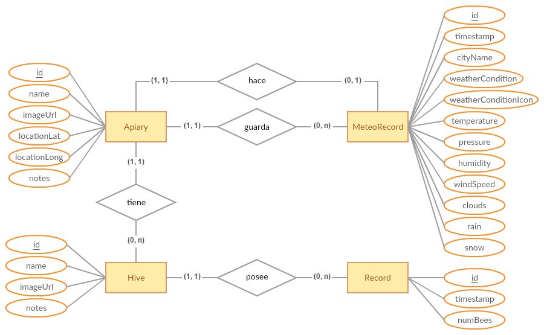

Diagrama Relacional
~~~~~~~~~~~~~~~~~~~

|relational|

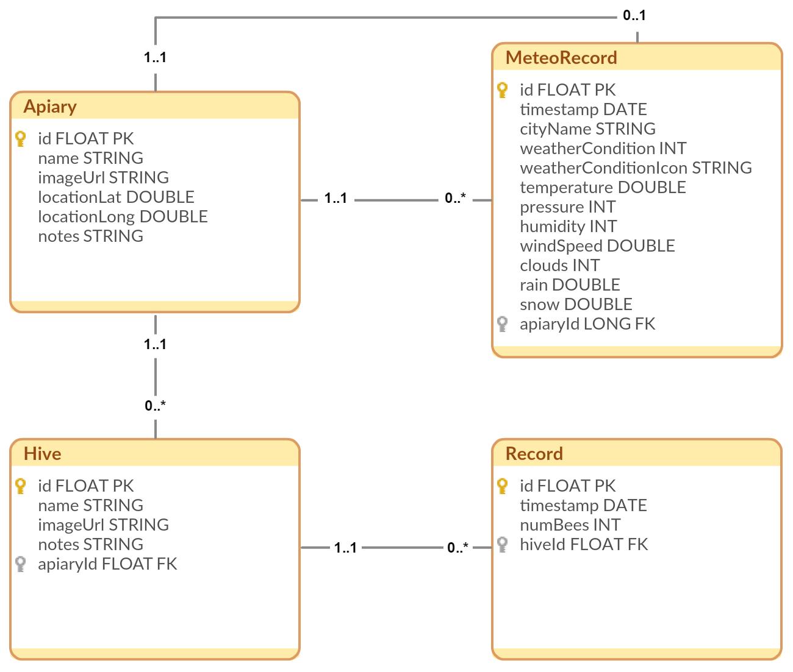

Diseño arquitectónico
---------------------

El hecho de que el proyecto se haya realizado para la plataforma Android
ha condicionado muchas de las decisiones de diseño. Aun así, se han
aplicado una serie de patrones para intentar desacoplar el código lo
máximo posible y así mejorar su testabilidad y mantenibilidad.

Model-View-Presenter (MVP)
~~~~~~~~~~~~~~~~~~~~~~~~~~

Uno de los patrones arquitectónicos que más relevancia está ganando para
el desarrollo de aplicaciones es MVP (*Model-View-Presenter)*. Se trata
de un patrón derivado del MVC (*Model-View-Controler*) cuyo objetivo es
separar la vista del modelo de datos subyacente. MVP introduce la figura
del *presenter* que actúa de mediador entre estas dos capas. Su segundo
objetivo es maximizar la cantidad de código que se puede testear de
forma automática.

MVP divide la aplicación en las siguientes capas:[pattern:mvp]_

-  *Model*: se corresponde únicamente con el acceso a datos. Se encarga
   de almacenar y proporcionar los diferentes datos que maneja la
   aplicación. En nuestra aplicación se corresponde con el Repositorio.

-  *View*: se encarga de la visualización de los datos (del modelo).
   Propaga todas las acciones de usuario al *presenter*. En nuestra
   aplicación se corresponde con los *Fragments*.

-  *Presenter*: enlaza las dos capas anteriores. Sincroniza los datos
   mostrados en la vista con los almacenados en el modelo y actúa ante
   los eventos de usuario propagados por la vista. En nuestra aplicación
   se corresponde con los *Presenters*.

|mvp|

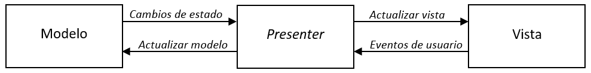

Existen varias variantes sobre cómo implementar MVP en Android. En
nuestro caso, se ha seguido la expuesta Google en Android Architecture
Blueprints [pattern:android_architecture]_. En
ella se realizan las siguientes consideraciones:

-  Se utilizan las *Activity* como controladores globales que se
   encargan de crear y conectar las vistas con los *presenters*.

-  Se utilizan los *Fragment* como vistas ya que proporcionan numerosas
   ventajas cuando se trabaja con múltiples vistas.

Patrón repositorio
~~~~~~~~~~~~~~~~~~

Para la capa del modelo, se ha utilizado el patrón repositorio que
proporciona una abstracción de la implementación del acceso a datos con
el objetivo de que este sea transparente a la lógica de negocio [pattern:repository]_.

En nuestra aplicación existen dos fuentes de datos: por una parte, está
la base de datos local implementada con Realm, y por otra, tenemos la
API remota que nos da acceso a la información meteorológica. Ambas
fuentes son transparentes para los *presenters*.

El repositorio media entre la capa de acceso a datos y la lógica de
negocio de tal forma que no existe ninguna dependencia entre ellas.
Consiguiendo desacoplar, mantener y testear más fácilmente el código y
permitiendo la reutilización del acceso a datos desde cualquier cliente.

|repositorypattern|

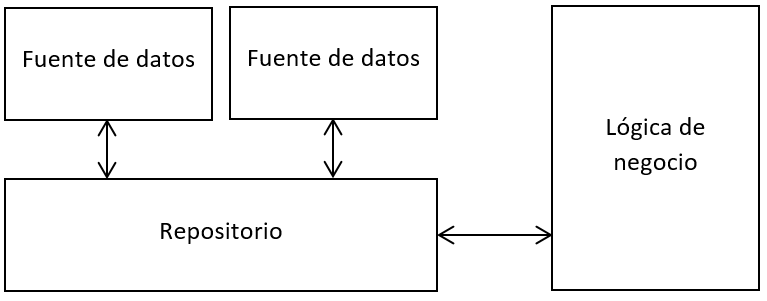

Inyección de dependencias
~~~~~~~~~~~~~~~~~~~~~~~~~

A la hora de testear, es muy frecuente necesitar sustituir la
implementación de una clase por otra “falsa” que se comporte de una
manera predeterminada para conseguir probar la funcionalidad de manera
aislada. En nuestro caso, para facilitar la labor de testeo nos vimos
obligados a sustituir la base de datos Realm por una base de datos en
memoria. Esta sustitución se realizó mediante la inyección de
dependencias.

La inyección de dependencias es un patrón mediante el cual se
proporcionan todas las dependencias que una clase necesita para su
funcionamiento, en lugar de ser la propia clase quien las cree. Al
separar las dependencias de la propia clase, se posibilita la opción de
sustituir estas por dobles con un comportamiento definido [wiki:injection]_.

Para la implementación de la inyección de dependencias se han utilizado
los *build flavors* que proporciona Gradle. Se crearon dos *flavors*:

-  Mock: inyectaba una base de datos en memoria utilizada para el testeo
   de la aplicación.

-  Prod: inyectaba la base de datos Realm utilizada para producción.

Arquitectura general
~~~~~~~~~~~~~~~~~~~~

El resultado de la arquitectura tras aplicar los patrones explicados es
el siguiente:

|architecture|

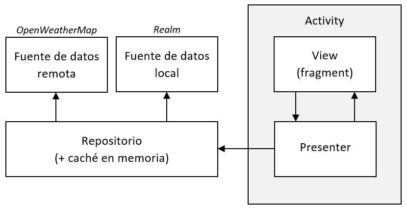

Para agilizar la navegación por la aplicación se implementó una capa de
caché en el repositorio.

Diseño de paquetes
~~~~~~~~~~~~~~~~~~

Para la organización de los diferentes archivos que componen la
aplicación no se utilizó la estrategia convencional de paquete por capa
(*package by layer approach*), sino una estrategia de paquete por
característica (*package per feature approach*).

Siguiendo esta estrategia se agruparon todos los archivos relacionados
cada una de las distintas funcionalidades de la aplicación en un mismo
paquete. De esta manera se mejora notablemente la legibilidad y la
modularización de la aplicación, ya que se puede modificar cada
funcionalidad de forma independiente.

Existen dos paquetes excepcionales que no siguen esta convención:

-  Paquete *data*: agrupa toda la capa de modelo.

-  Paquete *utils*: reúne un conjunto de clases de utilidad generales
   que son utilizadas por varias características.

El diagrama de paquetes es el siguiente:

|packagesdiagram|

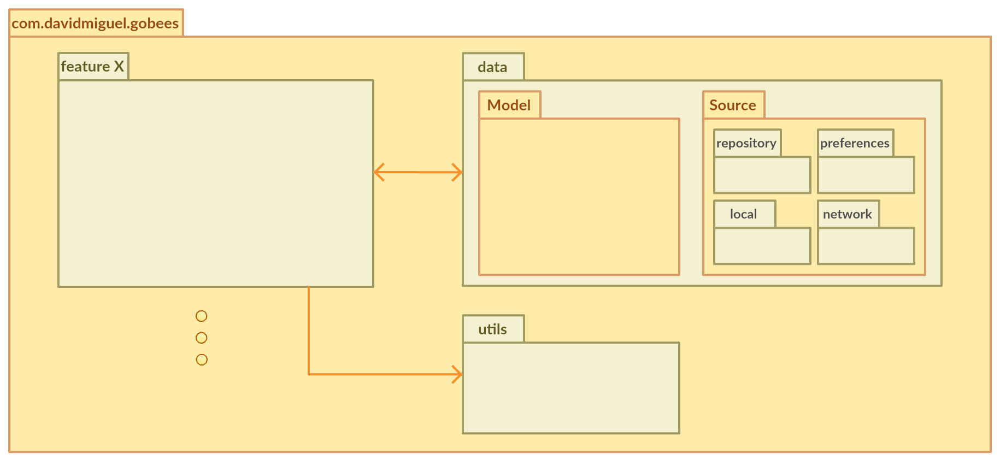

El paquete *feature X* se correspondería con cada paquete de cada
funcionalidad. Se ha representado de esta manera para simplificar el
diagrama.

A continuación, se muestran por separado los paquetes de todas las
funcionalidades:

|packagesfeaturesdiagram|

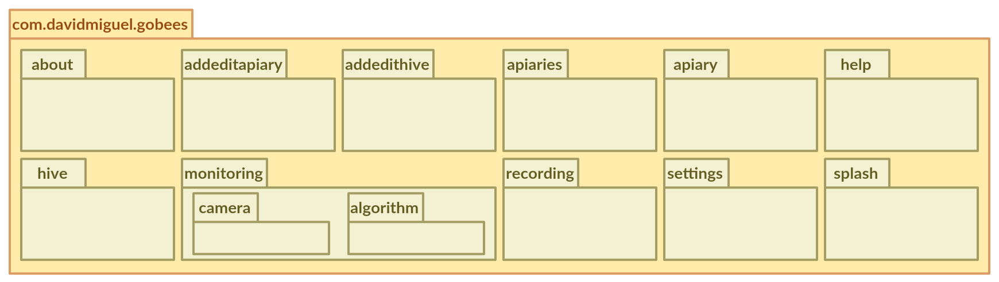

-  **About**: contiene la funcionalidad de “Acerca de” de la aplicación.
   Donde se muestra el autor, licencia, versión de la *app*, sitio web,
   historial de cambio y todas las dependencias junto con sus licencias.

-  **Addeditapiary**: permite añadir o editar colmenares.

-  **Addedithive**: permite añadir o editar colmenas.

-  **Apiaries**: permite listar los colmenares y gestionarlos.

-  **Apiary**: permite listar las colmenas de un colmenar, gestionarlas
   y mostrar la información relativa al colmenar.

-  **Help**: muestra la ayuda de la aplicación.

-  **Hive**: permite listar las grabaciones de una colmena, gestionarlas
   y mostrar la información relativa a la colmena.

-  **Monitoring**: agrupa toda la funcionalidad de monitorización de la
   actividad de vuelo de una colmena, desde la configuración hasta la
   ejecución del algoritmo.

-  **Recording**: permite visualizar los detalles de una determinada
   grabación.

-  **Settings**: permite configurar los distintos parámetros de la
   aplicación.

-  **Splash**: muestra una pantalla de inicio mientras la aplicación
   carga en memoria los recursos necesarios.

Diseño de clases
~~~~~~~~~~~~~~~~

Aplicando MVP, cada característica clave de la aplicación posee los
siguientes componentes:

-  FeatureActivity: funciona como un controlador global que crea la
   vista y el *presenter* y los enlaza.

-  FeatureContract: se trata de una interfaz que establece los
   siguientes contratos:

   -  FeatureContract.View: define la capa *view* para esta
      característica (las únicas funciones que expone a otras capas).

   -  FeatureContract.Presenter: define la interacción entre las capas
      *view* y *presenter*. Describe las acciones que pueden ser
      iniciadas desde la vista.

-  FeatureFragment: implementación concreta de la capa *view*.

-  FeaturePresenter: implementación concreta de la capa *presenter*.
   Escucha las acciones de usuario y actualiza la vista cuando cambia el
   modelo.

|featurepackage|

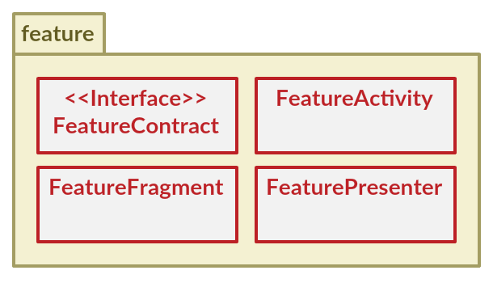

El diagrama de clases general que muestra cómo se relacionan todos los
componentes de una determinada característica es el siguiente:

|generalclassdiagram|

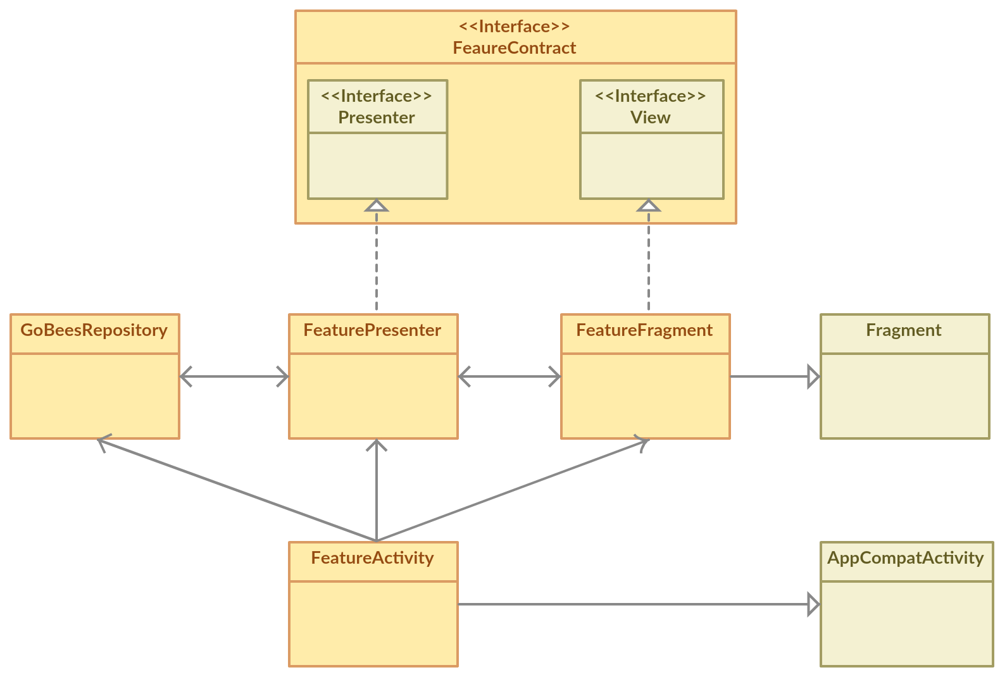

El único paquete que se diferencia de la estructura expuesta es el
paquete *monitoring.* Este integra a su vez toda la lógica de acceso a
la cámara y todas las clases relacionadas con el algoritmo de conteo.

|monitoringpackage|

.. |monitoringpackage| image:: ../../img/monitoring-package.png

El diagrama de clases del paquete cámara es el siguiente:

|cameraclassdiagram|

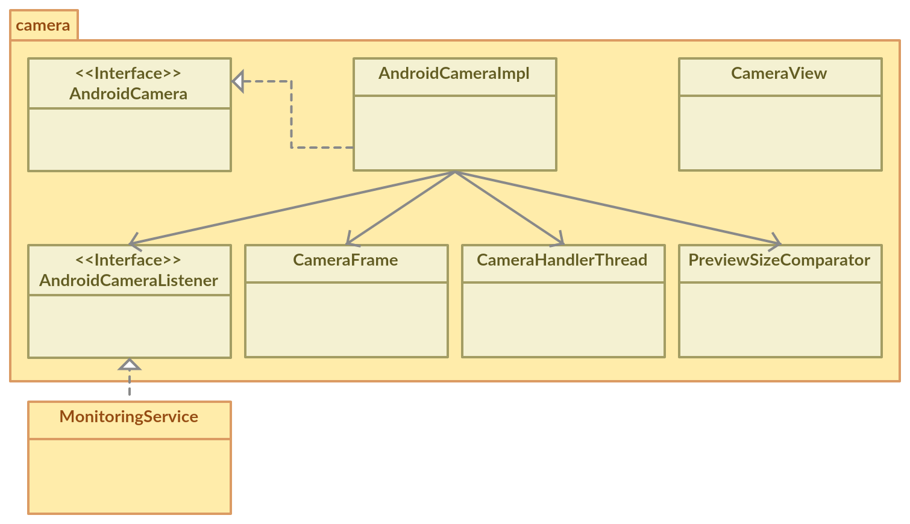

El diagrama de las clases que implementan el algoritmo de conteo es el
siguiente:

|algorithmclassdiagram|

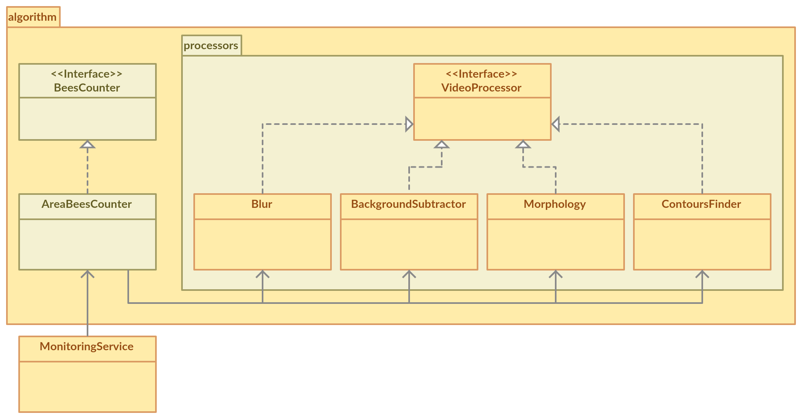

En la parte del acceso a datos, se poseen dos paquetes como se ha visto
en el apartado anterior.

|datapackage|

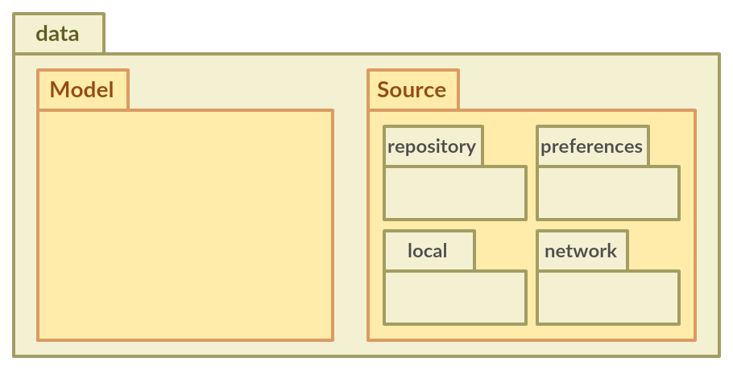

El paquete *model* contiene todas las clases de modelo que se mapean con
la base de datos.

|modelpackage|

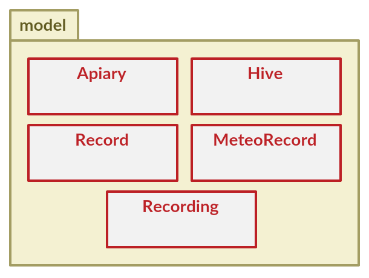

\*La clase Recording se utiliza para agrupar a un conjunto de Records,
pero no se almacena en la base de datos directamente (solo los Records).

Por otro lado, el paquete *source* contiene todas las clases
correspondientes a los accesos de las diferentes fuentes de datos. Su
diagrama de clases es el siguiente:

|sourceclassdiagram|

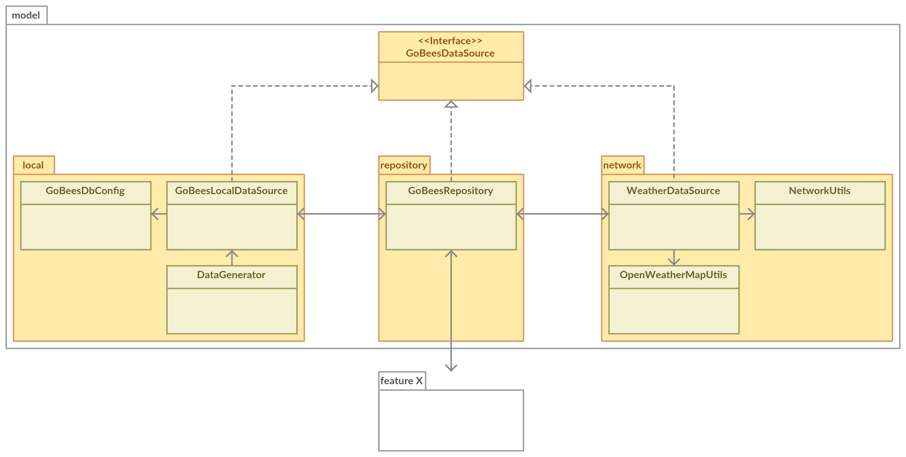

Para conocer a mayor detalle las funciones de cada clase se puede
consultar la documentación JavaDoc de la aplicación.

Diseño procedimental
--------------------

En este apartado se recogen los detalles más relevantes respecto a la
ejecución del algoritmo de monitorización de la actividad de vuelo de
una colmena.

En el siguiente diagrama de secuencia se ha representado como es la
interacción entre los diferentes objetos que se encargan de la
inicialización de la monitorización, la obtención de las imágenes y su
posterior procesado por el algoritmo de conteo.

|algosequencediagram|

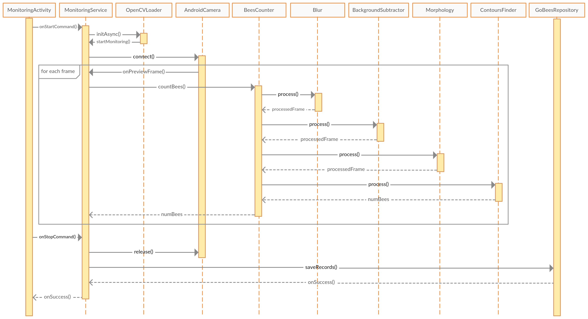

Diseño de interfaces
--------------------

En el diseño de la interfaz se ha seguido la guía de estilos de
*Material Design* [design:material]_ introducida en el Google I/O 2014 
y que se adoptó en Android a partir de la versión 5.0 (*Lollipop*).

En las primeras etapas de proyecto se realizaron una serie de prototipos
en los que se plasmaron las principales funcionalidades de la
aplicación.

|prototipos|

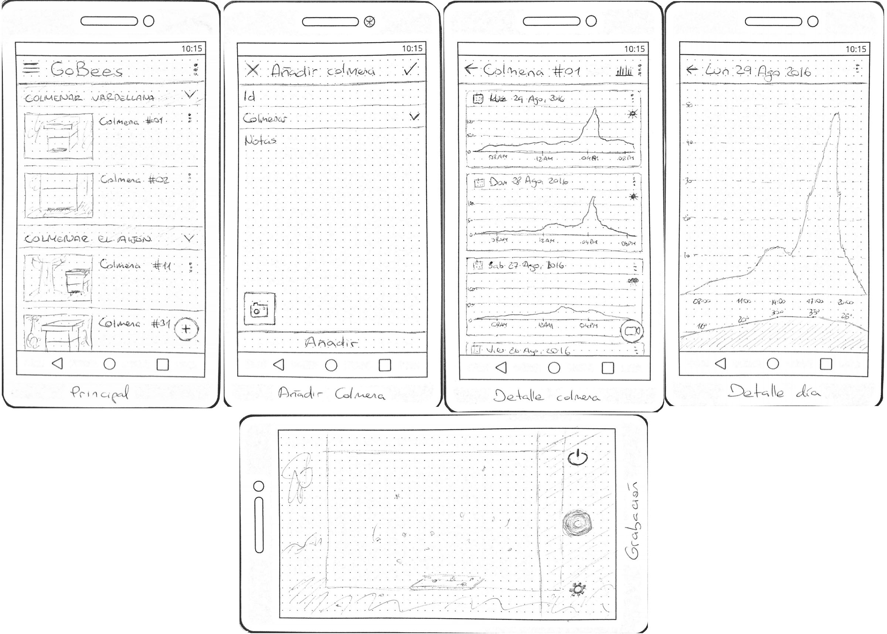

Tras una serie de iteraciones, estos se fueron mejorando hasta obtener
las interfaces con las que cuenta hoy en día la *app*.

|features|

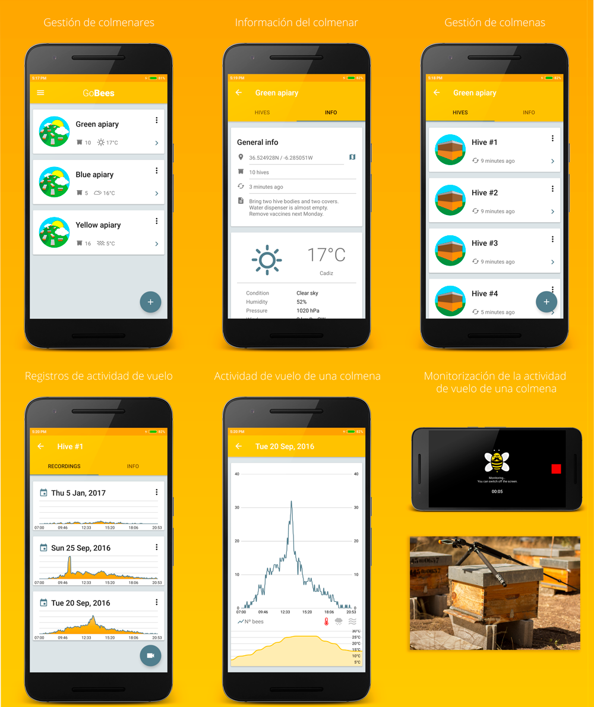

El siguiente diagrama muestra la navegabilidad por la aplicación. Esta
ha sido distribuida de acuerdo al tipo de contenido y a las tareas a
realizar sobre este.

|navegationdiagram|

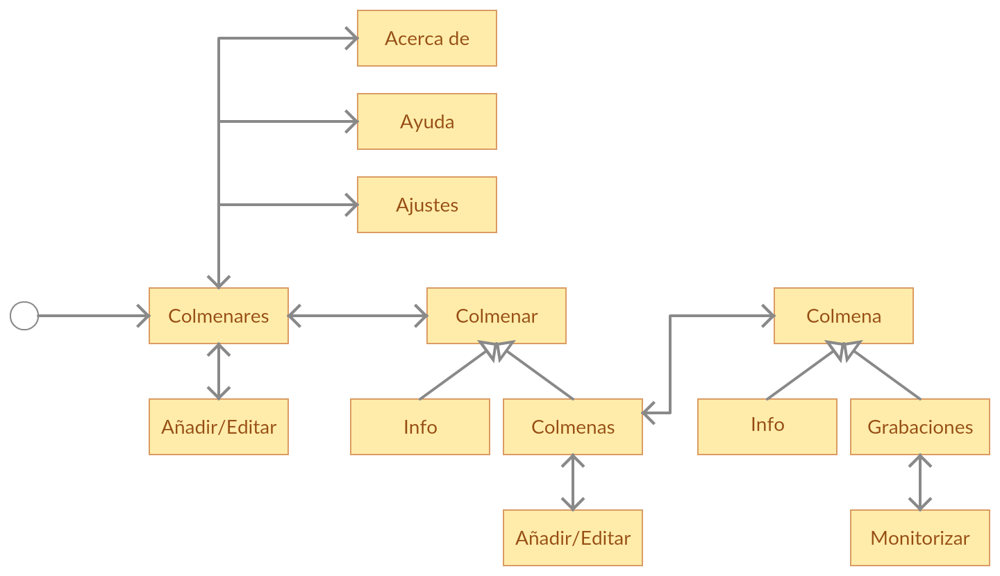

Se ha escogido la paleta de colores entre los recomendados por *Material
Design*. Utilizando como principal un color en la gama de los 500, lo
que denominan un color *material,* y definiendo otro color que contraste
con este para acentuar.

|palette|

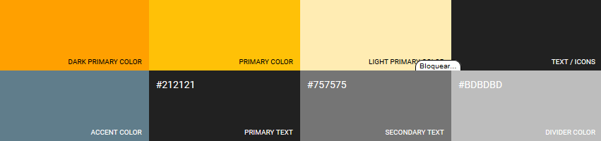

.. References

.. [pattern:mvp]
   https://martinfowler.com/eaaDev/uiArchs.html
.. [pattern:repository]
   https://martinfowler.com/eaaCatalog/repository.html
.. [pattern:android_architecture]
   https://github.com/googlesamples/android-architecture
.. [wiki:injection]
   https://en.wikipedia.org/wiki/Dependency_injection 
.. [design:material]
   https://material.io/guidelines/
   