Manual del programador
======================

Introducción
------------

En este anexo se describe la documentación técnica de programación,
incluyendo la instalación del entorno de desarrollo, la estructura de la
aplicación, su compilación, la configuración de los diferentes servicios
de integración utilizados o las baterías de test realizadas.

Estructura de directorios
-------------------------

El repositorio del proyecto se distribuye de la siguiente manera:

-  ``/``: contiene los ficheros de configuración de Gradle, de los servicios
   de integración continua, el fichero README y la copia de la licencia.

-  ``/app/``: módulo correspondiente a la aplicación.

-  ``/app/src/``: código fuente de la aplicación.

-  ``/app/src/main/``: contiene todas las clases comunes a todos los
   *flavours*.

-  ``/app/src/main/res/``: recursos de la aplicación (*layouts*, menús,
   imágenes, cadenas de texto, etc.).

-  ``/app/src/mock/``: *mock flavour*, utilizado para inyectar componentes
   alternativos durante los test.

-  ``/app/src/prod/``: *prod flavour*, utilizado para inyectar los
   componentes que se utilizan en la versión de producción.

-  ``/app/src/test/``: test unitarios.

-  ``/app/src/testMock/``: test unitarios y de integración que necesitan
   inyectar componentes falsos.

-  ``/app/src/androidTest/``: Android UI test.

-  ``/docs/``: documentación del proyecto.

-  ``/docs/img/``: imágenes utilizadas en la documentación.

-  ``/docs/javadoc/``: documentación *javadoc*.

-  ``/docs/latex/``: documentación en formato LaTeX.

-  ``/docs/rst/``: documentación en formato reStructuredText.

Para saber más sobre la organización de un proyecto Android consultar [android:folders]_.

Manual del programador
----------------------

El siguiente manual tiene como objetivo servir de referencia a futuros
programadores que trabajen en la aplicación. En él se explica cómo
montar el entorno de desarrollo, obtener el código fuente del proyecto,
compilarlo, ejecutarlo, testearlo y exportarlo.

Entorno de desarrollo
~~~~~~~~~~~~~~~~~~~~~

Para trabajar con el proyecto se necesita tener instalados los
siguientes programas y dependencias:

-  Java JDK 7.

-  Android Studio.

-  Git.

-  OpenCV.

A continuación, se indica como instalar y configurar correctamente cada
uno de ellos.

Java JDK 7
^^^^^^^^^^

El lenguaje de programación más popular para realizar aplicaciones
Android es Java. A día de hoy, Android no soporta la versión 8 de Java,
por lo que tenemos que trabajar con la versión 7. Podemos obtener esta
versión desde [java:jdk7]_. Se debe elegir correctamente el sistema 
operativo y la arquitectura del ordenador y posteriormente seguir 
el asistente de instalación.

Android Studio
^^^^^^^^^^^^^^

Android Studio es el IDE oficial para el desarrollo de aplicaciones
Android. Está basado en IntelliJ IDEA de JetBrains. Proporciona soporte
para Gradle, emulador, editor de *layouts*, refactorizaciones
específicas de Android, herramientas Lint para detectar problemas de
rendimiento, uso, compatibilidad de versión, etc.

Se puede obtener desde [android:androidstudio]_. Junto con Android
Studio se instala también el Android SDK y *Android Virtual Device*
(AVD).

|android-studio|

Git
^^^

Para hacer uso del repositorio se necesita tener instalado el gestor de
versiones Git. Este programa nos permitirá clonar el repositorio,
movernos por sus diferentes ramas, etiquetas, etc. Se puede obtener
desde [git:scm]_. Una vez instalado, trabajaremos con Git
Bash.

|git-clone|

OpenCv
^^^^^^

OpenCV es un paquete *Open Source* de visión artificial que contiene más
de 2500 librerías de procesamiento de imágenes y visión artificial,
escritas en C/C++ a bajo/medio nivel.

Para ejecutar OpenCV en un dispositivo Android se necesita tener
instalado la aplicación `OpenCV
Manager <https://play.google.com/store/apps/details?id=org.opencv.engine>`__.
Sin embargo, para el desarrollo de la aplicación también debemos
instalar la versión de escritorio de OpenCV para poder ejecutar los test
de integración del algoritmo en local.

Podemos obtener OpenCV desde la página oficial [opencv:web]_. En
este proyecto hemos utilizado la versión 3.2.

Una vez instalada, tenemos que añadir al *path* de Windows el directorio
donde se encuentran los ejecutables (``opencv/build/java/x64`` o ``x86``).

|opencv-var|

En la página web oficial se puede obtener información más detallada
sobre el proceso de instalación.

Obtención del código fuente
~~~~~~~~~~~~~~~~~~~~~~~~~~~

Para el desarrollo de la aplicación se ha utilizado un repositorio Git
hospedado en GitHub. Para obtener una copia de este hay que proceder de
la siguiente manera:

1. Abrir la terminal Git Bash.

2. Desplazarse al directorio donde se desee copiar el repositorio
   (utilizando el comando ``cd``).

3. Introducir el siguiente comando:  
   ``git clone https://github.com/davidmigloz/go-bees.git``.

4. Se iniciará la descarga del repositorio, cuando finalice se
   dispondrá de una copia completa de este.

|git-clone|

Para conocer el proceso detalladamente consultar [github:clone]_.

Importar proyecto en Android Studio
~~~~~~~~~~~~~~~~~~~~~~~~~~~~~~~~~~~

Una vez obtenido el código fuente de la aplicación, tenemos que
importarlo como proyecto de Android Studio. Para ello, hay que seguir
los siguientes pasos:

1. Abrir Android Studio.

2. Menú ``File > Open…``.

3. Buscamos el directorio donde hemos clonado el repositorio.

4. Dentro del repositorio, seleccionamos el archivo ``build.gradle``.

5. Android Studio detectará que es un proyecto Android y lo importará
   automáticamente.

6. Si alguna característica de las que hace uso la aplicación no se
   encuentra instalada, Android Studio mostrará un mensaje de error con
   un enlace para instalar la característica en cuestión.

|android-studio-import|

Para conocer el proceso detalladamente consultar [android:import]_.

Añadir nuevas características a la aplicación
~~~~~~~~~~~~~~~~~~~~~~~~~~~~~~~~~~~~~~~~~~~~~

Tras importar el proyecto en Android Studio, ya estamos en disposición
de realizar modificaciones de la aplicación.

Para añadir una nueva característica siguiendo la arquitectura MVP, la
convención de paquete por característica y las metodologías TDD y
GitFlow, se deben seguir los siguientes pasos generales.

1.  Crear una nueva rama (*feature branch*) desde la rama *develop*:
    ``git checkout -b export-data develop``.

2.  Crear un nuevo paquete con el nombre de la característica que se
    desea añadir (ej. ``exportdata``).

3.  Crear una interfaz (ej. ``ExportDataContract.java``) que contenga a su
    vez dos interfaces. En una se deben definir las responsabilidades
    del *presenter* y en la otra las de la vista. Hacer *commit*:  
    ``git add -A``
    ``git commit -m “Add export data contract #x”``.

4.  Crear una clase para el *presenter* (ej. ``ExportDataPresenter.java``)
    que implemente su correspondiente interfaz anterior (no añadir
    ninguna lógica todavía). Hacer *commit*.

5.  Crear una clase para la vista (ej. ``ExportDataFragment``) que descienda
    de ``Fragment`` e implemente su correspondiente interfaz anterior (no
    añadir ninguna lógica todavía). Hacer *commit*.

6.  Crear una clase que descienda de ``AppCompatActivity`` (ej.
    ``ExportDataActivity.java``) y que enlace el modelo, el *presenter* y la
    vista. Hacer *commit*.

7.  Crear un test sobre el *presenter* de acuerdo a los requisitos.
    Hacer *commit*.

8.  Ejecutar el test y comprobar que no pasa.

9.  Implementar las clases anteriores hasta conseguir que pasen el test.
    Hacer *commit*.

10. Refactorizar el código para mejorar su calidad. Hacer *commit*.

11. Añadir un *intent* desde donde se quiera acceder a esa
    característica. Hacer *commit*.

12. Una vez que se ha implementado correctamente la característica, se
    debe incorporar a la rama *develop* y sincronizar con GitHub:  
    ``git checkout develop``  
    ``git merge --no-ff export-data``  
    ``git branch -d myfeature``  
    ``git push origin develop``.

Actualizar dependencias
~~~~~~~~~~~~~~~~~~~~~~~

Una tarea de mantenimiento común es la actualización de las dependencias
de la aplicación. Es importante tenerlas actualizadas para evitar
problemas de seguridad o funcionalidad que pudiesen tener en versiones
anteriores.

El proyecto utiliza Gradle como sistemas de construcción automática del
*software*. Una de sus funcionalidades es la gestión de dependencias.
Esta permite al desarrollador definir las dependencias de su aplicación,
sus versiones y los repositorios donde se hospedan y Gradle se encarga
de descargarlas e importarlas al proyecto automáticamente.

Las dependencias se definen en el fichero ``build.gradle`` del módulo de la
aplicación (``go-bees/app/build.gradle``):

|dependences|

Se puede observar que existen tres formas de importar las dependencias,
cada una define con un ámbito de aplicación distinto:

-  ``Compile``: estará disponible para el código de la aplicación.

-  ``testCompile``: estará disponible en los test unitarios de la
   aplicación.

-  ``androidTestCompile``: estará disponible en los test de instrumentación
   de la aplicación.

Para actualizar la versión de una dependencia, solamente hay que
actualizar el número de la versión que figura en la importación.
Posteriormente, se debe sincronizar Gradle (*Sync Project with Gradle
Files*).

Compilar código fuente
~~~~~~~~~~~~~~~~~~~~~~

La compilación del proyecto se realiza mediante la tarea ``build`` de
Gradle. Podemos ejecutarla por línea de comandos (``./gradlew build``) o
mediante la interfaz de Android Studio.

|gradle-build|

Todos los ficheros generados durante la compilación se guardan en la
carpeta ``build`` del proyecto.

Para conocer el proceso detalladamente consultar [android:compilerun]_.

Ejecutar aplicación
~~~~~~~~~~~~~~~~~~~

La aplicación se puede ejecutar en un dispositivo real o en un emulador.

Dispositivo real
^^^^^^^^^^^^^^^^

Para ejecutar la aplicación en un dispositivo real, se debe conectar
este al equipo de desarrollo mediante un cable USB. El equipo debe tener
los *drivers* del dispositivo instalado, sino no lo reconocerá.

Una vez conectado el dispositivo:

1. Presionar el botón *Run*.

2. Si el equipo reconoce el dispositivo se mostrará su nombre debajo de
   “\ *Connected Devices*\ ”.

3. Seleccionar el dispositivo y pulsa *Ok*.

4. Se transferirá el ejecutable de la aplicación y se instalará.

5. Una vez instalada, se podrá utilizar la aplicación desde el
   dispositivo.

Emulador
^^^^^^^^

Un emulador (denominados *Android Virtual Device* - AVD) es una
aplicación que simula el funcionamiento de un dispositivo real Android.
La creación y gestión de los emuladores se hace a través de *AVD
Manager*.

Para ejecutar la aplicación en un emulador:

1. Presionar el botón de Run.

2. Si ya se posee algún emulador instalado, se mostrará en la lista de
   *Android Virtual Devices*.

3. Si no, presionar el botón “\ *Create New Virtual Device*\ ”.

4. Seleccionar las características que se deseen para el emulador y
   pulsa finalizar.

5. Seleccionar el emulador creado y pulsar *Ok*.

6. Se iniciará el emulador y se instalará la aplicación en él.

7. Una vez instalada, se podrá utilizar la aplicación desde el emulador.

Para conocer el proceso detalladamente consultar [android:compilerun]_.

Exportar aplicación
~~~~~~~~~~~~~~~~~~~

Para exportar la aplicación como un fichero ``.apk``:

1. Menú *Build* > *Generate APK*.

2. Se generará un archivo ``apk`` y se guardará en ``build/output/apk``.

Si el ``apk`` que se desea generar es para distribuirlo en Google Play, este
debe estar firmado. Para ello:

1. Menú *Build* > *Generate Signed APK*.

2. Se debe seleccionar el archivo ``.jks`` con la clave e introducir su
   contraseña. Si no se dispone de una clave, se puede generar siguiendo
   el asistente.

3. Se generará un archivo ``apk`` firmado apto para subir al Google Play.

Para conocer el proceso detalladamente consultar [android:compilerun]_.

Servicios de integración continua
~~~~~~~~~~~~~~~~~~~~~~~~~~~~~~~~~

En el repositorio se han integrado varios servicios de integración
continua para detectar fallos en el software lo antes posible,
reduciendo el impacto de estos y aumentando la calidad del código.

A continuación, se describe cada servicio y se indica cómo configurarlo.

TravisCI
^^^^^^^^

TravisCI es una plataforma de integración continua en la nube para
proyectos alojados en GitHub. Permite realizar una *build* del proyecto
y testearla automáticamente cada vez que se realiza un *commit*,
devolviendo un informe con los resultados.

Para integrar Travis en el repositorio hospedado en GitHub se debe crear
una cuenta en su página web y dar permisos de acceso al repositorio. Una
vez asociado el servicio, este se configura mediante el fichero
``travis.yml``.

Las secciones más importantes de este fichero son:

-  ``sudo``: permite definir si el usuario de la máquina virtual tendrá
   privilegios o no.

-  ``language``: permite definir el lenguaje de programación del proyecto.

-  ``jdk``: permite definir la versión del JDK.

-  ``compiler``: permite definir el compilador.

-  ``addons``: permite configurar *plugins* instalados en Travis (como, por
   ejemplo, el *plugin* de SonarQube).

-  ``env``: permite definir variables de entorno.

-  ``android``: permite definir las dependencias Android del proyecto.

-  ``licenses``: permite aceptar las licencias de las dependencias.

-  ``before_install``: en esta sección se pueden definir comandos a
   ejecutar antes de los comandos de la sección install (por ejemplo,
   actualizar la lista de paquetes).

-  ``install``: en esta sección se deben definir aquellos comandos que
   instalen alguna dependencia (en nuestro caso ``python-numpy``, necesaria
   para compilar OpenCV).

-  ``before_script``: en esta sección se pueden definir comandos a ejecutar
   antes de la sección script. En nuestro caso, nos descargamos el
   código fuente de OpenCV y lo compilamos.

-  ``script``: en esta sección se realiza la compilación del proyecto y se
   ejecutan los diferentes test unitarios y de integración. Además,
   lanza un emulador y ejecuta los test de interfaz. También ejecuta el
   motor de chequeo de SonarQube.

-  ``after_success``: esta sección se utiliza para recolectar datos
   generados en las secciones anteriores. En nuestro caso, se envían los
   diferentes informes de ejecución de los test a el servicio Codecov.

-  ``cache``: permite definir los directorios a cachear entre ejecuciones.

Los *log* de ejecución de Travis son accesibles desde [travis:gobees]_.

|travis|

Para saber más, acceder a su documentación [travis:doc]_.

Codecov
^^^^^^^

Codecov es una herramienta que permite medir el porcentaje de código que
está cubierto por un test. Además, realiza representaciones visuales de
la cobertura y gráficos de su evolución.

La forma de integrarlo en el repositorio es idéntica a cómo se hizo con
Travis. Adicionalmente, hay que configurar el *script* que ejecuta
Travis para que al finalizar su ejecución envíe los resultados a
Codecov.

``after_success:  bash <(curl -s https://codecov.io/bash)``

La configuración de Codecov se define en el archivo ``codecov.yml``.

|codecov|

Para saber más, acceder a su documentación [codecov:doc]_.

CodeClimate
^^^^^^^^^^^

Codeclimate es una herramienta que realiza revisiones de código
automáticamente.

La integración se realiza de forma similar a Travis. Su fichero de
configuración es ``.codeclimate.yml``.

En nuestro proyecto hemos activado los siguientes motores de chequeo:
*checkstyle*, *fixme*, *markdownlint* y *pmd*.

CodeClimate utiliza el sistema de puntación GPA (*Grade Point Average*)
para indicar el rendimiento general del proyecto. La nota máxima se
corresponde con un 4.0.

Los resultados de los chequeos se encuentran disponibles en [codeclimate:gobees]_.

|codeclimate|

Para saber más, acceder a su documentación [codeclimate:doc]_.

SonarQube es una plataforma de código abierto para la revisión continua
de la calidad de código. Permite detectar código duplicado, violaciones
de estándares, cobertura de test unitarios, *bugs* potenciales, etc.

Para integrar el servicio hay que seguir los siguientes pasos:

1. Crear una cuenta en `www.sonarqube.com <http://www.sonarqube.com>`__.

2. Generar un *token* de autenticación.

3. Instalar el plugin de SonarQube para Gradle (``org.sonarqube``).

4. Configurar SonarQube en el fichero de configuración de Gradle
   (``build.gradle``).

5. Ejecutar la nueva tarea sonarqube de Gradle desde Travis.

|sonarqube-config|

Los resultados de los análisis son accesibles desde [sonarqube:gobees]_.

|sonarqube|

Para saber más, acceder a su documentación [sonarqube:doc]_.

VersionEye
^^^^^^^^^^

VersionEye es una herramienta que monitoriza las dependencias del
proyecto y envía notificaciones cuando alguna de estas está
desactualizada, es vulnerable o viola la licencia del proyecto.

El servicio se integra de forma similar a Travis. No necesita fichero de
configuración.

Cuando se libera una nueva versión de alguna dependencia o se publica
alguna vulnerabilidad, VersionEye manda una notificación. Se puede
acceder a los informes desde [versioneye:gobees]_.

|versioneye|

Para saber más, acceder a su documentación [versioneye:doc]_.

Read the Docs
^^^^^^^^^^^^^

Read the Docs es un servicio de documentación continua que permite crear
y hospedar una página web generada a partir de los distintos ficheros
Markdown o reStructuredText de la documentación. Cada vez que se realiza
un *commit* en el repositorio se actualiza la versión hospedada.

Se integra en el repositorio de la misma manera que Travis. Y se
configura mediante el archivo ``conf.py`` ubicado en ``go-bees/docs/rst``.

Actualmente, se encuentra configurado para generar una sección en la
página web por cada archivo reStructuredText que encuentre dentro del
directorio ``rst``.

|readthedocs|

Para saber más, acceder a su documentación [readthedocs:doc]_.

Pruebas del sistema
-------------------

Para verificar el funcionamiento de cada uno de los módulos de la
aplicación, su integración y la interacción con estos desde la interfaz,
se han desarrollado una serie de baterías de test.

Test unitarios
~~~~~~~~~~~~~~

Los test unitarios comprueban la funcionalidad de un único módulo
trabajando de forma aislada. Para su escritura se han utilizado las
dependencias jUnit y Mockito.

JUnit es un *framework* de Java utilizado para realizar pruebas
unitarias. Mockito es un *framework* de *mocking* que permite crear
objetos *mock* fácilmente. Estos objetos simulan parte del
comportamiento de una clase. De esta manera, podemos aislar el módulo a
testear para que los módulos de los que depende no interfieran en los
resultados del test.

Se han escrito 120 test unitarios que testean 30 clases distintas. Se
han testeado en su mayoría los *presenters* que son los que poseen la
lógica de la aplicación y no tienen ninguna dependencia al *framework*
de Android. Lo que permite ejecutarlos sin necesidad de lanzar un
emulador.

|unit-test|

Ejecución de los test unitarios
^^^^^^^^^^^^^^^^^^^^^^^^^^^^^^^

Los test unitarios se ejecutan automáticamente en Travis cada vez que se
realiza un *commit* y se hace un *push* a GitHub. Pero también se pueden
ejecutar en local. Para ello:

1. Seleccionar el *Build Variants* ``mockDebug``.

2. Seleccionar como tipo de vista Android.

3. Pulsar botón derecho en el paquete ``test`` > *Run test in go-bees.*

4. Se ejecutarán todos los test y se obtendrá un informe de resultados.

|run-unit-test|

Test del algoritmo
~~~~~~~~~~~~~~~~~~

Para testear el algoritmo se han escrito varios test unitarios que
prueban cada uno de sus módulos y un test de integración
(``AreaBeesCounterTest.java``) que lo testea en su totalidad contra tres
conjuntos de fotogramas etiquetados manualmente. De esta manera, se
obtiene el error que comete el algoritmo en cada caso y se compara con
unos límites prefijados. Si por alguna modificación accidental el error
supera el límite el test falla.

Ejecución del test del algoritmo
^^^^^^^^^^^^^^^^^^^^^^^^^^^^^^^^

El test de integración se ejecuta automáticamente en Travis junto con
los test unitarios. También puede ser ejecutado en local, pero es
imprescindible tener instalado OpenCV en el equipo. Los pasos a seguir
son:

1. Seleccionar el *Build Variants* ``mockDebug``.

2. Seleccionar como tipo de vista Android.

3. Pulsar botón derecho en el paquete ``testMock`` > *Run test in go-bees.*

4. Se ejecutará el test y se obtendrá un informe de resultados.

|algo-test|

Etiquetado de nuevos conjuntos de fotogramas
^^^^^^^^^^^^^^^^^^^^^^^^^^^^^^^^^^^^^^^^^^^^

Para etiquetar videos manualmente se ha desarrollado una aplicación en
Java que facilita esta labor. La aplicación va mostrando cada fotograma
y el usuario solo tiene que pinchar encima de cada abeja existente.
Finalmente, la aplicación permite exportar los datos en un archivo ``CSV``
con el formato que utiliza el test del algoritmo.

Los pasos a seguir son:

1. Ejecutar la aplicación (Disponible en [github:extraapps]_).

2. Abrir el directorio que posee los fotogramas.

3. Marcar las abejas presentes en cada fotograma con el ratón. La
   aplicación mostrará el número del fotograma y el número de abejas
   marcadas.

4. Al finalizar, seleccionar guardar. La aplicación exportará los datos
   en un archivo ``CSV``.

|countingplatform|

Testeo de la parametrización del algoritmo
^^^^^^^^^^^^^^^^^^^^^^^^^^^^^^^^^^^^^^^^^^

Para desarrollar el algoritmo y parametrizarlo de forma óptima, se
desarrolló una aplicación Java que permite modificar los diferentes
parámetros de cada fase en tiempo real y calcular sus tiempos de
cómputo.

Si se desea probar nuevas parametrizaciones:

1. Ejecutar la aplicación (Disponible en [github:extraapps]_. Es
   necesario tener instalado OpenCV en el equipo).

2. Seleccionar un archivo de vídeo de prueba.

3. En la ventana izquierda se visualiza la entrada del algoritmo y a la
   derecha existe una pestaña por cada fase de este.

4. En cada pestaña, a parte de la salida del algoritmo para esa fase, se
   poseen una serie de controles para parametrizar el algoritmo.

5. En la parte inferior izquierda se muestra los fotogramas por segundo
   que se están procesando. En la parte central el tiempo total de
   procesado. Y en la parte derecha, el tiempo parcial de la fase en
   cuestión.

|devplatform|

Test de interfaz
~~~~~~~~~~~~~~~~

Por último, se han desarrollado 17 test de interfaz que testean cada uno
de los requisitos de la aplicación, a excepción del requisito de
monitorización que no fue posible testearlo en un emulador (no se puede
utilizar como *feed* de la cámara de un emulador un archivo de vídeo).

Para desarrollar los test se ha utilizado Espresso, un *framework* de
*testing* para Android que provee una API para escribir UI test que
simulen las interacciones de usuario con la app.

En la siguiente tabla se relaciona cada test con el requisito que
comprueba.

+--------------------------------+---------------------------------------+
| Test                           | Requisito                             |
+================================+=======================================+
| ``AddApiaryTest.java``         | RF-1.1 Añadir colmenar                |
+--------------------------------+---------------------------------------+
| ``EditApiaryTest.java``        | RF-1.2 Editar colmenar                |
+--------------------------------+---------------------------------------+
| ``DeleteApiaryTest.java``      | RF-1.3 Eliminar colmenar              |
+--------------------------------+---------------------------------------+
| ``ListApiariesTest.java``      | RF-1.4 Listar colmenares              |
+--------------------------------+---------------------------------------+
| ``ViewApiaryTest.java``        | RF-1.5 Ver colmenar                   |
+--------------------------------+---------------------------------------+
| ``AddHiveTest.java``           | RF-2.1 Añadir colmena                 |
+--------------------------------+---------------------------------------+
| ``EditHiveTest.java``          | RF-2.2 Editar colmena                 |
+--------------------------------+---------------------------------------+
| ``DeleteHiveTest.java``        | RF-2.3 Eliminar colmena               |
+--------------------------------+---------------------------------------+
| ``ListHivesTest.java``         | RF-2.4 Listar colmenas                |
+--------------------------------+---------------------------------------+
| ``ViewHiveTest.java``          | RF-2.5 Ver colmena                    |
+--------------------------------+---------------------------------------+
| ``AddRecordingTest.java``      | RF-3.1 Añadir grabación               |
+--------------------------------+---------------------------------------+
| ``DeleteRecordingTest.java``   | RF-3.2 Eliminar grabación             |
+--------------------------------+---------------------------------------+
| ``ListRecordingsTest.java``    | RF-3.3 Listar grabaciones             |
+--------------------------------+---------------------------------------+
| ``ViewRecordingTest.java``     | RF-3.4 Ver grabación                  |
+--------------------------------+---------------------------------------+
| ``SettingsTest.java``          | RF-5 Configuración de la aplicación   |
+--------------------------------+---------------------------------------+
| ``HelpTest.java``              | RF-6 Ayuda de la aplicación           |
+--------------------------------+---------------------------------------+
| ``AboutTest.java``             | RF-7 Información de la aplicación     |
+--------------------------------+---------------------------------------+

Ejecución de los test de interfaz
^^^^^^^^^^^^^^^^^^^^^^^^^^^^^^^^^

Para ejecutar los test de interfaz es imprescindible contar con un
dispositivo físico o un emulador. Una vez conectado, se siguen los
siguientes pasos:

1. Seleccionar el *Build Variants* ``mockDebug``.

2. Seleccionar como tipo de vista Android.

3. Pulsar botón derecho en el paquete ``androidTest`` > *Run test in
   go-bees.*

4. Se ejecutarán cada uno de los test en el dispositivo (Android Studio
   instala una aplicación adicional que instrumenta a la aplicación a
   testear).

5. Al finalizar, se obtiene un informe con los resultados.

.. Images

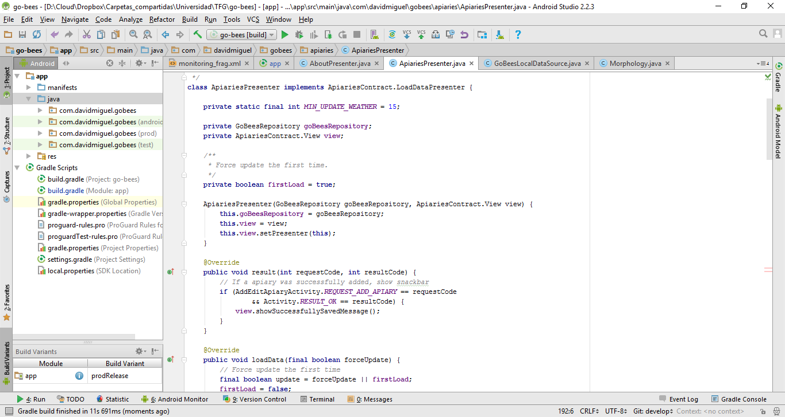
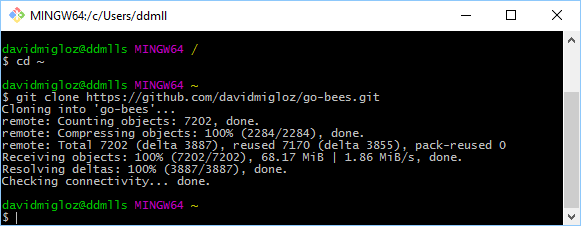
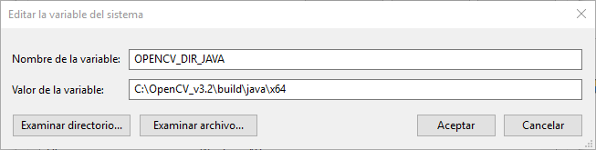
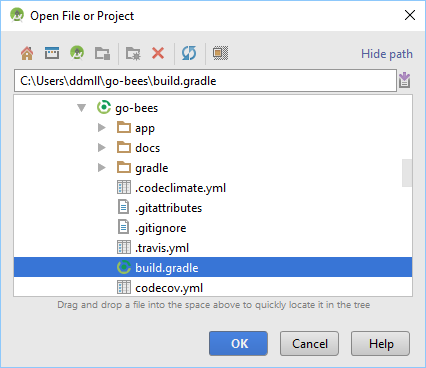
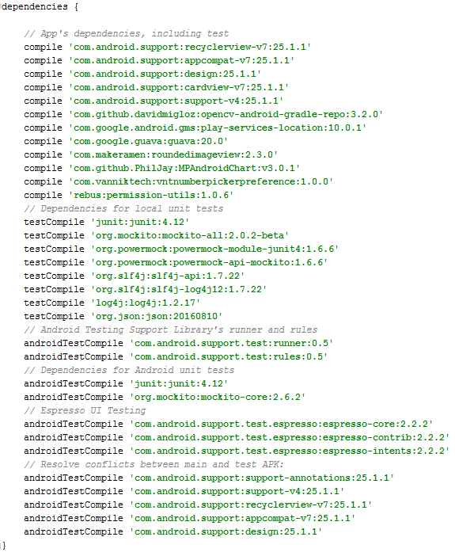
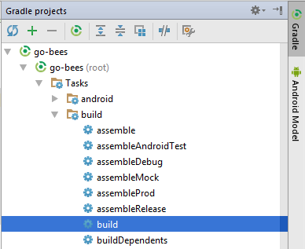
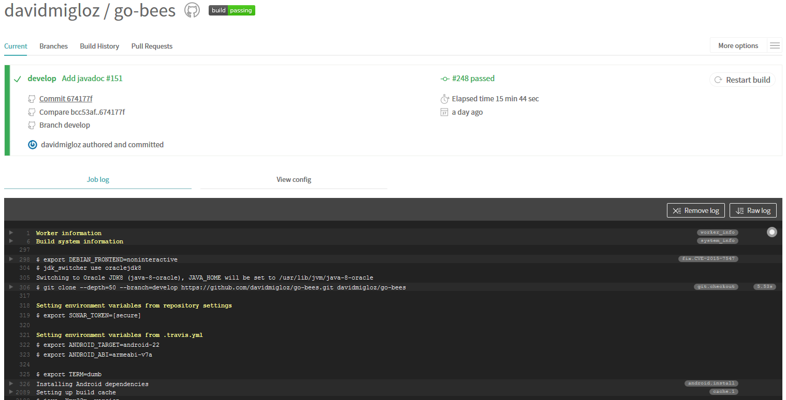
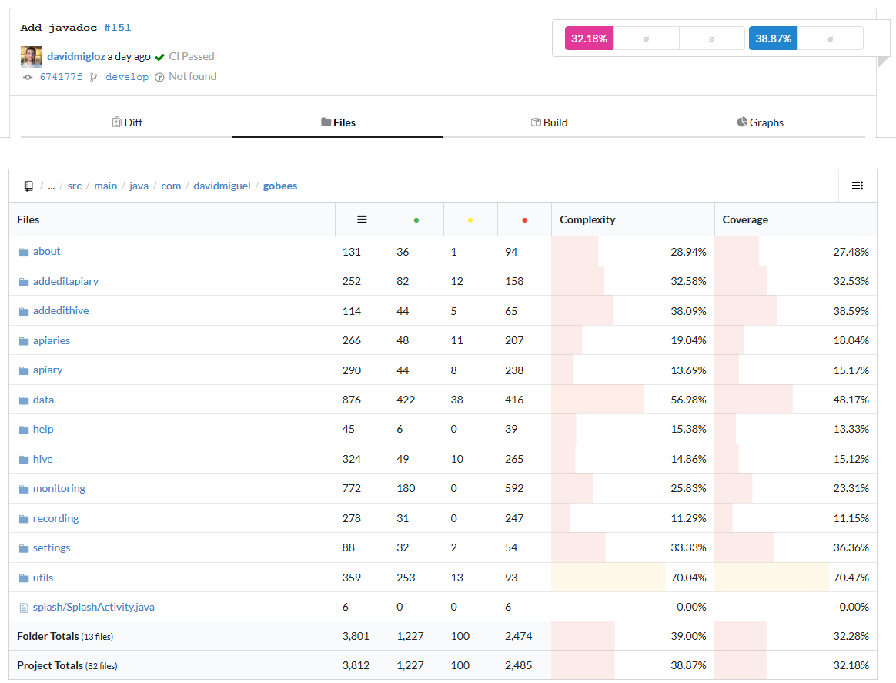
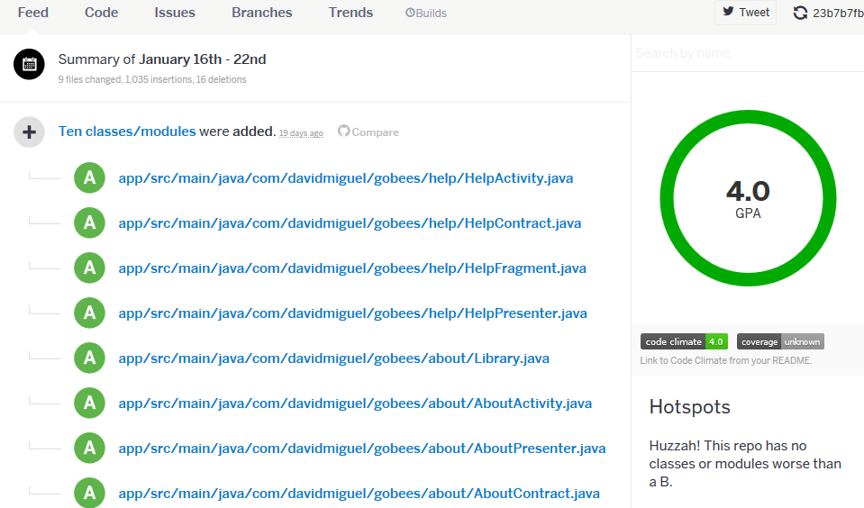
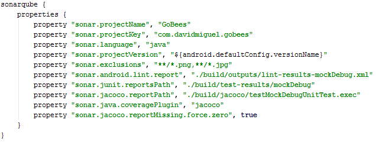
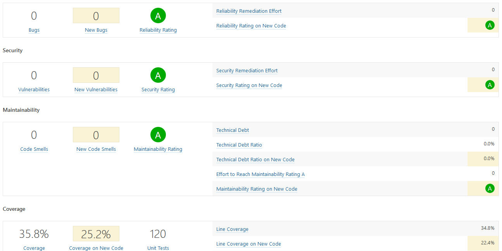
.. |versioneye| image:: ../../img/versioneye.png
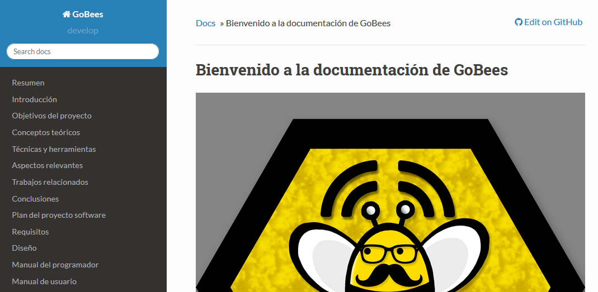
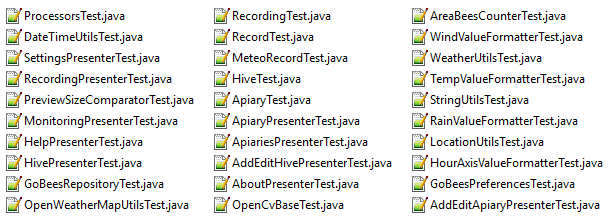
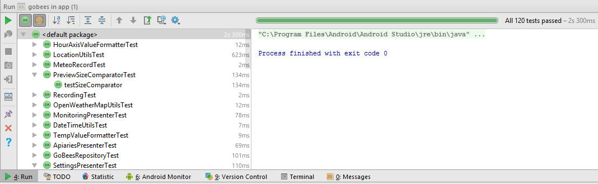
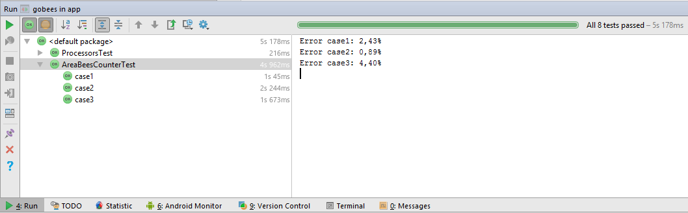
.. |countingplatform| image:: ../../img/counting_platform.png
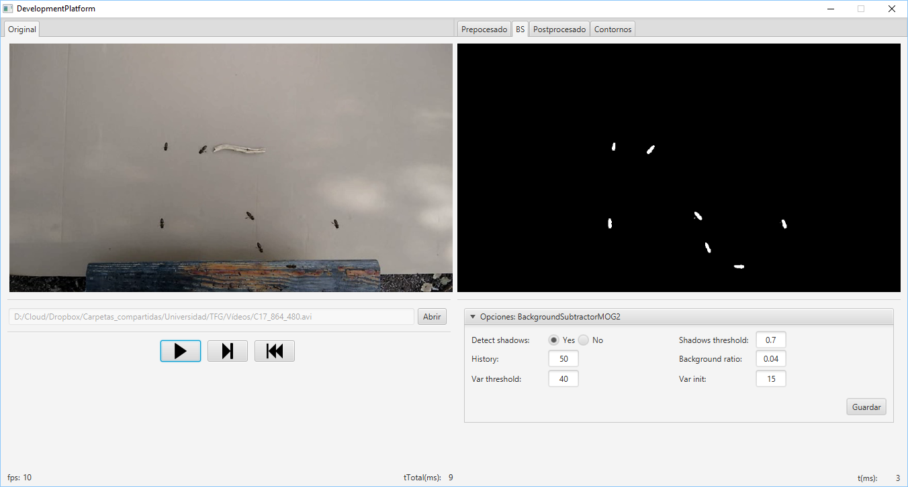
   
.. References

.. [android:folders]
   https://developer.android.com/studio/projects/index.html?hl=es
.. [java:jdk7]
   http://www.oracle.com/technetwork/es/java/javase/downloads/jdk7-downloads-1880260.html
.. [android:androidstudio]
   https://developer.android.com/studio/index.html?hl=es
.. [git:scm]
   https://git-scm.com/
.. [opencv:web]
   http://opencv.org/
.. [github:clone]
   https://help.github.com/articles/cloning-a-repository/ 
.. [android:import]
   https://www.jetbrains.com/help/idea/2016.3/importing-an-existing-android-project.html
.. [android:compilerun]
   https://developer.android.com/studio/run/index.html?hl=es-419
.. [travis:gobees]
   https://travis-ci.org/davidmigloz/go-bees   
.. [travis:doc]
   https://docs.travis-ci.com/
.. [codecov:doc]
   https://docs.codecov.io/
.. [codeclimate:gobees]
   https://codeclimate.com/github/davidmigloz/go-bees
.. [codeclimate:doc]
   https://docs.codeclimate.com/
.. [sonarqube:gobees]
   https://sonarqube.com/dashboard?id=go-bees
.. [sonarqube:doc]
   https://docs.sonarqube.org/
.. [versioneye:gobees]
   https://www.versioneye.com/user/projects/57f7b19e823b88004e06ad33
.. [versioneye:doc]
   https://www.versioneye.com/documentation
.. [readthedocs:doc]
   http://docs.readthedocs.io/en/latest/
.. [github:extraapps]
   https://github.com/davidmigloz/go-bees-prototypes/releases