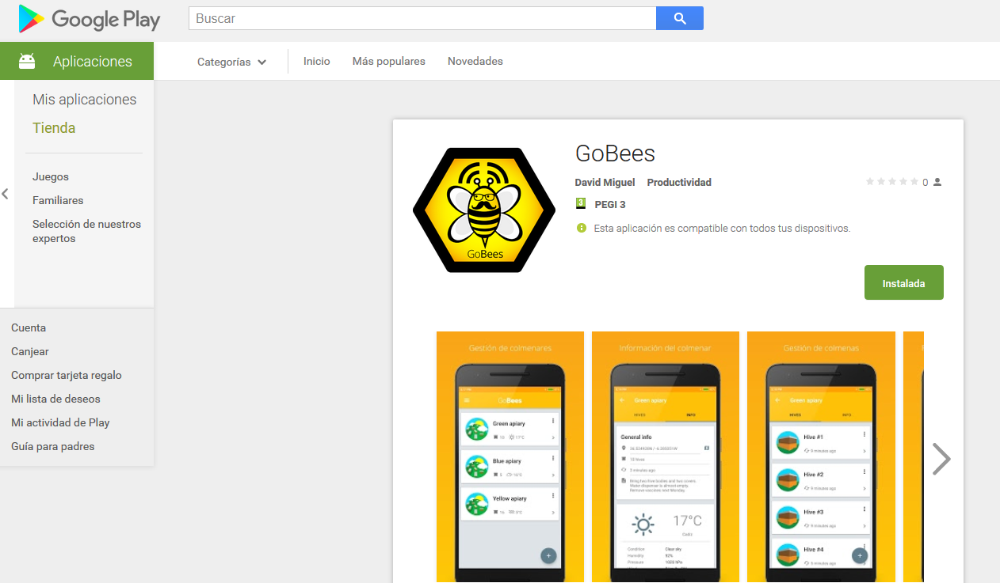
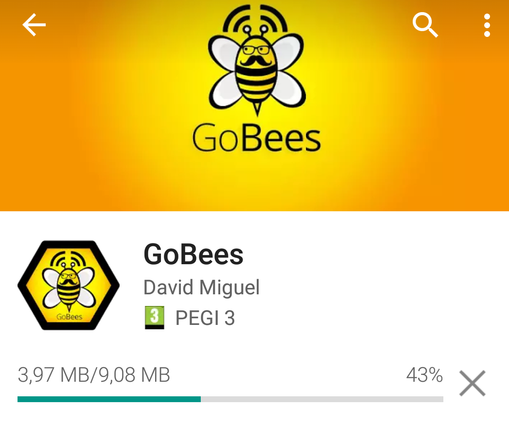
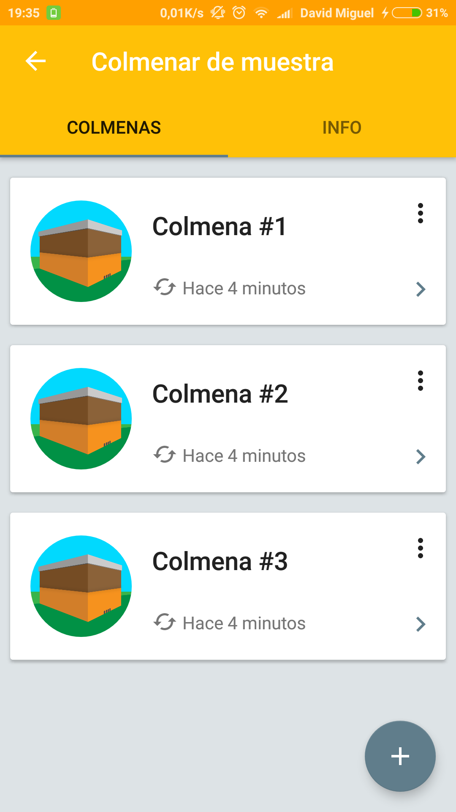
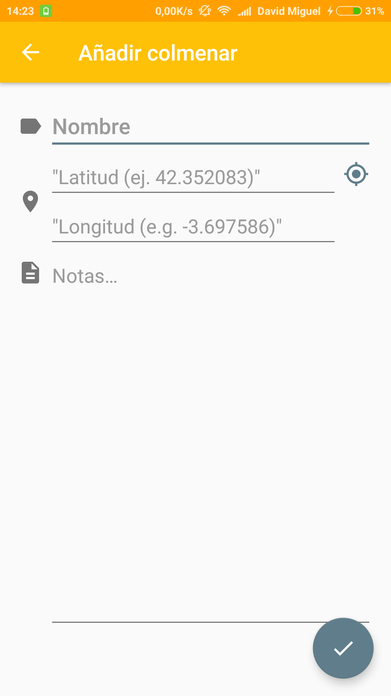
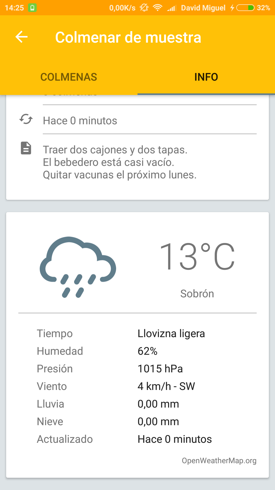
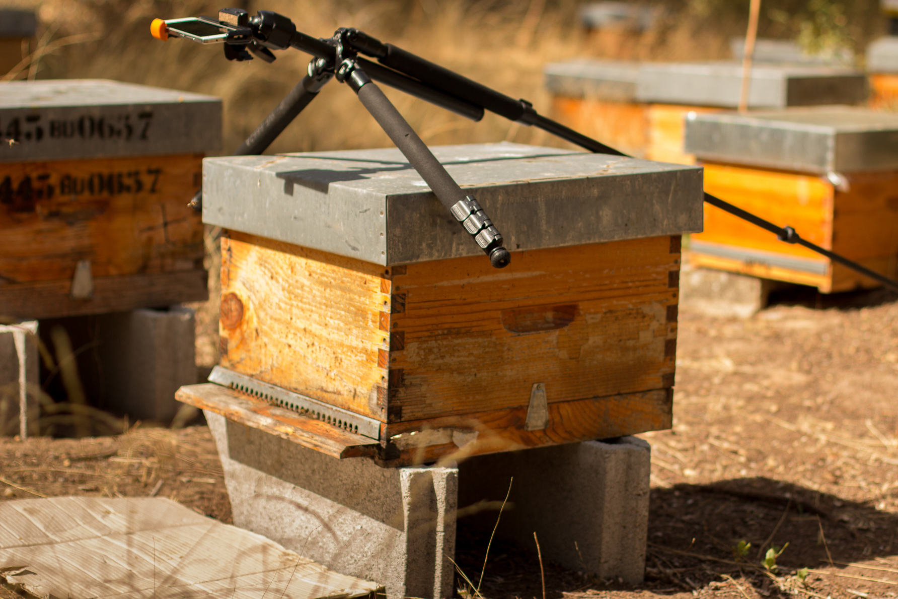
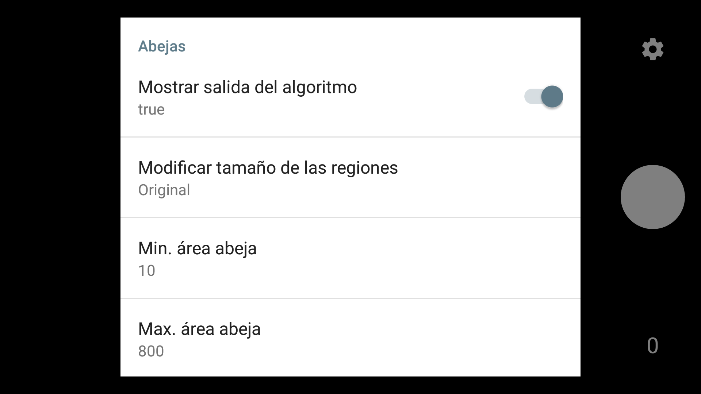
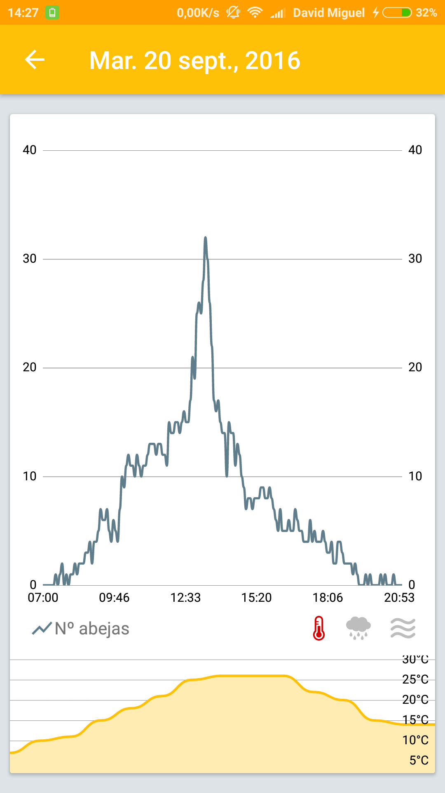
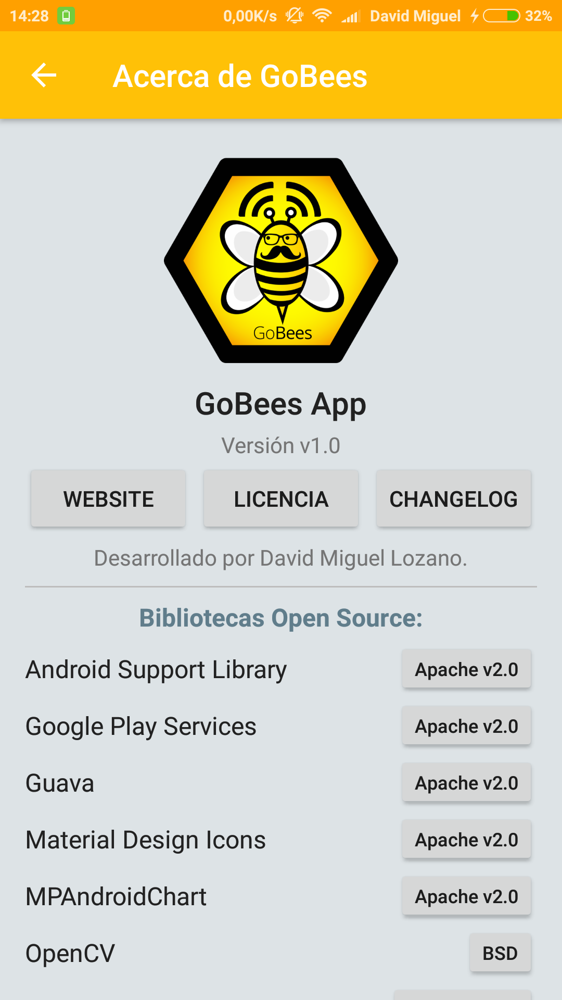

Manual de usuario
=================

Introducción
------------

En este manual se detallan los requerimientos de la aplicación, cómo
instalarla en un dispositivo Android e indicaciones sobre cómo
utilizarla correctamente. Todos los procedimientos aquí descritos se
encuentran también disponibles en formato video.

Requisitos de usuarios
----------------------

Los requisitos mínimos para poder hacer uso de la aplicación son:

-  Contar con un dispositivo que posea Android 4.4 (*KitKat* – API 19) o
   superior.

-  Para utilizar la característica de monitorización de la actividad, es
   necesario tener instalada la aplicación OpenCV Manager.
   https://play.google.com/store/apps/details?id=org.opencv.engine

-  También se necesita contar con permiso para acceder a la cámara del
   dispositivo.

-  Si se desea localizar los colmenares mediante GPS, es necesario
   contar con un dispositivo que lo soporte y conceder el permiso de
   localización a la aplicación.

-  Para acceder a la información meteorológica se requiere conexión a
   internet.

Instalación
-----------

La instalación se puede realizar de dos maneras: a través de Google Play
o instalando directamente el ejecutable de la aplicación en nuestro
dispositivo.

Desde Google Play
~~~~~~~~~~~~~~~~~

Google Play es una plataforma de distribución digital de aplicaciones
móviles para los dispositivos Android. GoBees se distribuye por esta
plataforma desde su versión 1.0.

|google-play|

Video-tutorial: http://gobees.io/help/videos/instalacion-google-play

Para instalar la aplicación debemos realizar los siguientes pasos:

1. Acceder a la aplicación Google Play.

2. Buscar el término “GoBees”.

3. Entrar en la sección correspondiente a la aplicación.

4. Pulsar el botón instalar.

5. Cuando la instalación haya finalizado, pulsar sobre el botón abrir.

6. La instalación habrá finalizado y la aplicación estará lista para su
   uso.

|install|

Desde fichero ejecutable
~~~~~~~~~~~~~~~~~~~~~~~~

La otra opción, es realizar la instalación directamente desde el fichero
ejecutable de la aplicación. Estos ficheros poseen la extensión ``.apk``.
Podemos conseguir la última versión del ``.apk`` de GoBees en el siguiente
enlace:

https://github.com/davidmigloz/go-bees/releases

Video-tutorial: http://gobees.io/help/videos/instalacion-apk

Una vez descargado, tenemos que seguir los siguientes pasos:

1. En primer lugar, hay que permitir la instalación de “aplicaciones con
   orígenes desconocidos”. Para ello:

   a. Ir a ajustes del dispositivo.

   b. Seguridad (o Privacidad).

   c. Activar “Orígenes desconocidos”.

2. Ejecutar el fichero descargado.

3. Pulsar el botón instalar.

4. Cuando la instalación haya finalizado, pulsar sobre el botón abrir.

5. La instalación habrá finalizado y la aplicación estará lista para su
   uso.

Manual de usuario
-----------------

En esta sección se describe el uso de las diferentes funcionalidades de
la aplicación.

Generar datos de muestra
~~~~~~~~~~~~~~~~~~~~~~~~

Una de las mejores maneras de aprender a utilizar una aplicación es
indagando en ella. GoBees permite generar un colmenar de prueba, de tal
manera, que podemos explorar las diferentes secciones con datos reales.

Video-tutorial: http://gobees.io/help/videos/generar-colmenar-prueba

Para generar los datos de prueba:

1. Pulsar el botón menú.

2. Entrar en la sección “Ajustes”.

3. Seleccionar la opción “Generar datos de muestra”.

4. Se generará un colmenar con tres colmenas y tres grabaciones por
   colmena.

|sample-apiary|

Añadir un colmenar
~~~~~~~~~~~~~~~~~~

Un colmenar hace referencia al lugar o recinto donde se poseen un
conjunto de colmenas. Un colmenar posee un nombre, una localización y
unas notas.

Video-tutorial: http://gobees.io/help/videos/anadir-colmenar

Para añadir un nuevo colmenar:

1. Desde la pantalla principal.

2. Pulsar el botón “+”.

3. Definir el nombre del colmenar (obligatorio).

4. Definir la localización del colmenar (opcional).

   a. Se pueden introducir manualmente las coordenadas, indicando la
      latitud y la longitud en el sistema de coordenadas geográficas.

   b. Alternativamente, se puede obtener la localización actual
      automáticamente pulsando el botón situado en la parte derecha (se
      necesitan permisos de localización para utilizar esta
      característica).

5. Definir unas notas sobre el colmenar (opcional). En las notas se
   puede apuntar cualquier cosa relacionada con el colmenar en general.

6. Pulsar el botón ✓ para guardar el nuevo colmenar.

|add-apiary|

Editar un colmenar
~~~~~~~~~~~~~~~~~~

Los detalles de un colmenar se pueden editar en cualquier momento.

Video-tutorial: http://gobees.io/help/videos/editar-colmenar

Para editar un colmenar existente:

1. Desde la pantalla principal.

2. Pulsar el botón de menú asociado al colmenar a editar (tres puntos
   verticales situados en la esquina superior derecha).

3. Seleccionar la opción de editar.

4. Se abrirá la pantalla de edición, donde se podrán modificar los datos
   que se deseen.

5. Pulsar el botón ✓ para actualizar los datos editados.

Eliminar un colmenar
~~~~~~~~~~~~~~~~~~~~

Al eliminar un colmenar, se eliminan también todos los datos asociados a
este (información del colmenar, colmenas, grabaciones e información
meteorológica).

Video-tutorial: http://gobees.io/help/videos/eliminar-colmenar

Para eliminar un colmenar existente:

1. Desde la pantalla principal.

2. Pulsar el botón de menú asociado al colmenar a eliminar (tres puntos
   verticales situados en la esquina superior derecha).

3. Seleccionar la opción de eliminar.

4. El colmenar se eliminará junto con toda su información.

Consultar la información meteorológica de un colmenar
~~~~~~~~~~~~~~~~~~~~~~~~~~~~~~~~~~~~~~~~~~~~~~~~~~~~~

Para poder consultar la información meteorológica de un colmenar se
necesita que este posea una localización y que el dispositivo esté
conectado a internet. Si se cumplen estos dos requisitos, la información
meteorológica del colmenar se actualizará automáticamente de forma
periódica.

Video-tutorial:
http://gobees.io/help/videos/consultar-info-meteo-colmenar

Para consultar la información meteorológica:

1. Asegurarse de que el colmenar tiene definida una localización y que
   se posee conexión a internet.

2. En la lista de colmenares, se puede visualizar un resumen con la
   temperatura y situación meteorológica en cada colmenar.

3. Si se desea consultar la información en detalle, entrar en el
   colmenar a consultar.

4. Desplazarse a la pestaña “info”.

5. En la parte inferior podremos visualizar todos los detalles de la
   situación meteorológica actual en ese colmenar.

Se pueden cambiar las unidades meteorológicas, para ello:

1. En la pantalla principal.

2. Pulsar el botón menú.

3. Entrar en la sección “Ajustes”.

4. Seleccionar “Unidades meteorológicas”.

   a. Sistema métrico: ºC y km/h.

   b. Sistema imperial: ºF y mph.

|meteo-info|

Visualizar un colmenar en el mapa
~~~~~~~~~~~~~~~~~~~~~~~~~~~~~~~~~

GoBees nos permite visualizar fácilmente un determinado colmenar en un
mapa utilizando nuestra aplicación de mapas favorita. De esta manera,
podemos navegar hacia él o consultar cualquier detalle cartográfico.

Video-tutorial: http://gobees.io/help/videos/ver-colmenar-mapa

Para visualizar un colmenar en el mapa:

1. Entrar en el colmenar a visualizar.

2. Desplazarse a la pestaña “info”.

3. Pulsar el botón “mapa” situado a la derecha de la localización del
   colmenar.

4. Seleccionar la aplicación con la que se desea visualizar el colmenar.

Añadir una colmena
~~~~~~~~~~~~~~~~~~

Cada colmena pertenece a un colmenar y tiene un nombre y unas notas.
Además, se puede monitorizar su actividad de vuelo, dando lugar a
grabaciones.

Video-tutorial: http://gobees.io/help/videos/anadir-colmena

Para añadir una colmena en un determinado colmenar:

1. Entrar en el colmenar al que pertenecerá.

2. Definir el nombre de la colmena (obligatorio).

3. Definir unas notas sobre la colmena (opcional). En las notas se puede
   apuntar cualquier cosa relacionada con la colmena en concreto.

4. Pulsar el botón ✓ para guardar la nueva colmena.

Editar una colmena
~~~~~~~~~~~~~~~~~~

Los detalles de una colmena se pueden editar en cualquier momento.

Video-tutorial: http://gobees.io/help/videos/editar-colmena

Para editar una colmena existente:

1. Entrar en el colmenar al que pertenece la colmena.

2. Pulsar el botón de menú asociado a la colmena a editar (tres puntos
   verticales situados en la esquina superior derecha).

3. Seleccionar la opción de editar.

4. Se abrirá la pantalla de edición, donde se podrán modificar los datos
   que se deseen.

5. Pulsar el botón ✓ para actualizar los datos editados.

Eliminar una colmena
~~~~~~~~~~~~~~~~~~~~

Al eliminar una colmena, se eliminan también todos los datos asociados a
esta (información de la colmena y sus grabaciones).

Video-tutorial: http://gobees.io/help/videos/eliminar-colmena

Para eliminar una colmena existente:

1. Entrar en el colmenar al que pertenece la colmena.

2. Pulsar el botón de menú asociado a la colmena a editar (tres puntos
   verticales situados en la esquina superior derecha).

3. Seleccionar la opción de eliminar.

4. La colmena se eliminará junto con toda su información.

Monitorizar la actividad de vuelo de una colmena
~~~~~~~~~~~~~~~~~~~~~~~~~~~~~~~~~~~~~~~~~~~~~~~~

La actividad de vuelo, junto con información previa de la colmena y
conocimiento de las condiciones locales, permite conocer al apicultor el
estado de la colmena con bastante seguridad, pudiendo determinar si esta
necesita o no una intervención.

GoBees permite monitorizar este parámetro utilizando la cámara del
*smartphone*.

Video-tutorial: http://gobees.io/help/videos/monitorizacion-act-vuelo

Para monitorizar la actividad de vuelo es necesario colocar el
*smartphone* de forma fija en posición cenital a la colmena. Para esto,
se puede utilizar un trípode o un soporte similar. En la siguiente
imagen se puede ver un ejemplo de colocación:

|cenital|

Para mejorar los resultados de la monitorización, es recomendable que el
suelo sea de un color claro y uniforme. Si posee maleza, se puede
colocar un cartón o similar, como se muestra en la imagen.

Una vez realizado en montaje, hay que seguir los siguientes pasos dentro
de la aplicación:

1. Entrar en el colmenar al que pertenece la colmena a monitorizar.

2. Entrar en la colmena.

3. Pulsar en el botón de “monitorización” (situado en la parte inferior
   derecha con un icono de una cámara).

4. Se abrirá una ventana que permite previsualizar la monitorización.

5. Para configurar los parámetros de la monitorización, pulsar el botón
   “ajustes” (situado en la parte superior derecha). Se abrirá una
   pantalla con los siguientes ajustes:

   -  **Mostrar salida del algoritmo**: si no se encuentra activado se
      previsualiza la imagen proveniente de la cámara. Si se activa, se
      muestran en verde las abejas detectadas y en rojo otros objetos en
      movimiento que el algoritmo no considera abejas. Además, en la
      esquina inferior derecha se puede visualizar el número total de
      abejas contadas en cada fotograma.

   -  **Modificar el tamaño de las regiones**: dependiendo de la
      distancia a la que esté situada la cámara, es posible que las
      abejas se visualicen demasiado pequeñas o demasiado grandes. Con
      esta opción, se puede agrandar o disminuir su silueta.

   -  **Min. área abeja**: la detección de una abeja se realiza por
      área. Si el contorno en movimiento detectado posee un área dentro
      de unos límites se considera una abeja. Este parámetro configura
      la cota inferior del área. Bien ajustado, permite descartar moscas
      y mosquitos.

   -  **Max. área abeja**: configura la cota superior del área. Permite
      descartar la mayoría de animales que pueden habitar en el colmenar
      (avispones, roedores, lagartos o cualquier animal de mayor
      tamaño).

   -  **Zoom**: permite configurar el zoom de la cámara para encuadrar
      la superficie deseada.

   -  **Frecuencia de muestreo**: determina el intervalo de tiempo entre
      un fotograma analizado y el siguiente a analizar. Es decir, si se
      establece en 1 segundo, la aplicación captará y analizará un
      fotograma cada segundo. Cuanto mayor sea el intervalo menor será
      el consumo de batería.

6. Una vez configurados los parámetros correctamente, se puede iniciar
   la monitorización pulsado el botón blanco.

7. Se iniciará una cuenta atrás y comenzará la monitorización. Durante
   esta, la pantalla puede estar apagada para ahorrar batería. Se puede
   aprovechar la cuenta atrás para apagarla sin influir en la
   monitorización (al manipular el móvil siempre se producen
   trepidaciones).

8. Cuando se desee detener la monitorización, se debe pulsar el botón
   cuadrado rojo. Una vez pulsado, se guardará la grabación y se podrá
   acceder a los detalles de esta.

\*Si se posee alguna aplicación de ahorro de batería es imprescindible
añadir una excepción a la aplicación GoBees para que esta se pueda
ejecutar en segundo plano sin restricciones. Sino, la aplicación puede
ser cerrada durante la monitorización.

|monitoring-settings|

Ver los detalles de una grabación
~~~~~~~~~~~~~~~~~~~~~~~~~~~~~~~~~

Al monitorizar una colmena se genera lo que denominamos una grabación.
Una grabación contiene los datos de actividad de vuelo de la colmena.

Video-tutorial: http://gobees.io/help/videos/ver-grabacion

Para ver los detalles de una grabación:

1. Entrar en el colmenar al que pertenece la colmena monitorizada.

2. Entrar en la colmena.

3. Pulsar en la grabación sobre la que se está interesado.

4. Se mostrará una pantalla con dos gráficos.

   a. El gráfico principal muestra la actividad de vuelo. En el eje de
      las Y se representa el número de abejas en vuelo y en las X los
      instantes de tiempo. Si se pulsa sobre un punto del gráfico, se
      obtiene la medida exacta en ese punto.

   b. El gráfico inferior muestra la información meteorológica. Existe
      un selector con tres botones: temperatura, precipitaciones y
      viento. Según se presione en uno u otro, se muestra su gráfico
      correspondiente.

5. Con ambos gráficos se puede interpretar la actividad de vuelo de la
   colmena y determinar si es una actividad normal o la colmena necesita
   una intervención.

|recording-detail|

Eliminar una grabación
~~~~~~~~~~~~~~~~~~~~~~

Al eliminar una grabación, se eliminan también todos los datos asociados
a esta.

Video-tutorial: http://gobees.io/help/videos/eliminar-grabacion

Para eliminar una grabación existente:

1. Entrar en el colmenar al que pertenece la colmena monitorizada.

2. Entrar en la colmena.

3. Localizar la grabación y pulsar el botón de menú asociado a esta
   (tres puntos verticales situados en la esquina superior derecha).

4. Seleccionar la opción de eliminar.

5. La grabación se eliminará junto con toda su información.

Eliminar toda la información de la aplicación
~~~~~~~~~~~~~~~~~~~~~~~~~~~~~~~~~~~~~~~~~~~~~

Si por algún motivo se desea resetear toda la información almacenada en
la aplicación, esta cuenta una opción para ello.

Video-tutorial: http://gobees.io/help/videos/eliminar-datos

Para eliminar toda la información de la aplicación:

1. Pulsar el botón menú.

2. Entrar en la sección “Ajustes”.

3. Seleccionar la opción “Borrar todos los datos”.

4. Todos los datos de la aplicación serán borrados. La aplicación
   volverá al mismo estado que cuando se instaló.

Consultar la información sobre la aplicación
~~~~~~~~~~~~~~~~~~~~~~~~~~~~~~~~~~~~~~~~~~~~

Para conocer la versión instalada de la aplicación, los cambios
introducidos en las diferentes versiones, la licencia o el autor de esta
hay que acceder a la sección “Acerca de GoBees”.

Video-tutorial: http://gobees.io/help/videos/acerca-gobees

Para acceder a la sección “Acerca de GoBees”:

1. Pulsar el botón menú.

2. Entrar en la sección “Acerca de GoBees”.

3. En ella se puede visualizar la versión de la aplicación, el autor y
   las bibliotecas utilizadas para su desarrollo.

4. Si se presiona el botón “Website” se accede a la página web de
   GoBees.

5. Si se presiona el botón “Licencia” se visualiza una copia de la
   licencia de la aplicación.

6. Si se presiona el botón “Changelog” se visualizan los cambios
   introducidos en cada versión.

|about-gobees|

