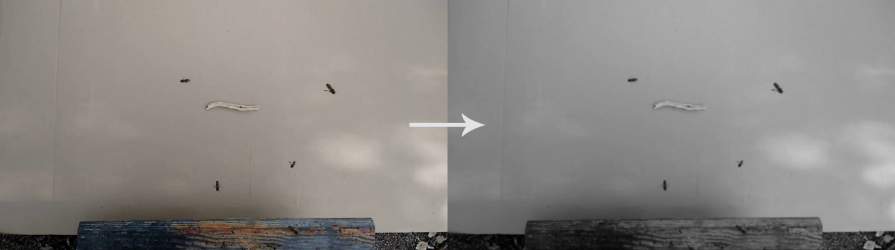
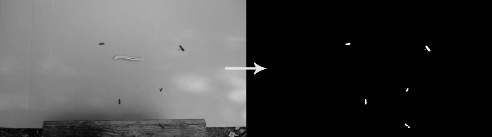
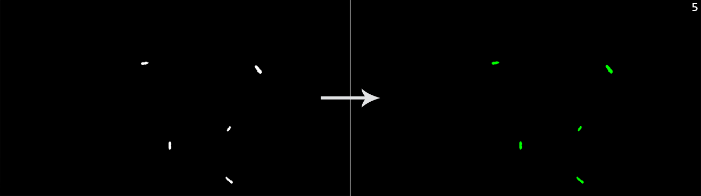
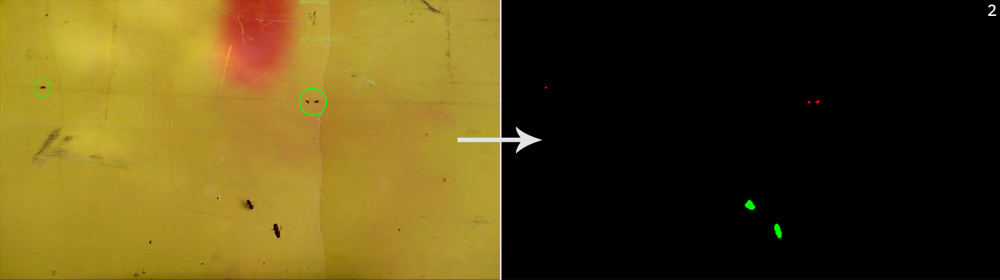

Conceptos teóricos
==================

La parte del proyecto con mayor complejidad teórica radica en el algoritmo de visión
artificial, el cual se puede dividir en cuatro fases. En primer lugar, se realiza un 
preprocesado de la señal de entrada para optimizarla. En segundo lugar, se substrae 
el fondo para segmentar los objetos en movimiento. Posteriormente, se realiza un 
posprocesado de la señal para mejorar los resultados obtenidos de la substracción 
del fondo. Y por último, se clasifican y cuentan los contornos que pueden pertenecer 
a una abeja.

A continuación se exponen los conceptos teóricos que conlleva cada fase.

Preprocesado
------------

Antes de aplicar el algoritmo de substracción del fondo, es recomendable
realizar un preprocesado de los fotogramas para facilitar el procesado posterior,
minimizar el ruido y optimizar los resultados. A continuación se
explican las técnicas utilizadas.

Conversión de RGB a escala de grises
~~~~~~~~~~~~~~~~~~~~~~~~~~~~~~~~~~~~

Los fotogramas captados por la cámara se devuelven en formato RGB. En
este formato se poseen tres matrices, una por cada canal
(*Red-Green-Blue*). La suma aditiva de los tres canales resulta en una
imagen a color.

Sin embargo, el color no proporciona ninguna información relevante en
nuestra tarea de identificación de abejas. Es por esto que se pueden
convertir los fotogramas de RGB a escala de grises. De esta manera, se
trabajará solamente con una matriz de píxeles en lugar de tres.
Simplificando, en gran medida, el número de operaciones a realizar y por
tanto, aumentado el rendimiento de nuestro algoritmo final.

OpenCV utiliza la conversión colométrica a escala de grises [opencv:color_cvt]_. Esta
técnica se basa en principios colométricos para ajustar la luminancia de
la imagen a color y la imagen resultante. Devolviendo una imagen con la
misma luminancia absoluta y la misma percepción de luminosidad [wiki:grayscal]_.

Utiliza la siguiente fórmula para calcular la luminancia resultante:

.. math::
   \text{RGB[A] to Gray:} \quad Y \leftarrow 0.299 \cdot R + 0.587 \cdot G + 0.114 \cdot B

La fórmula calcula la luminancia de una forma no lineal, sin necesidad
de realizar una expansión gamma. Los coeficientes intentan imitar la
percepción de intensidad medida por un humano tricromático, siendo más
sensible al color verde y menos al color azul [wiki:grayscal]_.

Desenfoque Gaussiano
~~~~~~~~~~~~~~~~~~~~

Las imágenes captadas pueden contener ruido que puede dificultar su
procesamiento. El ruido son variaciones aleatorias del brillo o del color
de una imagen. Una técnica que permite reducirlo es el desenfoque.

En nuestro caso hemos utilizado desenfoque Gaussiano, un filtro de paso
bajo que reduce las componentes de alta frecuencia de la imagen
utilizando para ello una convolución con una función Gaussiana [wiki:gaussian]_. Se
diferencia del desenfoque promedio en que da más peso a los vecinos
cercanos, siendo estos más influyentes en el resultado.

El kernel utilizado en la convolución es una muestra discreta de la
función Gaussiana. En nuestro caso utilizamos un kernel 3x3 que se
corresponde con: [book:mastering_opencv]_

.. math::
   M = 
   \begin{bmatrix}
   1 & 2 & 1 \\[0.3em] 
   2 & 4 & 2 \\[0.3em] 
   1 & 2 & 1
   \end{bmatrix}

En la siguiente imagen se puede ver el resultado de aplicar esta fase a
la imagen de entrada:

|Fase 1|

Substracción del fondo
----------------------

En un sistema de monitorización por vídeo resulta de gran interés el poder extraer los
objetos en movimiento del resto de la imagen. Esto se conoce como
extracción del fondo, en inglés *background subtraction* o *foreground
detection*, y consiste en clasificar todos los píxeles de un
determinado fotograma bien como fondo, o como primer plano [wiki:bs]_. En
primer plano se engloban todos los objetos en movimiento, mientras que
en el fondo se encuentran todos los objetos estáticos junto con posibles
sombras, cambios de iluminación u otros objetos en movimiento que no son
de interés, como puede ser la rama de un árbol balanceándose por el
viento. Se trata de un paso crítico, ya que algoritmos posteriores
dependen en gran medida de los resultados de este.

En nuestro proyecto, la toma de imágenes se realiza mediante una cámara
estática. Esto facilita en parte la detección del fondo, ya que este se
corresponderá con todos los píxeles estáticos. Sin embargo, como
trabajamos en un entorno al aire libre, tenemos que lidiar también con
cambios de iluminación, sombras, u otros objetos móviles que no son de
nuestro interés (falsos positivos).

Con OpenCV para Android podemos implementar varios algoritmos básicos de
extracción del fondo y además, nos proporciona la implementación de dos
algoritmos más sofisticados: ``BackgroundSubtractorMOG`` y 
``BackgroundSubtractorKNN``. Tras realizar un estudio de todos ellos, 
nos decantamos finalmente por ``BackgroundSubtractorMOG2``. A 
continuación, explicamos el funcionamiento de todos los algoritmos que se 
probaron, así como los resultados que nos proporcionaron.

Substracción con imagen de referencia
~~~~~~~~~~~~~~~~~~~~~~~~~~~~~~~~~~~~~

Se parte de una imagen de referencia del fondo, en la que no haya ningún
objeto en movimiento. A partir de esta, se obtienen los elementos en
movimiento substrayendo a cada fotograma la imagen tomada como
referencia.

Este método, al tomar un modelo del fondo tan sencillo y estático, es
muy vulnerable a cambios en la escena (iluminación, sombras, objetos del
fondo con ligeros movimientos, pequeñas oscilaciones de la cámara, etc.).
Sin embargo, ofrece muy buenos resultados cuando se trabaja en una
escena con la iluminación y los elementos controlados, ya que al ser tan
simple, es muy eficiente [programarfacil:detmov]_.

Para implementar este algoritmo con OpenCV, se hace uso de la función
``Core.absdiff()``.

En nuestro problema, al trabajar al aire libre nos es imposible utilizar
este algoritmo. Ya que el modelo del fondo cambia constantemente.

Substracción del fotograma anterior
~~~~~~~~~~~~~~~~~~~~~~~~~~~~~~~~~~~

En este método, el modelo del fondo se extrae del fotograma anterior. De
tal manera, que a cada nuevo fotograma se le substrae el anterior.

De esta manera se mejora la respuesta a cambios en la escena, como los
cambios de iluminación. Sin embargo, si un objeto en movimiento se queda
estático en la imagen, este deja de ser detectado [book:opencv_java]_.

La implementación se realiza como en la técnica anterior, variando el
modelo del fondo.

Tras probarlo en nuestro problema específico, vimos que no nos era de
utilidad. Ya que el fotograma resultante de la diferencia contenía 
las abejas por duplicado (la abeja en el fotograma actual y misma 
abeja en el fotograma anterior en otra posición).

Substracción del acumulado de los fotogramas anteriores
~~~~~~~~~~~~~~~~~~~~~~~~~~~~~~~~~~~~~~~~~~~~~~~~~~~~~~~

Una mejora interesante del algoritmo anterior supone tomar como modelo
del fondo un acumulado de los fotogramas anteriores de acuerdo a un
ratio de aprendizaje. De esta forma, se puede lidiar con cambios en el
fondo de la imagen dinámicamente. El modelo se calcula de acuerdo a la
siguiente fórmula:

.. math::
   u_t = (1-\alpha )u_{t-1}+\alpha\ p_t

Donde :math:`p_t` es el nuevo valor del píxel, :math:`u_{t-1}` es la media del fondo
en el instante :math:`t-1`, :math:`u_t` es la nueva media del fondo y
:math:`\alpha` es el ratio de aprendizaje (cómo de rápido olvida
los frames anteriores) [book:opencv_java]_.

OpenCV provee la función ``Imgproc.accumulateWeighted()`` que implementa
la fórmula anterior por nosotros. Haciendo uso de esta función y de la
utilizada en la sección anterior podemos implementar este algoritmo.

Tras probarlo, vimos que tenía una eficiencia muy buena y se adaptaba a
los cambios correctamente. Sin embargo, no era capaz de diferenciar las 
sombras de las abejas, por lo que se obtenían falsos positivos.

BackgroundSubtractorKNN
~~~~~~~~~~~~~~~~~~~~~~~

Se trata de un método que se basa en el algoritmo de clasificación
supervisada *K nearest neighbors* (k-nn). El algoritmo fue propuesto en
el artículo [art:zivkovic_efficient_2006]_. Y de acuerdo con sus conclusiones, es muy eficiente
cuando el número de píxeles que se corresponden con el primer plano es
bajo.

La clase de OpenCV que lo implementa es ``BackgroundSubtractorKNN``. Los
parámetros más importantes son:

-  ``history``: número de fotogramas recientes que afectan al modelo del
   fondo.
-  ``dist2Threshold``: umbral de la distancia al cuadrado entre el píxel
   y la muestra para decidir si un píxel está cerca de esa muestra.
-  ``detectShadows``: con un valor verdadero detecta las sombras
   (aumenta considerablemente el tiempo de procesado).

En nuestras pruebas, el algoritmo proporcionaba unos resultados buenos
pero su tiempo de ejecución era muy elevado (entorno a 25ms/frame). Como
el tiempo de ejecución es un factor clave en nuestro proyecto, se
descartó el uso de este algoritmo.

BackgroundSubtractorMOG2
~~~~~~~~~~~~~~~~~~~~~~~~

``BackgroundSubtractorMOG2`` es una mejora del algoritmo
``BackgroundSubtractorMOG``. En la versión original de OpenCV se
encuentran implementados ambos, sin embargo, en los *wrappers* para
Android solo disponemos de la revisión.

``BackgroundSubtractorMOG`` está basado en el modelo *Gaussian Mixture*
(GMM). Se trata de un modelo compuesto por la suma de varias
distribuciones Gaussianas que, correctamente elegidas, permiten modelar
cualquier distribución [coursera:gmm]_. 

El algoritmo de substracción del fondo fue propuesto en el artículo 
[art:yao_improved_2001]_ y modela cada píxel del fondo como
la mezcla de *K* distribuciones Gaussianas. Los pesos de la mezcla
representan las proporciones de tiempo que el color de ese píxel se ha
mantenido en la escena. Siendo los colores de fondo más probables los
que más permanezcan y sean más estáticos [opencv:bs_tutorial]_.

``BackgroundSubtractorMOG2`` se basa en los mismos principios que su
antecesor pero implementa una mejora sustancial. Es el propio algoritmo
el que selecciona el número adecuado de distribuciones Gaussianas
necesarias para modelar cada píxel. De esta manera, se mejora
notablemente la adaptabilidad del algoritmo a variaciones en la escena. Fue propuesto
en los artículos [art:zivkovic_improved_2004]_ y [art:zivkovic_efficient_2006]_.

El código fuente de este algoritmo está disponible en [github:background_segm]_ (interfaz)
y [github:bgfg_gaussmix2]_ (implementación).

La clase de OpenCV que lo implementa es ``BackgroundSubtractorMOG2``.
Posee los siguientes parámetros configurables: [opencv:mog]_

-  ``history``: número de fotogramas recientes que afectan al modelo del
   fondo. Se representa en la literatura como ``T``. Por defecto, 500
   fotogramas. Nosotros hemos obtenido buenos resultados con valores de 
   entorno a 50.
-  ``learningRate``: valor entre 0 y 1 que indica como de rápido aprende
   el modelo. Si se establece un valor de -1 el algoritmo elige
   automáticamente el ratio. 0 significa que el modelo del fondo no se
   actualiza para nada, mientras que 1 supone que el modelo del fondo se
   reinicializa completamente cada nuevo fotograma. En la literatura
   podemos encontrar este parámetro como ``alfa``. Si el intervalo que
   se quiere considerar es ``history``, se debe establecer
   ``alfa=1/history`` (valor por defecto). También se pueden mejorar los
   resultados iniciales estableciendo ``alfa=1`` en el instante 0 e ir
   decrementándolo hasta ``alfa=1/history``. De esta manera, en el
   inicio aprende rápidamente, pero una vez estabilizada la situación
   las variaciones afectan menos al modelo. En nuestro caso, el valor por 
   defecto ha funcionado correctamente.
-  ``backgroundRatio``: si un pixel del primer plano permanece con un
   valor semi-constante durante ``backgroundRatio*history`` fotogramas,
   es considerado fondo y se añade al modelo del fondo como centro de
   una nueva componente Gaussiana. En los artículos se hace referencia a
   este parámetro como ``TB``. ``TB=0.9`` es el valor por defecto. Este 
   parámetro nos permite decidir cuando dejar de contar una abeja que se
   ha quedado inmóvil o un objeto nuevo en la escena como podría ser una 
   hoja que se acaba de caer de un árbol.
-  ``detectShadows``: con un valor verdadero (valor por defecto) detecta
   las sombras (aumenta ligeramente el tiempo de procesado). Nos permite 
   despreciar las sombras de las abejas con muy buenos resultados.
-  ``shadowThreshold``: el algoritmo detecta las sombras comprobando si
   un píxel es una versión oscurecida del fondo. Este parámetro define
   cómo de oscura puede ser la sombra como máximo. Por ejemplo, un valor
   de 0.5 (valor por defecto) significa que si un píxel es más del doble
   de oscuro, entonces no se considerará sombra. En los artículos se
   representa como ``Tau``.
-  ``shadowValue``: es el valor utilizado para marcar los píxeles de
   sombras en la máscara resultante. El valor por defecto es 127. En la
   máscara devuelta, un valor de 0 siempre se corresponde con un pixel
   del fondo, mientras que un valor de 255 con un píxel del primer
   plano.
-  ``nMixtures``: número máximo de componentes Gaussianas para modelar
   el modelo del fondo. El número actual se determina dinámicamente para
   cada píxel. Hemos utilizado el valor por defecto, 5.
-  ``varThreshold``: umbral utilizado en el cálculo de la distancia
   cuadrada de Mahalanobis entre el píxel y el modelo del fondo para
   decidir si una muestra está bien descrita por el modelo o no. Este
   parámetro no afecta a la actualización del modelo del fondo. Se
   representa como ``Cthr``. Por defecto, 16. Se han obtenido mejores 
   resultados con valores de entorno a 40.
-  ``varThresholdGen``: umbral sobre la distancia cuadrada de
   Mahalanobis entre el píxel y el modelo para ayudar a decidir si un
   píxel está cercano a alguna de las componentes del modelo. Si no es
   así, es considerado como primer plano o añadido como centro de una
   nueva componente (dependiendo del ``backgroundRatio``). Se representa
   como ``Tg`` y su valor por defecto es 9. Un valor menor genera más
   componentes Gaussianas, mientras que un valor mayor genera menos.
-  ``complexityReductionThreshold``: este parámetro define el número de
   muestras necesarias para probar que una componente existe. Se
   representa como ``CT``. Su valor por defecto es ``CT=0.05``. Si se
   establece su valor a 0 se obtiene un algoritmo similar al de Stauffer
   & Grimson (no se reduce el número de componentes).
-  ``varInit``: varianza inicial de cada componente Gaussiana. Afecta a
   la velocidad de adaptación. Se debe ajustar teniendo en cuenta la
   desviación estandar de las imágenes. Por defecto es 15.
-  ``varMin``: varianza mínima. Por defecto, 4.
-  ``varMax``: varianza máxima. Por defecto, ``5*varInit``.

De todos ellos, los parámetros más importantes a ajustar son ``history``
o ``learningRate``, ``varThreshold`` y ``detectShadows``.

La parametrización correcta de este algoritmo es clave para su buen
funcionamiento. Por ello, durante las pruebas se integró en nuestra
aplicación de desarrollo, permitiendo variar todos estos parámetros en
tiempo real. De esta manera. se pudo elegir la mejor configuración para
nuestro problema concreto. 

En la siguiente imagen se puede ver una captura de nuestra plataforma 
de desarrollo en la pestaña correspondiente a esta fase:

|devplatform|

.. |devplatform| image:: ../../img/devplatform.png

Una vez parametrizado correctamente, vimos como este algoritmo era el
que mejores resultados nos proporcionaba. Con un tiempo de ejecución en
nuestro equipo de pruebas de entorno a 4ms/frame, mucho menor que el
proporcionado por ``BackgroundSubtractorKNN``, de entorno a 25ms/frame.
El algoritmo detectaba correctamente las abejas, era resistente al ruido,
y además, era capaz de diferenciar una abeja de su sombra. Por todos
estos motivos, se seleccionó para la fase de substracción del fondo.

Otros algoritmos
~~~~~~~~~~~~~~~~

La implementación original de OpenCV implementa otros dos algoritmos más
que no están disponibles a través de los *wrappers* de Android.

-  ``BackgroundSubtractorGMG`` es un algoritmo que combina una
   estimación estadística del fondo de la imagen junto con una
   segmentación Bayesiana píxel a píxel [opencv:bs_tutorial]_.

-  ``BackgroundSubtractorFGD`` está disponible en la versión para CUDA.
   Utiliza la regla de decisión de Bayes para clasificar los elementos
   del fondo y los del primer plano atendiendo a sus vectores de
   características [art:li_foreground_2003]_.

En la siguiente imagen se puede ver el resultado de aplicar 
``BackgroundSubtractorMOG2`` a la salida de la fase anterior:

|Fase 2|

Se puede apreciar como ha descartado correctamente las sombras en movimiento
de los árboles y se ha quedado únicamente con los objetos en movimiento.

Posprocesado
-------------

Para mejorar los resultados de la extracción de fondo y preparar la
imagen para la búsqueda de contornos, se han aplicado las siguientes
técnicas:

Dilatación
~~~~~~~~~~

Se trata de una operación morfológica por la cual se expanden las
regiones luminosas de una imagen. Esto se consigue mediante la
sustitución de cada píxel por el más brillante de los vecinos
considerados por el *kernel* (matriz utilizada para la convolución). 
De esta manera se consiguen unir las regiones de abejas que podían 
haberse roto [book:mastering_opencv]_.

Erosión
~~~~~~~

Se trata de la operación contraria a la anterior, expande las regiones
oscuras de la imagen. Para ello se coge el valor mínimo de los valores
considerados por el *kernel* [book:mastering_opencv]_.

La dilatación nos permite reconstruir las abejas, pero también aumenta
su tamaño, aumentando el riesgo de solapamientos. Para evitar esto, se
vuelve a reducir el tamaño de estas mediante una erosión.

En nuestro algoritmo aplicamos tres operaciones morfológicas seguidas:

1. **Erosión (3x3)**: elimina las piernas de las abejas.
2. **Dilatación (2x2)**: junta la cabeza de las abejas con su cuerpo que en
   numerosas ocasiones es separado durante la substracción de fondo.
3. **Erosión (3x3)**: recupera el tamaño inicial.

A continuación podemos ver el resultado de esta fase:

|Fase 3|

.. |Fase 3| image:: ../../img/s3.png

Detección y conteo de abejas
----------------------------

El último paso que realiza nuestro algoritmo de visión artificial es
detectar cuáles de las regiones obtenidas en la fase anterior se correponden
con abejas. Para ello, se realiza una búsqueda de contornos y se filtran por área. 

Entendemos por contorno una línea curva que une todos los puntos continuos del 
borde de una región de un mismo color o intensidad.

La salida de la fase anterior es una imagen binaria con los objetos en
movimiento en blanco y el fondo en negro. Por lo tanto, el objetivo de
esta fase es detectar todas las regiones blancas que puedan
corresponderse con una abeja.

OpenCV provee la función ``Imgproc.findContours()`` para realizar la búsqueda
de contornos. Esta toma una imagen binaria y devuelve una lista con todos los
contornos encontrados. Para entender la función se necesita comprender
una serie de conceptos: [opencv:contour]_

-  **Jerarquía**: los contornos pueden ser independientes unos de otros,
   o poseer una relación padre-hijo cuando un contorno está dentro de
   otro. En la jerarquía se especifican las relaciones entre contornos.

-  **Modo de obtención del contorno**: define cómo se van a obtener los
   contornos en cuestión de jerarquía [opencv:find_contour]_.

   -  ``RETR_LIST``: devuelve todos los contornos en una lista, sin
      ninguna información de jerarquía entre ellos.
   -  ``RETR_EXTERNAL``: devuelve todos los contornos externos. Si algún
      contorno tiene contornos hijo, estos son ignorados.
   -  ``RETR_CCOMP``: devuelve los contornos agrupados en dos niveles de
      jerarquía. Un primer nivel en el que se encuentran todos los
      contornos exteriores. Y un segundo nivel con los contornos
      correspondientes a agujeros en los primeros.
   -  ``RETR_TREE``: devuelve todos los contornos creando un árbol
      completo con la jerarquía.

-  **Método de aproximación de los contornos**: define el método que
   utiliza la función para almacenar los contornos [opencv:find_contour]_.

   -  ``CHAIN_APPROX_NONE``: almacena todos los puntos del borde del
      contorno.
   -  ``CHAIN_APPROX_SIMPLE``: almacena sólo los puntos relevantes del
      contorno. Por ejemplo, si el contorno es una línea no se necesita
      almacenar todos los puntos de esta, con el punto inicial y el
      final basta. Esto es lo que realiza este método, eliminar todos
      los puntos redundantes y comprimirlos para que ocupe menos
      espacio.
   -  ``CV_CHAIN_APPROX_TC89_L1`` y ``CV_CHAIN_APPROX_TC89_KCOS``:
      aplican el algoritmo de aproximación de cadena de Teh-Chin,
      simplificando los polígonos que forman los contornos.
   -  ``CV_CHAIN_CODE``: almacena los contornos utilizando el código de
      cadenas de Freeman.

En nuestro caso, la configuración más adecuada es utilizar
``RETR_EXTERNAL`` y ``CHAIN_APPROX_SIMPLE``. Ya que no nos interesa
ningún contorno interno que pueda tener la abeja (y que en principio no
debería tener) y tampoco nos es relevante el cómo se almacenan estos,
sólo nos interesa el número.

Para evitar posibles falsos positivos, establecemos un umbral mínimo y
máximo en el área del contorno. De esta manera, evitamos que contornos
diminutos o grandes generados por ruidos o por objetos del entorno
(moscas, pájaros, roedores...) sean contados cómo abejas.

En la siguiente imagen podemos ver la salida del algoritmo:

|Fase 4|

En esta otra se puede apreciar como se descartan las tres moscas que 
hay en la imagen ya que su área es inferior al área mínima:

|Moscas en la escena|

.. References

.. [opencv:color_cvt]
   http://docs.opencv.org/3.1.0/de/d25/imgproc\_color\_conversions.html
.. [wiki:grayscal]
   https://en.wikipedia.org/wiki/Grayscale
.. [wiki:gaussian]
   https://en.wikipedia.org/wiki/Gaussian\_blur
.. [book:mastering_opencv]
   https://www.packtpub.com/application-development/mastering-opencv-android-application-programming
.. [wiki:bs]
   https://en.wikipedia.org/wiki/Background\_subtraction
.. [programarfacil:detmov]
   http://programarfacil.com/blog/vision-artificial/deteccion-de-movimiento-con-opencv-python/
.. [book:opencv_java]
   https://www.packtpub.com/application-development/opencv-30-computer-vision-java
.. [coursera:gmm]
   https://www.coursera.org/learn/robotics-learning/lecture/XG0WD/1-4-1-gaussian-mixture-model-gmm/
.. [art:yao_improved_2001]
   http://www.ee.surrey.ac.uk/CVSSP/Publications/papers/KaewTraKulPong-AVBS01.pdf
.. [opencv:bs_tutorial]
   http://docs.opencv.org/master/db/d5c/tutorial\_py\_bg\_subtraction.html
.. [art:zivkovic_improved_2004]
   http://www.zoranz.net/Publications/zivkovic2004ICPR.pdf
.. [art:zivkovic_efficient_2006]
   http://www.zoranz.net/Publications/zivkovicPRL2006.pdf
.. [github:background_segm]
   https://github.com/opencv/opencv/blob/master/modules/video/include/opencv2/video/background\_segm.hpp
.. [github:bgfg_gaussmix2]
   https://github.com/opencv/opencv/blob/master/modules/video/src/bgfg\_gaussmix2.cpp
.. [opencv:mog]
   http://docs.opencv.org/3.1.0/d7/d7b/classcv\_1\_1BackgroundSubtractorMOG2.html
.. [art:li_foreground_2003]
   http://citeseerx.ist.psu.edu/viewdoc/download?doi=10.1.1.62.8313&rep=rep1&type=pdf
.. [opencv:contour]
   http://docs.opencv.org/3.0-beta/doc/py\_tutorials/py\_imgproc/py\_contours/py\_table\_of\_contents\_contours/py\_table\_of\_contents\_contours.html
.. [opencv:find_contour]
   docs.opencv.org/3.0-beta/modules/imgproc/doc/structural\_analysis\_and\_shape\_descriptors.html
