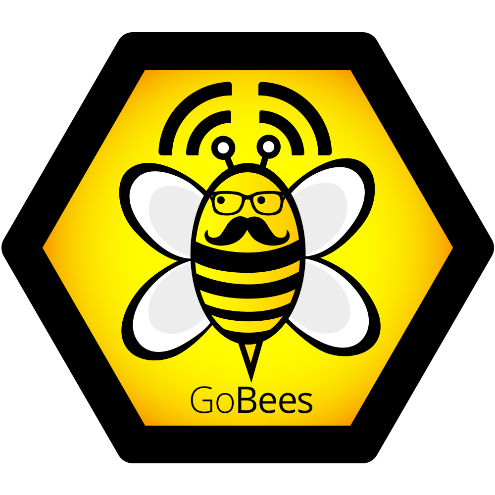
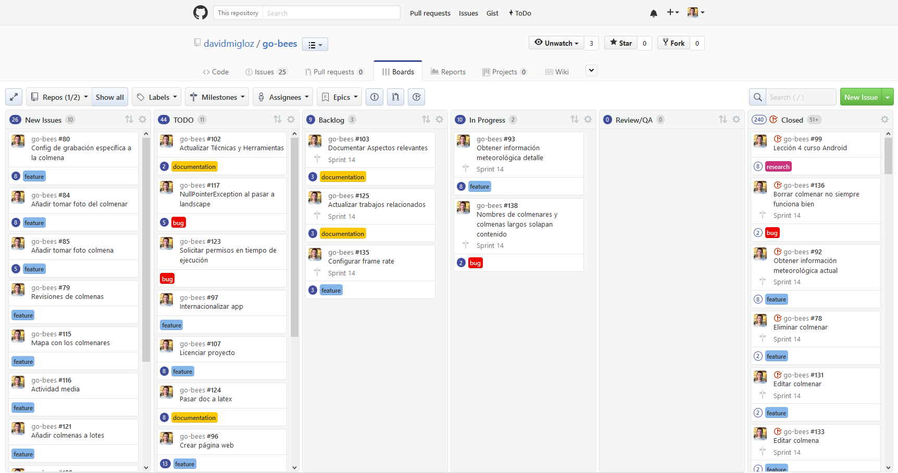

Aspectos relevantes
===================

En este apartado se van a recoger los aspectos más importantes del
desarrollo del proyecto. Desde las decisiones que se tomaron y sus
implicaciones, hasta los numerosos problemas a los que hubo que
enfrentarse y cómo se solucionaron.

Inicio del proyecto
-------------------

La idea del proyecto surgió del afán de encontrar un tema con el que
poder aunar mi formación técnica y mis aficiones.

Mi padre me transmitió el interés por la apicultura desde bien pequeño
y, posteriormente, llegué a trabajar en una empresa de apicultura
profesional. Esto me hizo ser consciente de los problemas con los que lidia
día a día un apicultor. Por otro lado, los conocimientos adquiridos
durante mis estudios de Ingeniería Informática, me posibilitaron idear
soluciones tecnológicas a alguno de estos problemas.

Tras formalizar la idea del proyecto y recibir el visto bueno de los
tutores, nos pusimos manos a la obra.

|GoBees|

Metodologías
------------

Desde el primer momento se dedicaron grandes esfuerzos para que la
realización del proyecto se llevase a cabo de la manera más profesional
posible. Para ello, se siguieron varias metodologías y procesos,
expuestos a continuación.

Para la gestión del proyecto se utilizó una metodología ágil, en
concreto Scrum. Aunque no se siguió al 100% al tratarse de un proyecto
educativo (no éramos un equipo de 4 a 8 personas, no hubo reuniones
diarias, etc.), sí que se aplicó una filosofía ágil en líneas generales:

-  Se siguió una estrategia de desarrollo incremental a través de
   iteraciones (*sprints*) y revisiones.

-  La duración media de los *sprints* fue de una semana.

-  Al finalizar cada *sprint* se entregaba una parte del producto
   operativo (incremento).

-  Se realizaban reuniones de revisión al finalizar cada *sprint* y al
   mismo tiempo de planificación del nuevo *sprint*.

-  En la planificación del *sprint* se generaba una pila de tareas a
   realizar.

-  Estas tareas se estimaban y priorizaban en un tablero *canvas*
   (ZenHub).

-  Para monitorizar el progreso del proyecto se utilizó gráficos
   *burndown*.

|board|

Para el diseño del algoritmo de visión artificial se utilizó una
metodología de ensayo y error. Se barajaban diferentes alternativas y se
iban verificando empíricamente su eficacia y eficiencia.

Para el desarrollo de la aplicación Android se intentó utilizar
*Test-Driven Development* (TDD) para fomentar la escritura de test y
mejorar la calidad del *software*. La mayoría de los módulos de la
aplicación se implementaron exitosamente siguiendo esta metodología. Sin
embargo, en las partes más complejas de esta, como el servicio de
monitorización, se hacía muy engorroso la escritura de test (ya
complicada de por sí en Android), por lo que finalmente se omitieron al
penalizar notablemente la productividad.

Formación
---------

El proyecto requería una serie de conocimientos técnicos de los que no
se disponía en un principio. Sobre todo, relacionados con visión
artificial, OpenCV y Android. A continuación, se enumeran los
principales recursos didácticos que se utilizaron.

Para la formación en visión artificial y OpenCV se leyeron los
siguientes libros:

-  *Android Application Programming with OpenCV 3* (Joseph Howse) [book:android_opencv]_.

-  *Mastering OpenCV Android Application Programming* (Salil Kapur y
   Nisarg Thakkar) [book:mastering_opencv]_.

-  *Learning Image Processing with OpenCV* (Ismael Serrano Gracia, Jesús
   Salido Tercero y José Luis Espinosa Aranda) [book:learning_cv]_.

-  *OpenCV 3.0 Computer Vision with Java* (Daniel Lélis Baggio) [book:opencv_java]_.

Para la formación en Android se realizaron los siguientes cursos online:

-  *Android Development for Beginners: How to Make Apps* (Udacity) [course:android_beginners]_.

-  *Developing Android Apps* (Udacity) [course:developing_android]_.

-  *Android Testing Codelab* (Google) [course:testing]_.

También cabe destacar la importancia que tuvo la comunidad
`StackOverflow <http://stackoverflow.com/>`__ para la resolución de los
diferentes problemas que surgieron durante el desarrollo.

Desarrollo del algoritmo
------------------------

Una gran parte de los recursos del proyecto se dedicaron al desarrollo
del algoritmo de visión artificial para la monitorización de la
actividad de vuelo de una colmena.

El problema a resolver poseía una serie de condicionantes que
dificultaban el análisis:

-  Cada abeja ocupa una porción muy pequeña de la imagen.

-  Las condiciones lumínicas varían a lo largo del día o de la época del
   año.

-  Existen sombras producidas por la cámara o por las propias abejas.

-  A 20 fps una abeja volando puede recorrer una distancia significativa
   entre fotogramas.

-  Un grupo de abejas puede estar confinado, dificultando su
   segmentación.

El desarrollo comenzó con una búsqueda bibliográfica sobre el tema. En
esta, se encontraron varios artículos relacionados que nos dieron una
idea de las técnicas que podíamos probar. También se tuvo una reunión
con un experto en visión artificial que nos proporcionó su punto de
vista sobre cómo abordar el problema.

El primer punto a abordar fue la toma de las imágenes. Se decidió que la
toma se debía de hacer con un trípode en posición cenital a la colmena.
De esta manera, se disminuía las diferencias de tamaño por perspectiva,
no se obstaculizaba el vuelo de las abejas y se facilitaba el análisis.
Además, era aconsejable cubrir el suelo con alguna superficie uniforme
para mejorar la segmentación de las abejas.

|cenital|

.. |cenital| image:: ../../img/cenital.jpg

En un primer momento, el desarrollo del algoritmo se iba a realizar
directamente sobre la plataforma Android. Sin embargo, rápidamente nos
dimos cuenta que no era lo más adecuado si queríamos seguir una
metodología basada en el ensayo y error, debido a los elevados tiempos
de compilación y a la poca flexibilidad de la plataforma.

Finalmente se decidió desarrollar el algoritmo directamente en Java, ya
que nos proporcionaba una mayor flexibilidad y, además, migrar el código
a Android posteriormente sería una tarea bastante trivial.

Para facilitar el desarrollo del algoritmo y del testeo de las
diferentes alternativas se realizó una aplicación Java que permitía
parametrizar en tiempo real las diferentes etapas del algoritmo.

|devplatform|

.. |devplatform| image:: ../../img/devplatform.png

Además de permitir variar la parametrización, la aplicación nos permitía
observar la salida de cada etapa del algoritmo y su tiempo de
computación.

Es importante recalcar que los tiempos de computación obtenidos en la
plataforma había que multiplicarlos por cuatro si se quería obtener una
estimación de lo que equivaldría ejecutarlo en el dispositivo móvil. Por
lo que los márgenes con los que se jugaba no eran demasiado grandes.

Tras varias iteraciones, se consiguió obtener un algoritmo bastante
robusto que poseía las siguientes etapas:

1. **Preprocesado:** conversión de RGB a escala de grises y desenfoque
   Gaussiano para facilitar el procesado.

2. **Substracción del fondo:** extracción de los elementos en movimiento
   utilizando el algoritmo ``BackgroundSubtractorMOG2``.

3. **Posprocesado:** mejora de la salida de la etapa anterior mediante
   varias iteraciones de erosión y dilatación.

4. **Detección y conteo de abejas:** localización de los contornos
   pertenecientes a abejas en base al área y conteo de los mismos.

Desarrollo de la *app*
----------------------

El desarrollo de la aplicación Android se realizó de forma incremental,
publicando una *release* al finalizar cada *sprint*.

Se decidió dar soporte a partir de la versión KitKat (API 19), de tal
forma que es cubría un 86,3\% de los dispositivos Android del mercado
[android:versions]_.  Dar soporte a versiones anteriores suponía una 
sobrecarga importante, por lo que se descartó al no constituir una cuota de
mercado importante.

La primera tarea consistió en migrar el algoritmo de visión artificial a
la plataforma Android. A primera vista, no parecía una tarea complicada.
Sin embargo, nos encontramos con varios *bugs* que, unidos a la mala
documentación de OpenCV para Android, dificultó considerablemente la
labor.

El primer *bug* (*issue*
`#26 <https://github.com/davidmigloz/go-bees/issues/26>`__) consistía en
que al llamar a algunas funciones del núcleo de OpenCV, se producía un
error con un mensaje que hacía referencia a una señal que variaba entre
ejecuciones, lo cual hizo muy difícil encontrar el origen. Finalmente,
se dio con la fuente del problema, el cual tenía su origen en que la
versión de la aplicación OpenCV Manager distribuida en el Google Play
contaba con una versión corrupta de la librería OpenCV 3.1.

Se notificó al equipo de OpenCV a través de su gestor de incidencias 
y finalmente solucionaron el problema en la nueva versión OpenCV 3.2.

El segundo *bug* (*issue*
`#27 <https://github.com/davidmigloz/go-bees/issues/27>`__) hacía que la
aplicación fallase cuando se compilaba para dispositivos con una versión
de Android inferior a Lollipop, debido a la API de la cámara. Tras
publicar el caso en
`StackOverflow <http://stackoverflow.com/questions/39770355/classnotfoundexception-android-hardware-camera2-cameraaccessexception-with-open>`__,
un usuario sugirió que podía estar relacionado con el *Instant Run* de
Android Studio. Y así fue; desactivando esta característica, la
aplicación no fallaba. Se describió el caso en el gestor de incidencias
de Android y, a día de hoy (enero 2017), el *bug* se encuentra resuelto y
está a la espera de ser incorporado en futuras *releases* del
*framework*.

Una vez solventados ambos *bugs,* se logró que el algoritmo funcionase
sin problemas en la nueva plataforma.

Cabe destacar que como OpenCV no distribuía oficialmente la librería a
través de ningún repositorio que permitiese utilizarla directamente como
dependencia Gradle, se creó uno propio [gobees:prototipes]_.

Para el diseño de la arquitectura de la *app* se siguió el patrón de
arquitectura *Model-View-Presenter* (MVP), que permite separar los datos
internos del modelo de una vista pasiva y agrupar toda la lógica de la
aplicación en una capa intermedia llamada *presenter*. De esta manera se
consigue un código muy desacoplado, haciendo que este sea más fácil de
testear y mantener.

En cuanto a la persistencia de datos, se optó por utilizar Realm. Se
trata de una base de datos orientada a objetos que proporciona una API
para trabajar directamente con la capa de persistencia. Es
multiplataforma y presume de ser más rápida que SQLite.

Para la obtención de la información meteorológica se escogió la API
proporcionada por *OpenWeatherMaps*, la cual nos permitía realizar hasta
60 llamadas por minuto de forma gratuita.

El acceso a datos se centralizó utilizando el patrón repositorio, que
abstrae la lógica de negocio de la fuente de datos. Todo el acceso a
datos se centraliza en el repositorio y es este quien decide de qué
fuente los obtiene (base de datos, internet, etc.). Además, se incorporó
una capa de caché en este punto con el fin de agilizar la navegación por
la *app*.

El siguiente esquema resume la arquitectura de la aplicación:

|architecture|

.. |architecture| image:: ../../img/architecture.png

Surgieron problemas al implementar el algoritmo de monitorización como
un servicio de Android para que el usuario pudiese apagar la pantalla
durante la monitorización. El acceso a la cámara proporcionado por
OpenCV era en sí una vista, y las vistas no pueden ser utilizadas en
servicios. Finalmente se optó por realizar una implementación propia que
accediese directamente a la API de la cámara y convirtiese los
fotogramas al formato de OpenCV.

En cuanto al diseño de la aplicación, se dedicaron grandes esfuerzos a
la usabilidad y accesibilidad de la misma. Se siguieron las directrices
de diseño recogidas en la guía de Material Design en cuanto a estilos,
disposición de los elementos, tipos de componentes, patrones de
navegación, gestos, etc.

Por último, se internacionalizó la aplicación a los siguientes idiomas:
español, inglés, catalán, polaco y árabe. Para ello se utilizó
la herramienta Toolkit del Traductor de Google que permite realizar una
primera traducción automática de los diferentes textos de la aplicación
y posteriormente una revisión colaborativa de los resultados de esta.
Para la revisión se recurrió a amistades nativas en los diferentes
idiomas.

*Testing*
---------

En lo relativo al *testing*, podemos diferenciar el testeo del algoritmo
del testeo de la *app*.

Para testear el error cometido por el algoritmo era necesario contar con
fragmentos de vídeo etiquetados con el número de abejas presentes en
cada fotograma. Como esta labor era muy tediosa, se desarrolló una
aplicación Java para agilizar el etiquetado de los fotogramas.

La aplicación iba mostrando los diferentes fotogramas al usuario y este
indicaba con el ratón los píxeles pertenecientes a abejas. Finalmente
permitía exportar los datos en un archivo CSV.

|counting|

.. |counting| image:: ../../img/counting_platform.png

Se etiquetaron fragmentos de vídeo correspondientes a tres situaciones
distintas:

-  **Caso 1** (vídeo `#C14 <https://youtu.be/9pkPCnS2aRY>`__): actividad
   media, sombras de abejas y moscas.

-  **Caso 2** (vídeo `#C17 <https://youtu.be/ENocXS3cEP0>`__): actividad
   media, cambios de iluminación y sombras de árboles.

-  **Caso 3** (vídeo `#C5 <https://youtu.be/YjGX4mC7pO4>`__): alta
   actividad, solapamiento, sombras y fondo no uniforme.

Tras ejecutar el algoritmo se obtuvieron los siguientes errores
relativos (considerando como error absoluto la distancia entre la 
medida esperada y la obtenida):

-  **Caso 1:** 2,43%.

-  **Caso 2**: 0,89%.

-  **Caso 3**: 4,48%.

Se puede observar que en la situación menos favorable el error es menor
a un 5%, precisión más que suficiente para la finalidad de los datos.

En cuanto al tiempo medio de ejecución del algoritmo para cada fotograma
era de 25 ms en el equipo de pruebas (Intel i7-3610QM) y de 100 ms
cuando se ejecutaba en un *smartphone* (Xiaomi Mi4).

Por otra parte, la aplicación se testeó mediante test unitarios, test de
integración y test de interfaz. La mayor parte de los test unitatios se realizaron
contra los *presenters*, que son los que poseen la lógica de negocio de
la *app*. Los test de interfáz se ejecutaron en siete dispositivos diferentes,
uno por cada versión de Android que soporta la *app* (API 19-25).

Además, se configuraron una serie de servicios de integración continua,
de tal forma, que cada vez que se realizaba un *commit* en el
repositorio, se ejecutaban las siguientes tareas:

1. **Travis**: realizaba una compilación del proyecto, ejecutaba los
   test unitarios, ejecutaba *Lint*, ponía en marcha un emulador de
   Android, y ejecutaba los Android test sobre este. Al finalizar, 
   enviaba los resultados a Codecov y SonarQube.

2. **Codecov**: realizaba un análisis sobre la cobertura de los test
   unitarios.

3. **CodeClimate**: ejecutaba cuatro motores de chequeo (*checkstyle*,
   *fixme*, *pmd* y *markdownlint*) sobre el código para detectar
   posibles problemas o vulnerabilidades en él.
   
4. **SonarQube**: analizaba código duplicado, violaciones de estándares, 
   cobertura de tests unitarios, bugs potenciales, etc.

5. **VersionEye**: chequeaba todas las dependencias utilizadas en la
   aplicación y comprobaba si estaban actualizadas, si tenían algún
   problema de seguridad conocido, o si violaban la licencia del
   proyecto.

|ci|
   

Por último, cabe comentar algunas estadísticas del proyecto:

+--------------------------------------+----------+
| Concepto                             | Valor    |
+======================================+==========+
| Total de líneas                      | 38.068   |
+--------------------------------------+----------+
| Líneas de código                     | 57%      |
+--------------------------------------+----------+
| Comentarios                          | 35%      |
+--------------------------------------+----------+
| Líneas en blanco                     | 9%       |
+--------------------------------------+----------+
| Número de clases                     | 126      |
+--------------------------------------+----------+
| Número de XML                        | 86       |
+--------------------------------------+----------+
| Número de test unitarios             | x        |
+--------------------------------------+----------+
| Número de test de interfáz           | x        |
+--------------------------------------+----------+
| Cobertura total test unitarios       | 14%      |
+--------------------------------------+----------+
| Cobertura test unitarios algoritmo   | 100%     |
+--------------------------------------+----------+
| Cobertura test unitarios *presenters*| 100%     |
+--------------------------------------+----------+

Documentación
-------------

En un primer momento, se decidió escribir la documentación en formato
Markdown, utilizando las *wikis* que proporciona GitHub en el
repositorio. De esta forma, la documentación podía ser visualizada
directamente desde GitHub, sin necesidad de tener que compilarla con cada
modificación.

Posteriormente, se optó por implementar un sistema de documentación
continua integrado en el repositorio, en concreto ReadTheDocs. De tal
forma, que la documentación se escribía en archivos Markdown dentro del
repositorio y este servicio generaba una página web
(`go-bees.readthedocs.io <http://go-bees.readthedocs.io/>`__) que se
actualizaba cada vez que se realizaba un *commit*.

No obstante, los tutores preferían obtener la documentación en formato
PDF para su corrección, por lo que finalmente se optó por utilizar
Sphinx junto con ReadTheDocs.

Sphinx es un generador de documentación que permite exportar la
documentación en varios formatos, entre ellos HTML y PDF.
Desafortunadamente, no soportaba Markdown como formato de entrada, por
lo que hubo que migrar la documentación al formato reStructuredText. 
Esta conversión se realizó con la herramienta Pandoc. 

Con todo configurado, ahora ReadTheDocs generaba automáticamente la página
web y un PDF actualizado con los últimos cambios realizados en la
documentación.

|readthedocs|

.. |readthedocs| image:: ../../img/readthedocs.png 

Para la exportación final de la memoria se utilizó el conversor Pandoc,
con objeto de transformar la documentación del formato reStructuredText
a LaTeX. Algunos elementos, como las citas o las imágenes, no eran convertidos 
correctamente, por lo que se tuvo que hacer uso de expresiones regulares.

La totalidad de este tedioso proceso se realizó bajo la idea de que
cualquier proyecto comercial tiene su documentación accesible desde una
página web, y que además necesita estar acorde con la versión del
proyecto. Sin embargo, para este caso concreto en el que el entregable
final es un PDF con un formato determinado, el montar todo este sistema
ha supuesto una sobrecarga notable.

Publicación
-----------

En cuanto la aplicación estuvo lista para pasar a producción, se publicó
en Google Play.

    TODO meter captura Google Play.

Además, se desarrolló una página web promocional
(`gobees.io <http://gobees.io/>`__), donde se describen las
características de la aplicación, los manuales de usuario, y el enlace
de descarga, entre otras cosas.

    TODO meter captura página web.

Por último, se crearon perfiles en las principales redes sociales para
promocionar la aplicación.

Reconocimientos
---------------

Durante el desarrollo del proyecto se obtuvieron varios reconocimientos:

-  **Beca de colaboración con departamentos**: se me concedió esta beca
   para profundizar en el algoritmo desarrollado y publicar un artículo
   científico sobre él.

-  **Prototipos Orientados al Mercado**: GoBees resultó ganador de uno
   de los tres premios de la convocatoria de Prototipos Orientados al
   Mercado realizada por el Vicerrectorado de Investigación y
   Transferencia del Conocimiento de la Universidad de Burgos.

-  **YUZZ**: GoBees fue elegido para participar en el programa YUZZ
   2017, patrocinado por el Banco Santander para el impulso del talento
   joven y el espíritu emprendedor.
   
.. References

.. [book:android_opencv]
   https://www.packtpub.com/application-development/android-application-programming-opencv-3
.. [book:mastering_opencv]
   https://www.packtpub.com/application-development/mastering-opencv-android-application-programming
.. [book:opencv_java]
   https://www.packtpub.com/application-development/opencv-30-computer-vision-java 
.. [book:learning_cv]
   https://www.packtpub.com/application-development/learning-image-processing-opencv
.. [course:android_beginners]
   https://www.udacity.com/course/android-development-for-beginners--ud837
.. [course:developing_android]
   https://www.udacity.com/course/new-android-fundamentals--ud851
.. [course:testing]
   https://codelabs.developers.google.com/codelabs/android-testing/
.. [gobees:prototipes]
   https://github.com/davidmigloz/opencv-android-gradle-repo/
.. [android:versions]
   https://developer.android.com/about/dashboards/
   